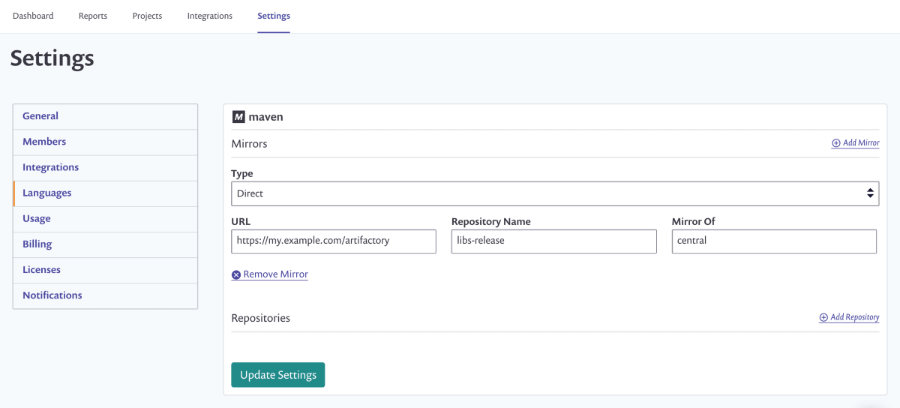

# Maven용 Artifactory 레지스트리


**기능 가용성**\
패키지 저장소 통합은 엔터프라이즈 플랜에서만 사용 가능합니다. 자세한 정보는 [플랜 및 가격](https://snyk.io/plans/)을 참조하세요.

**지원되는 프로젝트**\
Artifactory 패키지 저장소 통합은 [Node.js](../../../../supported-languages-package-managers-and-frameworks/javascript/#supported-frameworks-and-package-managers) (npm 및 Yarn) 및 [Maven](../../../../supported-languages-package-managers-and-frameworks/java-and-kotlin/#supported-frameworks-and-package-managers) 프로젝트를 지원합니다. [Gradle SCM 스캐닝 개선](../../../../supported-languages-package-managers-and-frameworks/java-and-kotlin/git-repositories-with-maven-and-gradle.md#improved-gradle-scm-scanning-early-access)을 위해서는 이 페이지의 Maven 설정을 사용하세요.


Snyk는 Maven 프로젝트와 함께 사용자 정의 Artifactory 패키지 저장소를 사용할 수 있습니다.

이를 통해 Snyk가 사용자 정의 레지스트리에 호스팅된 패키지의 모든 직접 및 간접 의존성을 해결하고 더욱 완전하고 정확한 의존성 그래프와 관련된 취약점을 계산할 수 있습니다.

Maven 프로젝트를 구성하여 모든 요청을 사용자 정의 패키지 저장소를 통해 미러링하거나 Maven Central과 함께 사용할 추가 저장소를 지정할 수 있습니다.

## **사용자 정의 Maven 패키지 레지스트리 설정**

사용자 정의 레지스트리에 액세스하기 위해 인증이 필요한 경우 Artifactory 패키지 저장소 통합을 구성해야 합니다. 자세한 내용은 [Artifactory 패키지 저장소 연결 설정](./)을 참조하세요.

통합 설정을 완료한 후에는 **설정 > 언어 > Java**로 이동하여 Maven 설정을 구성할 수 있습니다.

Artifactory를 미러 또는 아티팩트가 소재할 추가 저장소로 사용할지 선택할 수 있습니다. 이러한 설정은 `~/.m2/settings.xml`에 있는 설정과 매우 유사합니다.

## **미러**

<figure><figcaption>
Maven 설정, 유형 선택
</figcaption></figure>

**유형**에 대한 값을 선택하세요. **직접(Direct)** 또는 인증을 사용하는 경우 **통합(Integration)** 중 하나를 선택할 수 있습니다.

**직접**을 사용하는 경우 반드시 **URL**, **저장소 이름**, **Mirror Of**를 완료해야 합니다.

**Mirror Of** 값은 모든 것을 반영하기 위해 `*`로 설정하거나 `central`과 같은 값으로 입력할 수 있습니다.

**통합** 유형을 사용하는 경우 통합 유형을 선택하고 **저장소 이름** 및 **Mirror Of** 세부 정보를 제공해야 합니다.

**저장소 이름**은 내부 저장소 URL에서 `artifactory/` 뒤에 오는 것으로 설정해야 합니다.

예를 들어, URL이 `http://artifactory.company.io/artifactory/libs-release`인 경우 **저장소 이름**은 `libs-release`로 설정해야 합니다.

## **추가 저장소**

대안으로 아티팩트를 확인할 추가 위치로 사용될 저장소를 구성할 수 있습니다.

저장소는 [미러](artifactory-registry-for-maven.md#mirrors)와 같은 방식으로 구성되지만 **Mirror Of**는 필요하지 않습니다.