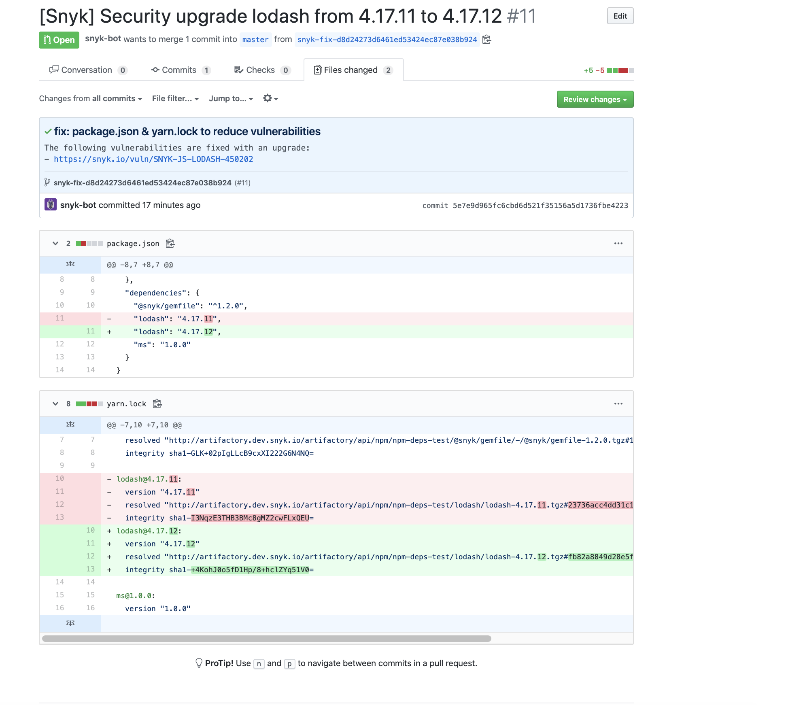

# Artifactory Registry for npm


**기능 가용성**

패키지 저장소 통합은 엔터프라이즈 플랜에서만 사용할 수 있습니다. 자세한 정보는 [요금제 및 가격 책정](https://snyk.io/plans/)을 참조하십시오.

이 가이드는 Snyk UI 통합에만 관련이 있습니다. CLI는 개인 Artifactory 레지스트리를 사용하는 Yarn 및 npm 프로젝트를 지원합니다.


Snyk은 npm 및 Yarn 프로젝트와 함께 Artifactory 패키지 저장소를 사용할 수 있습니다. 이를 통해 Snyk은 Pull/Merge 요청을 만들 때 올바른 URL로 lockfiles를 다시 생성할 수 있습니다.

Snyk에게 개인 Artifactory Node.js 패키지가 호스팅되며 어떤 scope 하에 있는지 알려줄 수 있는 구성을 추가할 수 있습니다. 이는 일반적으로 `.yarnrc` 또는 `.npmrc`에 추가하는 정보와 동일합니다.

## JavaScript 언어 설정

1. 설정 > 언어 > JavaScript로 이동하고 프로젝트 종류에 따라 npm 또는 Yarn 설정 중 하나를 선택합니다.
2. 이전에 Artifactory에 연결하지 않았다면, 먼저 통합을 구성하라는 요청이 표시될 것입니다; [Artifactory 패키지 저장소 연결 설정](./)을 참조하십시오.
3. **레지스트리 구성 추가**를 선택합니다.
   1. **패키지 소스**로 **Artifactory**를 선택합니다.
   2. 이 레지스트리를 **기본 레지스트리 URL로 구성**하려면 **scope**를 비워둡니다.
   3. **스코프된 패키지만** 이 레지스트리를 사용하도록 구성하려면 **scope**를 추가합니다. 예를들어, `@snyk`는 `@snyk`로 시작하거나 스코프된 모든 종속성에 대해 구성된 레지스트리를 사용할 것입니다.
   4. **기본 레지스트리 URL** 및 **스코프된 패키지**를 혼합하여 추가하려면, 기본적으로 하나의 설정 및 각 스코프마다 하나의 설정을 추가합니다.
4. 원하는 모든 레지스트리 및 스코프를 추가한 후, **설정 업데이트**를 클릭합니다.

## 통합 테스트

Artifactory에 호스팅되는 개인 종속성을 포함하는 프로젝트에서 Pull 또는 Merge 요청을 열어서 **올바른 URL로 레포지토리가 포함된 Snyk Fix Pull Request에 업데이트 된 lockfile을 확인**할 수 있습니다.

<figure><figcaption>
Artifactory 통합 테스트용 Pull 요청
</figcaption></figure>