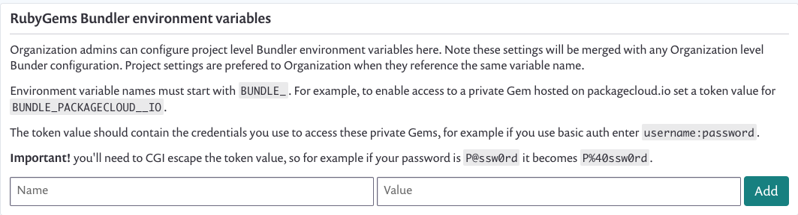

# Ruby 구성을 위한 비공개 gem 소스


**기능 가용성**\
이 기능은 베타 버전입니다. [Snyk 지원팀에 문의](https://support.snyk.io)하여 조직에 활성화할 수 있습니다.

이 안내서는 Snyk UI 통합에 관한 것입니다. CLI는 추가 구성 없이 개인 레지스트리가 있는 Ruby 프로젝트를 지원합니다.


Snyk에게 개인 gem이 호스팅되는 위치를 알려주는 구성을 추가할 수 있습니다. 이는 보통 Bundler 환경 변수로 추가하는 정보입니다.

이 구성을 추가한 후에는 Snyk이 해당 정보를 사용하여 풀/병합 요청을 만들 때 개인 종속성에 액세스하여 lockfile을 재생성할 수 있도록 Bundler가 해당 종속성에 도달할 수 있게 됩니다.

## Ruby를 위한 개인 gem 소스 구성

1. **설정 > 일반**으로 이동합니다.
2. `RubyGems Bundler 환경 변수` 섹션을 찾아서 화면 예제를 참조합니다.
3. 환경 변수 이름과 값을 추가하여 gem 소스에 대한 자격 증명을 정의합니다.\
   이는 보통 개발자 머신, CI 환경 또는 둘 다에 설정한 값과 동일합니다.\
   예: 이름 - `BUNDLE_GITHUB__COM`, 값 - `abcd0123generatedtoken:x-oauth-basic`
4. 구성을 테스트하려면, 개인 레지스트리에서 gem이 포함된 프로젝트에서 Pull/Merge 요청을 열어 lockfile이 업데이트되고 Snyk Fix Pull 요청에 포함된 것을 볼 수 있습니다.

<figure><figcaption>
RubyGems Bundler 환경 변수
</figcaption></figure>

## Ruby를 위한 개인 gem 소스 구성 요구 사항

구성 요구 사항 목록은 다음과 같습니다:

* 변수 값은 CGI 이스케이핑이 되어야 합니다.
* Gem 소스는 `https` URL을 사용해야 합니다.\
  예: **지원됨:** `gem "privvy", git: "https://github.com/testexample/ruby-gem-for-private-source"`\
  **지원되지 않음:** `gem "privvy", git: "git@github.com:testexample/ruby-gem-for-private-source"`
* Gem 소스는 공개적으로 해결 가능해야 합니다, 즉, 방화벽 뒤에 숨겨져 있으면 안 됩니다.
* 변수는 [Bundler Gem Sources를 위한 자격 증명 문서](https://bundler.io/v1.16/bundle_config.html#CREDENTIALS-FOR-GEM-SOURCES)에 따라 구성되어야 합니다.
