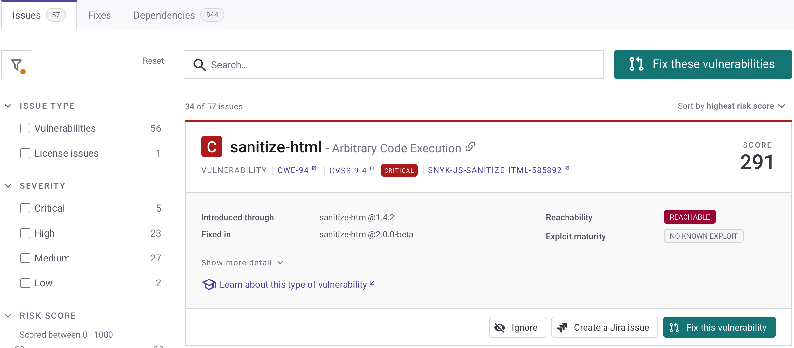
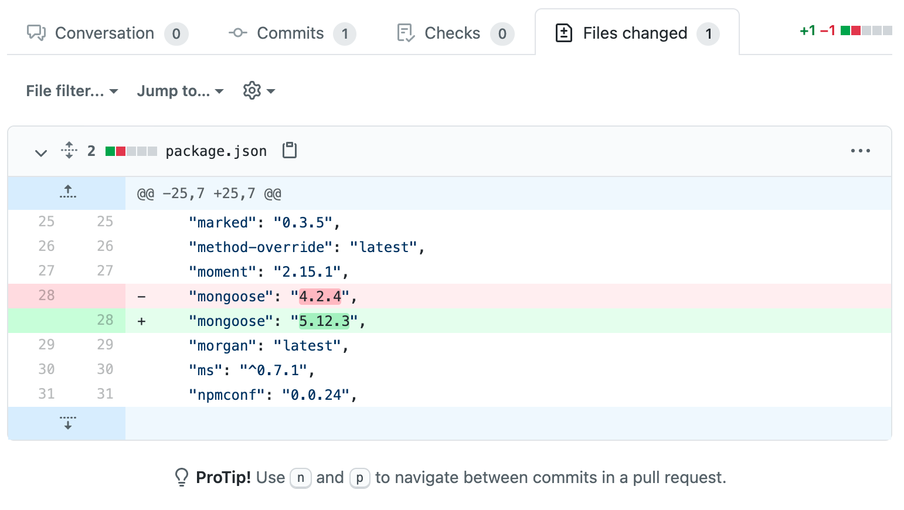

# 오픈 소스 라이브러리 및 라이선스 스캔하기

Snyk 오픈소스를 사용하여 오픈 소스 라이브러리를 스캔할 수 있습니다:

* [Snyk Web UI](../../../getting-started/snyk-web-ui.md)에서
* [IDE](https://docs.snyk.io/integrations/ide-tools)로
* [CI/CD 통합](../../../scm-ide-and-ci-cd-integrations/snyk-ci-cd-integrations/)을 통해
* [Snyk CLI](../../../snyk-cli/scan-and-maintain-projects-using-the-cli/snyk-cli-for-open-source/)로
* [Snyk API](../../../snyk-api/reference/test-v1.md)를 통해

## Snyk 오픈소스를 Web UI에서 사용하기 위한 사전 요구 사항

Snyk 오픈소스를 사용하여 오픈 소스 라이브러리를 스캔하기 전에 [시작하기](../../../getting-started/) 단계를 완료했는지 확인하세요.

## 오픈 소스 라이브러리의 취약점 확인

가져온 프로젝트의 취약점 결과를 확인할 수 있습니다. 가져오기 후 **프로젝트** 페이지가 기본적으로 표시되며, 가져온 Snyk 프로젝트의 취약점 정보가 함께 표시됩니다. 이는 즉, 스캔한 저장소인 **타겟**으로 그룹화됩니다.

**타겟**을 확장하여 프로젝트의 취약점 정보를 확인할 수 있으며, 각 심각도 수준으로 그룹화된 이슈 수를 볼 수 있습니다:

프로젝트를 클릭하여 해당 프로젝트의 이슈 페이지를 열고, 각 이슈가 발생한 모듈, 이를 해결하는 방법 및 취약점 자체에 대한 자세한 정보를 볼 수 있는 이슈 카드가 표시됩니다.

자세한 내용은 [프로젝트 정보 보기](../../../snyk-admin/snyk-projects/project-information.md)를 참조하세요.

## 오픈 소스 라이브러리의 취약점 수정

일부 언어에 대해 Snyk는 수정된 풀/병합 요청을 사용하여 취약점을 처리할 수 있습니다. 자세한 내용은 [Snyk Open Source를 통한 자동 및 수동 PR](../../pull-requests/snyk-pull-or-merge-requests/)을 참조하세요.

프로젝트의 **이슈** 카드로 이동합니다.

<figure><figcaption>
오픈 소스 프로젝트의 이슈 탭
</figcaption></figure>

취약점을 수정하려면:

1. **이 취약점 수정**을 클릭하여 이 문제에 대한 수정 PR을 엽니다. 여러 문제를 수정하려면 **이 취약점 수정**을 클릭합니다.
2. 선택한 취약점이 표시되는 **수정 PR 열기** 화면이 열립니다.
3. 수정하거나 수정하지 않으려는 이슈를 확인란을 선택하거나 선택 취소합니다.
4. 화면 하단으로 스크롤하여 **수정 PR 열기**를 클릭합니다.
5. Snyk는 PR에 작용하고 결과 화면이 표시됩니다.
6. 선택 사항로 **변경된 파일** 탭을 선택하여 실제로 변경된 내용을 확인할 수 있습니다.

<figure><figcaption>
오픈 소스 프로젝트에 대한 Fix PR을 트리거한 후 GitHub에서 변경된 파일 탭
</figcaption></figure>

자세한 내용은 [취약점 수정](../manage-vulnerabilities/fix-your-vulnerabilities.md)을 참조하세요.
