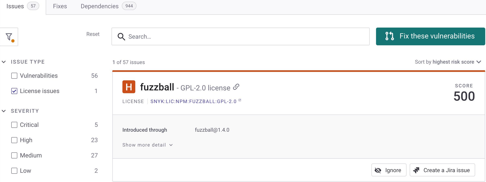
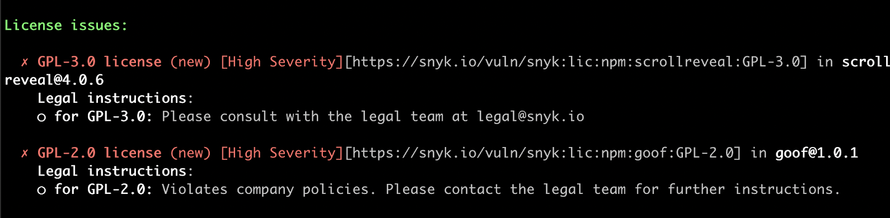
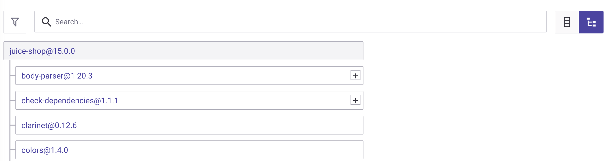

# Snyk 라이선스 규정 준수 관리


**기능 가용성**

Snyk 라이선스 준수 관리는 엔터프라이즈 플랜에서만 사용할 수 있습니다. 자세한 내용은 [요금제 및 가격 책정](https://snyk.io/plans/)을 참조하십시오.


Snyk 라이선스 준수 관리를 사용하여 코드 내의 오픈 소스 라이선스 준수를 확인할 수 있습니다.

Snyk 기본 라이선스 정책은 프로젝트에서 사용하는 오픈 소스 패키지에서 잠재적인 라이선스 문제를 식별하는 방법을 정의합니다. 이 정책은 그룹에서 생성된 모든 조직에 적용됩니다.

## **Snyk 라이선스 준수 관리 사용 전 요구 사항**

Snyk 라이선스 준수 관리로 라이선스 준수를 확인하기 전에 다음 사항을 준비해야 합니다:

* Snyk [유료 플랜](https://snyk.io/plans/)에 가입했어야 합니다.
* 프로젝트를 통합하고 가져와야 합니다. 자세한 내용은 [시작하기](../../../getting-started/)를 참조하십시오.

## **라이선스 정책 정의**

라이선스 문제에 대한 효과적인 조치를 취하려면 라이선스 유형을 기반으로 이러한 조치를 정의하는 정책을 명시해야 합니다. 정책은 비즈니스 부문 등 요인에 따라 조직 내에서 다양한 요구 사항을 캡처하는 방법을 제공합니다. 회사에 특화된 정책을 만들기 위해 법률팀과 협력하십시오.

Snyk 그룹 기본 라이선스 정책을 열려면 그룹에서 **정책** 메뉴 옵션으로 이동하십시오.

### 정책 규칙 생성

각 정책에는 허용되는 라이선스와 사용이 금지된 라이선스를 상세히 설명하고 라이선스 위반의 심각성 수준을 나타내는 규칙이 포함되어 있습니다. 예를 들어, 내부 전용 라이선스 문제의 심각성 수준은 외부 공개용 문제보다 덜 심각할 수 있습니다.

조직을 위해 여러 라이선스 정책을 생성하고 편집할 수 있습니다. 자세한 내용은 [라이선스 정책 및 규칙 생성](../../../manage-risk/policies/license-policies/create-a-license-policy-and-rules.md)을 참조하십시오.

## 라이선스 준수 문제 보기

Snyk의 [Git 기반 통합](../../../scm-ide-and-ci-cd-integrations/snyk-scm-integrations/)은 정기 작업 중 라이선스 스캔을 지원합니다. 스캔 중 라이선스 문제는 **문제** 탭에서 필터링할 수 있는 목록으로 나타납니다.

<figure><figcaption>
의존성 프로젝트 내 문제 개요
</figcaption></figure>

아래 예시는 GPL-2.0 라이선스에 대한 심각한 문제를 보여주며, 해당 라이선스에 대한 정책에서 정의된 지침을 함께 제공합니다.

`snyk test`를 실행한 후 Snyk CLI 도구를 사용하여 또한 라이선스 문제를 확인할 수 있습니다.

<figure><figcaption>
Snyk CLI에서 라이선스 문제 개요
</figcaption></figure>

### **모든 라이선스 정보 보기**

조직 내 모든 프로젝트에서 사용 중인 라이선스를 상세히 보고 공유할 수 있으며, 모든 오픈 소스 구성 요소와 라이선스 목록을 볼 수 있는 보고서를 볼 수 있습니다. 저작권 정보가 2024년 1월 8일 이후로는 더 이상 보고되지 않습니다.

### **라이선스 종속성 보기**

Snyk은 **의존성** 탭에서 직접 및 간접 종속성 양쪽의 라이선스 문제를 보여줍니다.

.png>)

트리 아이콘을 클릭하여 전체 종속성 트리를 볼 수 있습니다. 이를 통해 라이선스 문제를 도입한 종속성을 확인할 수 있습니다:

<figure><figcaption>
의존성 개요 - 트리 뷰
</figcaption></figure>

## **라이선스 문제 해결**

스캔 중 식별된 라이선스 문제를 해결하려면 라이선스 조건 및 정책에 따라 조치를 취할 수 있습니다. 예를 들어, 라이선스 위반이 발견된 경우, 이 문제는 해당 위반을 추가한 종속성을 교체하거나 법률 팀에 접근함으로써 완화할 수 있습니다.

대안으로 문제를 무시할 수도 있습니다. 자세한 내용은 [문제 무시](../../../manage-risk/prioritize-issues-for-fixing/ignore-issues/)를 참조하십시오.
