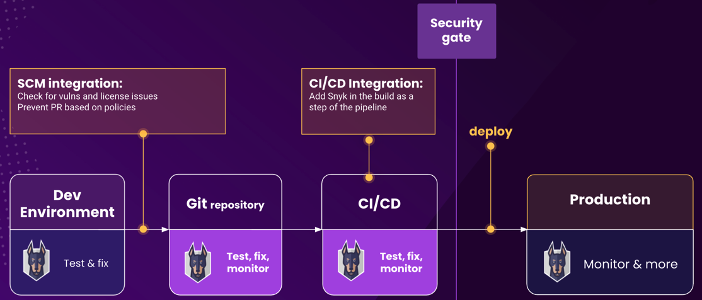

# Git 저장소 및 CI/CD 비교

[Git 저장소](snyk-scm-integrations/) 및 [CI/CD 파이프라인](snyk-ci-cd-integrations/) 통합은 일반적으로 사용됩니다.&#x20;

다음 다이어그램에서 볼 수 있듯이 Git 저장소(SCM) 통합을 사용하여 취약점 및 라이선스 문제를 확인하고 정책에 따라 풀 리퀘스트를 방지할 수 있습니다. 개발 환경에서 테스트하고 수정한 다음 Git 저장소 통합을 사용하여 테스트, 수정 및 모니터링할 수 있습니다. Git 저장소 통합을 사용하여 애플리케이션 보안을 향상시키고 취약 코드를 코드베이스로 허용하지 않고 취약점에 대한 빠른 시각화를 얻을 수 있습니다.

<figure><figcaption>
Snyk 통합
</figcaption></figure>

다이어그램에 나타난대로 CI/CD 통합을 통해 빌드 단계로 Snyk를 추가하여 테스트, 수정 및 모니터링할 수 있습니다. 취약한 응용프로그램이나 구성 요소(레지스트리)를 배포하지 않고 응용프로그램을 안전하게 유지하기 위해 빌드에 Snyk를 사용하세요.

Git 저장소 통합 또는 CI/CD 통합을 또는 둘 다 구현할 수 있습니다. 구현 방법은 팀의 흐름 및 조직 프로세스에 따라 다를 것입니다.

## Git 저장소 고려 사항

코드 및 배포된 애플리케이션의 보안을 향상시키기 위해 Git 저장소 통합을 사용하세요.

Git 저장소 통합은 다음을 통해 소프트웨어 개발 수명주기 초기에 스캐닝 및 시각화를 제공합니다:

* 모든 가져온 프로젝트의 자동 일일 재스캔
* 제출된 모든 PR에 대한 보안 문제 확인
* 기술적 부채를 해결하기 위해 의존성 업그레이드 PR 생성
* 주소지 않은 기존 취약점에 대한 수정 PR 생성

Git 저장소 통합은 CI/CD 파이프라인에서 리소스를 소모하지 않습니다.

더 자세한 내용은 [SCM 통합 배포 권고 사항](snyk-scm-integrations/introduction-to-git-repository-integrations/deployment-recommendations-for-scm-integrations.md)을 참조하세요.

## CI/CD 고려 사항

다음을 달성하기 위해 CI/CD 통합을 사용하세요:

* 코드 및 배포된 애플리케이션을 안전하게 유지
* 빌드를 중단하고 Snyk에 보고하거나 Snyk에만 보고하여 프로덕션으로 푸시된 구성 요소에 시각성을 제공

CI/CD 통합을 구현할 때 다음을 고려하세요:

* 일부 패키지 관리자는 로컬 컨텍스트가 필요하며 Scala, Gradle, Go 모듈, Artifactory 및 Nexus와 같은 환경에서 실행하는 것이 더 좋습니다.
* CI/CD 통합은 빌드를 차단하는 세밀한 옵션을 제공하여 강력한 게이트키퍼 역할을 합니다.
* CI/CD 통합은 컨테이너 및 인프라 코드 스캔에 대한 모범 사례입니다. IaC의 경우 템플릿화되지 않은 IaC 선언보다 Terraform 계획 파일을 스캔하여 더 정확한 결과를 얻을 수 있습니다.

더 자세한 내용은 [Snyk CI/CD 통합 배포 및 전략](snyk-ci-cd-integrations/snyk-ci-cd-integration-deployment-and-strategies/)을 참조하세요.