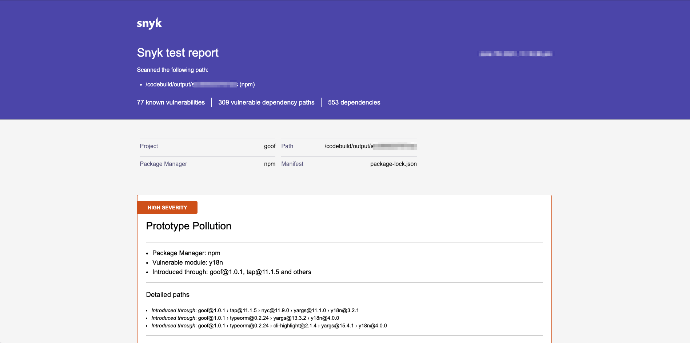

# AWS CodePipeline 테스트 보고서 세부 정보


**AWS CodePipeline을 위한 Snyk 통합이 중단될 예정입니다**

\
**작업 필요**

서비스 및 고객의 보안을 보호하기 위해 Snyk는 **AWS CodePipeline**과의 통합을 폐지하기 시작했습니다. 중단을 최소화하기 위해 **AWS CodeBuild** 및 Snyk CLI를 사용하여 동일한 사용 사례와 기능을 지원하는 대체 방법으로 전환하는 것을 권장합니다.&#x20;

**이주 일정**

2024년 **10월 30일**부터는 새로운 또는 기존의 파이프라인에 Snyk 플러그인을 추가하거나 수정할 수 없습니다. 기존 파이프라인은 6개월 동안 현재 상태로 계속 작동하겠지만 가능한 빨리 새로운 프로세스로 이주하는 것이 권장됩니다. CI/CD 워크플로우를 방해하지 않기 위해 **2025년 4월 30일** 이전에 Snyk CLI로 전환해야 합니다. [마이그레이션 가이드](https://docs.snyk.io/scm-ide-and-ci-cd-integrations/snyk-ci-cd-integrations/aws-codepipeline-integration-by-adding-a-snyk-scan-stage/migrating-to-aws-codebuild)에서 Snyk CLI를 AWS CodeBuild와 함께 사용하는 방법에 대해 참조하십시오.\

AWS CodeBuild와 Snyk CLI가 요구 사항을 충족할 것으로 확신합니다.&#x20;


Snyk는 애플리케이션의 매니페스트 파일을 분석하고 Snyk 취약점 데이터베이스와 종속성 목록을 연관시킵니다. [Snyk는 오픈 소스 코드에 대한 자세한 보고서를 제공합니다](../../../manage-issues/reporting/legacy-reports/legacy-reports-overview.md). 매니페스트 파일을 분석함으로써 Snyk는 전체 종속성 트리를 작성하여 직간접 종속성(직간접 종속성은 Snyk가 감지하는 취약성의 78%를 차지합니다)을 정확하게 식별합니다. 이를 통해 Snyk는 어떻게 취약성이 응용 프로그램에 도입되었는지 정확히 보여줄 수 있습니다.


보고서는 만료되기 전에 14일 동안 저장됩니다. 후속 파이프라인 실행은 보고서를 업데이트하고 보존 기간을 재설정합니다.
