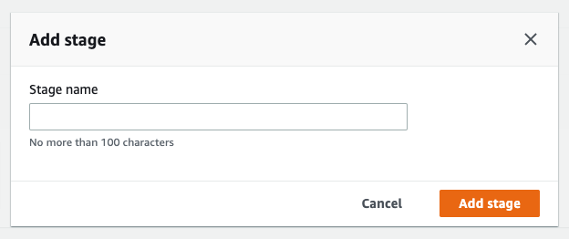
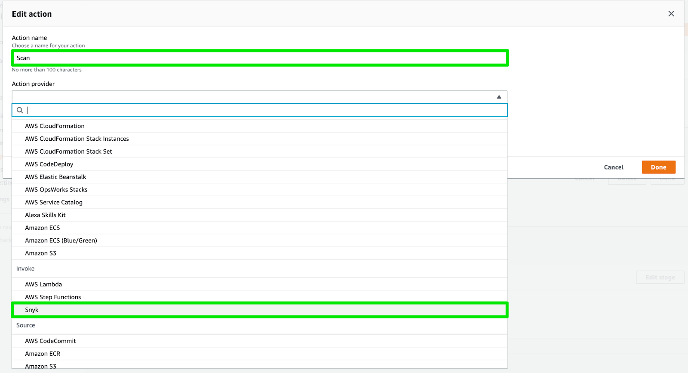
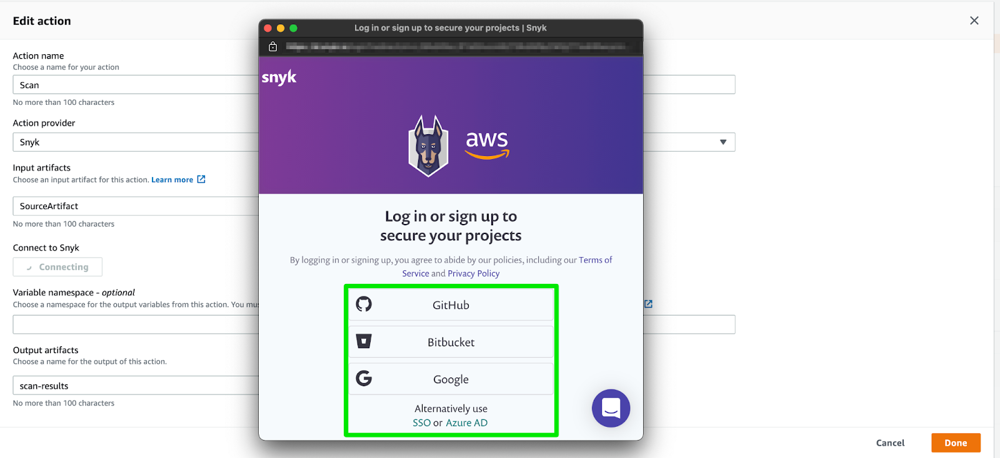
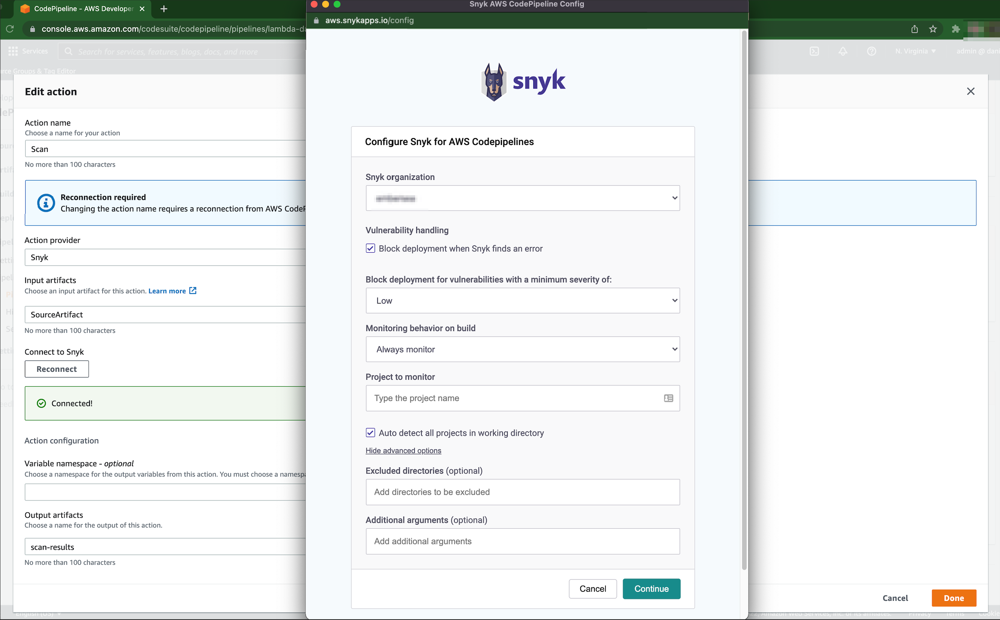
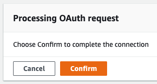

# AWS CodePipeline 통합을 위한 설정 단계


**AWS CodePipeline을 위한 Snyk 통합이 중단될 예정입니다**

\
**조치 필요**

우리 서비스와 고객들의 보안을 보호하기 위해 Snyk은 **AWS CodePipeline**과의 통합을 폐지하기 시작했습니다. 중단을 최소화하기 위해 **AWS CodeBuild** 및 Snyk CLI를 사용하는 것을 권장합니다. 이는 동일한 사용 사례와 기능을 지원할 것입니다.

**이주 일정**

**2024년 10월 30일**부터는 새로운 또는 기존 파이프라인에 Snyk 플러그인을 추가하거나 수정할 수 없게 될 것입니다. 기존 파이프라인은 6개월 동안 그대로 작동할 것이지만, 가능한 빨리 새로운 프로세스로 이주하는 것을 권장합니다. CI/CD 워크플로우에 중단을 피하려면 **2025년 4월 30일** 이전에 Snyk CLI로 이주해야 합니다. Snyk CLI를 AWS CodeBuild와 함께 사용하도록 마이그레이션하려면 이 [마이그레이션 가이드](https://docs.snyk.io/scm-ide-and-ci-cd-integrations/snyk-ci-cd-integrations/aws-codepipeline-integration-by-adding-a-snyk-scan-stage/migrating-to-aws-codebuild)를 참조하십시오.

AWS CodeBuild 및 Snyk CLI가 요구 사항을 충족할 것임을 확신합니다.


Snyk을 AWS CodePipeline 콘솔에서 직접 시작할 수 있습니다.


CodePipeline과의 Snyk 통합에는 UI 기반의 인증 단계가 설정의 일부로 필요합니다. 이는 CloudFormation 또는 Terraform과 같은 비대화식 설정 방법과 호환되지 않습니다.


다음 단계를 따라 새로운 또는 기존 파이프라인에 Snyk를 추가하십시오:

## 단계 1: 단계 추가

소스 단계 이후 어느 시점이든 Snyk 스캔 단계를 추가하여 애플리케이션을 CI/CD 파이프라인의 다른 단계에서 테스트할 수 있습니다.

**편집**을 클릭하고 **스캔 단계 추가**를 클릭하십시오.

## 단계 2: 액션 그룹 추가

**액션 그룹 추가**를 클릭하여 **액션 편집** 창을 열어줍니다:

액션의 이름을 지정한 다음 **동작 제공자**로 **Snyk**을 선택하십시오.

연결 프로세스를 시작하려면 **Snyk 연결**을 클릭하십시오.

## 단계 3: Snyk에 연결

Snyk에 대한 인증 방법을 선택하여 Snyk이 오픈 소스 코드를 스캔 시작할 수 있도록 허용합니다.

## 단계 4: 설정 구성

다음 옵션을 구성할 수 있습니다:

* **Snyk 조직:** 발견 보고서가 저장되는 Snyk 조직을 선택합니다.
* **취약점 처리:** 취약점이 발견되었을 때 파이프라인 동작을 정의합니다. **Snyk이 오류를 발견하면 배포 차단** 확인란이 선택되면 파이프라인이 실패하고 CodePipeline의 다음 단계로 진행하지 않습니다.
* **최소 심각도로 취약성을 가진 취약성에 대해 배포 차단**: **Low**|**Medium**|**High**|**Critical**: 특정 수준 이상의 취약성만 보고합니다.
*   **빌드에서의 모니터링 동작**: AWS CodePipeline에서 프로젝트를 모니터링하는 기준을 설정합니다. 가능한 옵션은:

    * **항상 모니터링**: 테스트 결과와 독립적으로 프로젝트 스냅샷이 생성됩니다.
    * **테스트 실패 시**: 테스트 실패 시에만 프로젝트 스냅샷이 생성됩니다.
    * **테스트 통과 시**: 테스트 성공 시에만 프로젝트 스냅샷이 생성됩니다.
    * **모니터링하지 않음**: 프로젝트 스냅샷이 생성되지 않습니다.

    **모니터링하지 않음** 옵션을 선택하지 않으면 **모니터링할 프로젝트** 필드가 필수입니다. 이는 이름 충돌로 인한 의도치 않은 프로젝트 오버라이드를 방지하기 위함입니다. 보고서는 선택된 **Snyk 조직**과 연결됩니다.
* **모니터링할 프로젝트**: 프로젝트 그룹 이름을 지정합니다. 이는 CLI에서 `remote-repo-url` 옵션 사용과 동일합니다. 이름에 공백을 허용하지 않습니다. **모니터링하지 않음** 옵션이 선택된 경우를 제외하고 이 필드는 필수입니다.
* **작업 디렉토리의 모든 프로젝트 자동 감지**: 이 확인란을 선택하면 AWS CodePipeline의 모든 프로젝트를 자동으로 감지합니다. 이 옵션이 선택되지 않으면 플러그인은 첫 번째로 발견하는 프로젝트를 테스트합니다. 이는 `--all-projects` 옵션을 사용하여 모든 프로젝트를 감지하기 때문입니다.
* **고급 옵션** (모두 선택 사항):
  * **제외할 디렉토리**: **모든 프로젝트 자동 감지**가 선택되었을 때만 이 옵션이 표시됩니다. 제외할 하위 디렉토리를 지정하십시오. 디렉터리는 쉼표로 구분되어야 합니다.
  * **테스트할 매니페스트 파일의 사용자 정의 경로**: **모든 프로젝트 자동 감지**가 선택되지 않았을 때만 이 옵션이 나타납니다. Snyk가 스캔할 매니페스트 파일의 경로를 지정할 수 있습니다. 이 옵션을 생략하면 Snyk가 프로젝트의 매니페스트 파일을 자동으로 감지하려고 합니다.
  * **추가 인수:** `test` 및 `monitor`에 적용할 수 있는 여러 추가 옵션이 허용됩니다. 다음과 같은 옵션이 있습니다: `--dev`, `--detection-depth`, `--prune-repeated-subdependencies`, `--strict-out-of-sync`, `--yarn-workspaces`, `--skip-unresolved`. 이러한 옵션에 대한 자세한 내용은 [CLI 도움말 문서](../../../snyk-cli/commands/)를 참조하십시오.


이전에 구성된 단계의 구성 설정을 변경하려면 **Snyk** 링크를 클릭하십시오.


프롬프트가 표시되면 Snyk에 연결을 확인하십시오.

Snyk에 성공적으로 연결한 후에 파이프라인을 저장하십시오.

이로써 CodePipeline의 Snyk 단계를 구성하여 응용 프로그램을 테스트할 수 있습니다. 최신 변경 사항을 발표하려면 최신 변경 사항을 적용하려면 CodePipeline 옵션을 사용하십시오.
