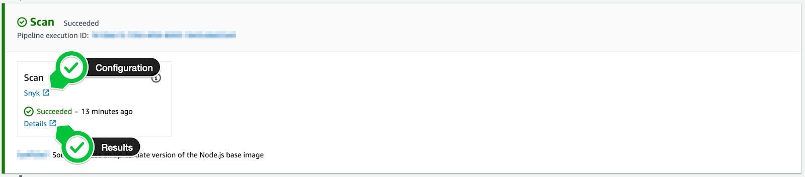
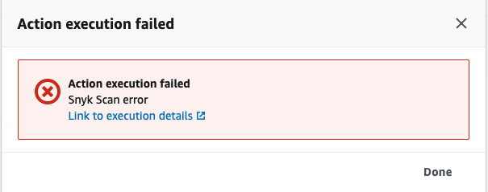

# AWS CodePipeline 스캔 결과 보기


**AWS CodePipeline에 대한 Snyk 통합이 중단될 예정입니다**

\
**작업이 필요함**

서비스 및 고객의 보안을 보호하기 위해, Snyk는 **AWS CodePipeline**과의 통합을 폐기하기 시작했습니다. 혼란을 최소화하기 위해 **AWS CodeBuild** 및 Snyk CLI를 사용하여 동일한 사용 사례와 기능을 지원하는 대안으로 전환하는 것을 권장합니다.&#x20;

**마이그레이션 일정**

2024년 10월 30일부터 **효과적**으로, 새로운 또는 기존의 파이프라인에 Snyk 플러그인을 더 이상 추가하거나 수정할 수 없게됩니다. 기존 파이프라인은 6개월 동안 작동할 예정이지만, 가능한 빨리 새로운 프로세스로 마이그레이션하는 것을 권장합니다. CI/CD 워크플로를 방해하지 않기 위해 **2025년 4월 30일** 이전에 Snyk CLI로 전환해야 합니다. [마이그레이션 가이드](https://docs.snyk.io/scm-ide-and-ci-cd-integrations/snyk-ci-cd-integrations/aws-codepipeline-integration-by-adding-a-snyk-scan-stage/migrating-to-aws-codebuild)의 단계를 참조하여 AWS CodeBuild에서 Snyk CLI를 사용하도록 변경하십시오.

AWS CodeBuild 및 Snyk CLI가 요구 사항을 충족할 것이라고 확신합니다.&#x20;


AWS CodePipeline 콘솔에서 **스캔 단계**의 **세부 정보**를 클릭하여 스캔 결과를 볼 수 있습니다.

다음 스크린샷에 나와 있는 것처럼 자세한 취약성 보고서를 보려면 **실행 세부 정보로 이동** 링크를 클릭하십시오.

