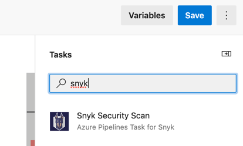
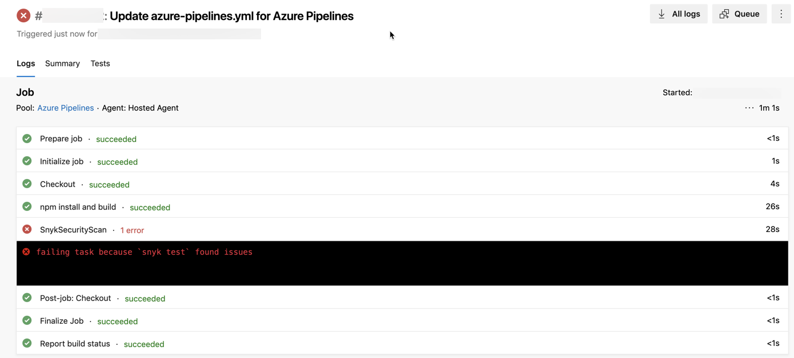

# 파이프라인에 Snyk 보안 작업 추가하기

## **파이프라인에 Snyk 보안 작업을 추가하기 위한 전제 조건**

* 테스트하려는 코드의 저장소 내에 파이프라인이 있어야 합니다.
* Azure Repos 마법사를 사용하여 파이프라인을 만든 경우 해당 파일은 `azure-pipelines.yml`이라고 합니다.
* 이 저장소에 여러 서비스 연결이 있는 경우, 파이프라인에 어떤 것을 사용해야 하는지 Snyk 관리자에게 문의하세요.
* 컨테이너를 테스트할 때 사용할 추가 기본 이미지 데이터를 위해 Dockerfile을 추가하려는 경우, 이미지가 빌드되었는지 확인하세요.

## **Snyk 보안 작업을 파이프라인에 추가하는 데 필요한 요구 사항**

이 확장 프로그램을 사용하려면 빌드 에이전트에 Node.js와 npm이 설치되어 있어야 합니다. 이들은 모든 Microsoft 호스팅된 빌드 에이전트에 기본적으로 제공됩니다. 그러나 자체 호스팅된 빌드 에이전트를 사용하는 경우, Node.js와 npm을 명시적으로 활성화하고 [PATH](https://en.wikipedia.org/wiki/PATH_\(variable\))에 있는지 확인해야 할 수 있습니다. 이는 파이프라인에 Snyk 보안 스캔 작업을 추가하기 전에 [Microsoft의 NodeTool 작업](https://docs.microsoft.com/en-us/azure/devops/pipelines/tasks/tool/node-js?view=azure-devops)을 사용하여 수행할 수 있습니다.

## **파이프라인에 Snyk 보안 작업을 추가하는 단계**

1. Snyk 보안 스캔 작업을 생성하거나 기존 작업을 편집하는 동안 파이프라인에 추가하세요. 자세한 내용은 [Azure 파이프라인 문서](https://docs.microsoft.com/en-us/azure/devops/pipelines/?view=azure-devops)를 참조하세요.
2. Azure에서 취약점을 스캔하려는 파이프라인에 액세스하세요. 편집을 열고 Snyk 작업을 삽입하려는 위치 바로 전에 빌드 단계가 포함되었는지 확인하세요. 이는 필수 사항은 아니지만 프로젝트 간 일관성을 유지하기 위해 최선의 방법으로 간주됩니다.
3. **assistant**를 열고 Snyk 보안 스캔 작업을 검색하고 다음 화면에 표시된 대로 클릭하세요. 구성 패널이 assistant 위에 열립니다.\
   
4. 구성에서 필드를 작성하세요. 매개변수에 대한 자세한 내용은 [Snyk 보안 스캔 작업 매개변수 및 값](snyk-security-scan-task-parameters-and-values.md)에서 찾을 수 있습니다. **참고:** **Snyk**이 문제를 찾을 경우 빌드를 실패로 처리하려면 **Fail build if Snyk finds issue** 옵션을 선택하세요. **Fail build if Snyk finds issue** 옵션을 해제하면 **Snyk** 작업이 취약점을 테스트하지만 파이프라인 작업을 실패시키지 않습니다. **컨테이너 이미지를 테스트**할 때, dockerfilePath 속성을 사용하여 Dockerfile의 경로를 지정하여 기본 이미지의 문제에 대한 추가 정보를받을 수 있습니다. 컨테이너를 테스트할 때 추가 기본 이미지 데이터를 위한 Dockerfile을 추가하려는 경우 이미지가 빌드되었는지 확인하세요.
5. 파이프라인 내부에 커서를 놓고 **npm publish** 또는 **docker push**와 같은 배포 단계 앞에 배치하세요. **참고:** 파이프라인 내에서 Snyk 보안 스캔 작업을 여러 번 사용할 수 있습니다. 예를 들어 여러 프로젝트 매니페스트 파일을 테스트하려는 경우 또는 응용 프로그램 및 컨테이너 이미지를 모두 테스트하려는 경우에 유용할 수 있습니다.
6.  구성 패널에서 **Add**를 클릭하세요. 작업이 커서가 위치한 곳에 삽입되며 다음과 유사합니다:

    ```
       - task: SnykSecurityScan@1
         inputs:
           testType: 'app'
           monitorWhen: 'always'
           failOnIssues: true
    ```

파이프라인에 포함되면 해당 작업은 파이프라인 실행 시마다 실행되며 결과는 Azure 파이프라인 출력 뷰에 표시됩니다:



> Snyk 작업이 빌드를 실패하게 하면 결과에서 `snyk test`로 인해 빌드 실패가 발생한 것을 나타내는 오류 메시지가 표시됩니다.
