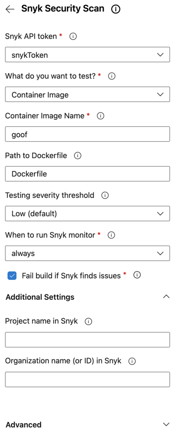
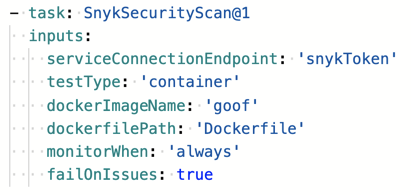

# 컨테이너 이미지 파이프라인을 위한 Snyk 작업의 예시

다음은 스크립트 내에서 Snyk 보안 스캔 작업의 예시입니다.

가장 일반적인 설정으로 채워진 경우, Azure의 구성 패널은 다음과 같이 보입니다:

<figure><figcaption>
Snyk Security Scan 구성 패널
</figcaption></figure>

다음은 동일한 구성을 파이프라인에 추가한 후의 모습을 보여줍니다.

