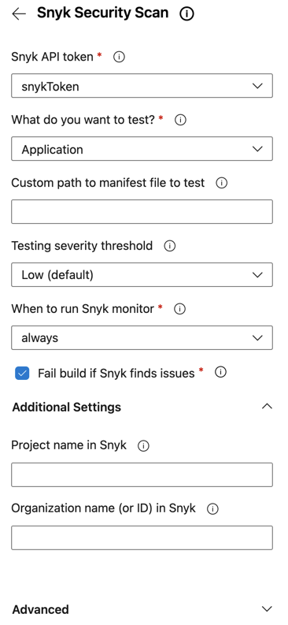
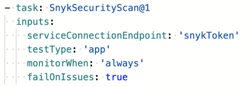

# Node.js (npm) 기반 애플리케이션을 테스트하는 Snyk 작업 예제

다음은 소프트웨어 구성 요소 분석(SCA)을 사용하여 애플리케이션이 사용하는 오픈 소스 패키지를 검토하기 위한 Node.js (npm) 애플리케이션을 테스트하는 Snyk 보안 스캔 작업 구성 및 매개변수 예제를 보여줍니다.

구성 패널은 다음과 같이 나타납니다:

<figure><figcaption>
Snyk 보안 스캔 구성 패널
</figcaption></figure>

**추가**를 클릭하면 작업이 다음과 같이 파이프라인에 추가됩니다:

