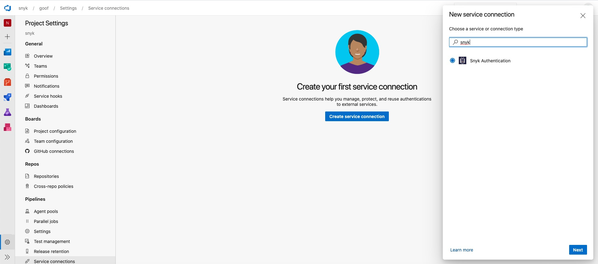
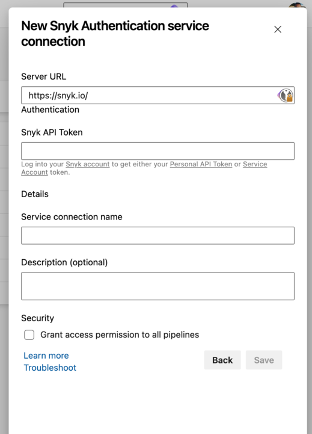

# Azure 파이프라인에 Snyk 확장 프로그램 설치하기

파이프라인 빌드의 일부로 Snyk 작업을 사용하기 위해, [Visual Studio Marketplace](https://marketplace.visualstudio.com/items?itemName=Snyk.snyk-security-scan)에서 확장 프로그램을 Azure DevOps 인스턴스로 설치하여 조직에 추가하세요.

## **Azure 파이프라인을 위한 Snyk 확장 프로그램 설치 전 요구 사항**

* [https://snyk.io/](https://snyk.io)에서 Snyk 계정을 생성하세요.
* 이 계정의 소유자 또는 관리자인지 확인하세요.

## **Azure 파이프라인을 위한 Snyk 확장 프로그램 설치 단계**

1. Snyk 계정에 액세스하세요.
2. 토큰:
   1. **무료 요금제**의 경우, **일반 계정 설정**으로 이동하여 개인 API 인증 토큰을 찾아 복사하고 저장하세요.
   2. **유료 요금제**의 경우, 통합하려는 조직으로 이동한 다음 **설정**으로 이동하여 새 서비스 계정 토큰을 생성하세요. 이를 복사하고 저장하세요.
3. Azure DevOps 계정에 접속하고 **Extensions -> Browse marketplace**로 이동하세요.
4. **Snyk Security Scan** 확장 프로그램을 검색하고 **Get it free**를 클릭하세요.
5. **프로젝트 설정** → **파이프라인** → **서비스 연결**을 통해 프로젝트에 새 **서비스 연결**을 생성하세요.
6. **Snyk Authentication** 서비스 연결을 선택하세요:
   1. Snyk 인증 서비스 연결 양식에 **Snyk API 토큰**을 입력하세요.
   2. **저장**을 클릭하여 새 서비스 연결이 서비스 연결 목록에 나타나는지 확인하세요.

<figure><figcaption>
첫 번째 서비스 연결 생성
</figcaption></figure>

<figure><figcaption>
새 Snyk 인증 서비스 연결
</figcaption></figure>


시스템 기본값이 아닌 데이터 센터를 사용 중이라면 [Custom API endpoints](https://docs.snyk.io/scm-ide-and-ci-cd-integrations/snyk-ci-cd-integrations/azure-pipelines-integration/custom-api-endpoints) 섹션을 참조하세요.
