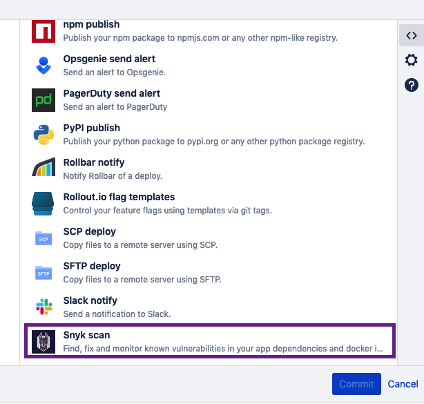
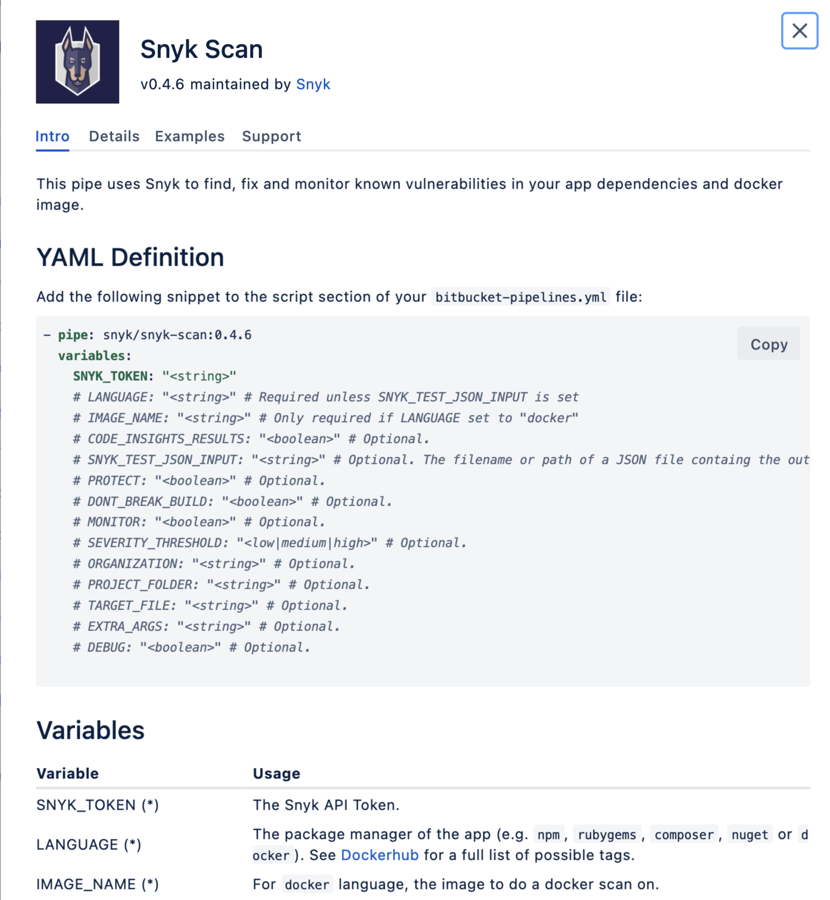

# Snyk 파이프를 사용한 Bitbucket 파이프라인 통합

Snyk은 연속적인 통합/전달 (CI/CD) 워크플로의 일부로 응용 프로그램 종속성 및 Docker 이미지를 보안 취약점으로 쉽게 검사하기 위해 **Snyk 파이프**를 사용하여 Bitbucket 파이프라인과 통합합니다.

[Bitbucket Pipes](https://bitbucket.org/blog/meet-bitbucket-pipes-30-ways-to-automate-your-ci-cd-pipeline)를 사용하면 사용자는 준비된 작업 그룹으로 Bitbucket 파이프라인 CI/CD 워크플로를 사용자 정의하고 자동화하여 Bitbucket 인터페이스에서 복사하여 붙여넣기로 파이프라인 내에 추가할 수 있습니다.

Snyk 파이프를 사용하면 설정에 따라 CI/CD 워크플로의 다른 지점에서 취약성을 테스트하고 모니터링할 수 있으며 이를 빠르게 파이프라인에 추가할 수 있습니다. 결과는 Bitbucket 파이프라인 출력 보기에 표시되며 [Snyk Web UI](http://app.snyk.io)에서도 모니터링할 수 있습니다.

## Bitbucket에서의 Snyk 파이프 정보

빌드 디렉터리에서 Bitbucket 파이프라인은 사용자 정의된 사용 가능한 파이프 목록을 표시하며 다음 스크린샷과 유사한 목록을 표시합니다.

이 목록에서 **Snyk**을 찾아 클릭하여 파이프, 예제, 매개변수 및 값에 대한 정보를 확인할 수 있습니다.

## 설정 및 사용 상세

설정 및 사용 상세에 대한 자세한 내용은 다음 페이지를 참조하십시오:

* [Bitbucket 파이프라인 통합을 위한 언어 지원](language-support-for-bitbucket-pipelines-integration.md)
* [Bitbucket 파이프라인 통합: 작동 방식](bitbucket-pipelines-integration-how-it-works.md)
* [Bitbucket 파이프라인 통합을 위한 전제 조건](prerequisites-for-bitbucket-pipelines-integration.md)
* [Bitbucket 파이프라인 통합 구성](configure-your-bitbucket-pipelines-integration.md)
* [Snyk 파이프 추가 방법](how-to-add-a-snyk-pipe.md)
* [Snyk 파이프 매개변수 및 값 (Bitbucket 클라우드)](snyk-pipe-parameters-and-values-bitbucket-cloud.md)
* [Bitbucket 클라우드를 위한 Snyk 파이프 예제](https://bitbucket.org/snyk/snyk-scan/src/develop/README.md)