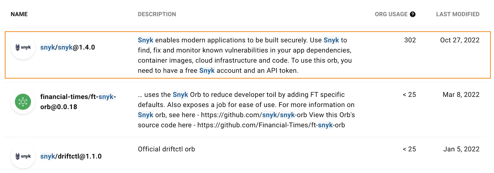
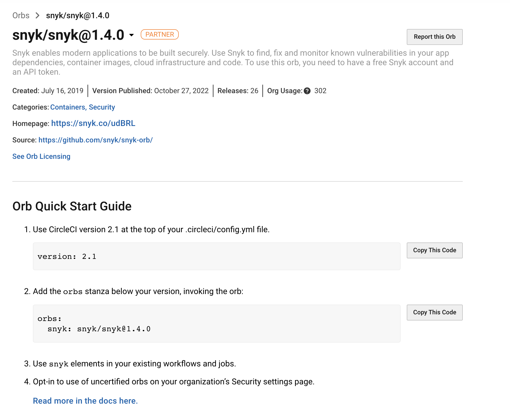

# Snyk Orb를 사용한 CircleCI 통합

Snyk은 **Snyk Orb**를 사용하여 [CircleCI](https://circleci.com)와 통합되며, 지속적 통합/지속적 전달 (CI/CD) 워크플로우의 일환으로 응용 프로그램 종속성과 Docker 이미지를 원활하게 스캔하여 오픈 소스 보안 취약점을 확인할 수 있습니다.

CircleCI는 사용자가 구성 파일에 추가할 수 있는 미리 만들어진 명령어 그룹인 [Orbs](https://circleci.com/orbs/)를 사용하여 쉽게 CI/CD 워크플로우를 생성할 수 있습니다.

Snyk Orb를 사용하면 구성에 기반하여 오픈 소스 취약점을 테스트하고 모니터링할 수 있어 CI/CD에 빠르게 Snyk 스캔을 추가할 수 있습니다. 그 결과는 CircleCI 출력 뷰에서 표시되며 또한 [Snyk.io](http://app.snyk.io)에서도 모니터링할 수 있습니다.

## Snyk Orb 구현

아래 정보를 참조하여 CircleCI로 시작하고, 구현부터 Snyk와 함께 그린 빌드까지 진행하세요.

* [Snyk Circle CI README](https://circleci.com/orbs/registry/orb/snyk/snyk) - 구성에 Snyk를 설정하는 데 필요한 모든 정보를 포함하며 매개변수 및 샘플 목록을 제공합니다.
* [응용 프로그램 및 이미지 스캔을 CI/CD 파이프라인에 추가하기 (Circle CI 블로그 게시물)](https://circleci.com/blog/adding-application-and-image-scanning-to-your-cicd-pipeline/) - Snyk Orb로 안전한 파이프라인을 설정하는 방법에 대해 설명합니다.

## CircleCI 통합 방법

CircleCI에 프로젝트를 추가하고 구성 파일에 Snyk Orb를 추가하면, 빌드 실행마다 Snyk Orb가 사용되어 다음과 같은 작업을 수행합니다.

### 스캔

1. 어플리케이션 종속성 또는 컨테이너 이미지를 취약점이나 오픈 소스 라이선스의 문제를 스캔하고, 해당 취약점 및 문제를 나열합니다.
2. Snyk가 취약점을 발견하면 구성에 따라 다음 중 하나를 수행합니다:
   * 빌드를 실패 처리
   * 빌드를 완료

### **모니터**

선택적으로 빌드가 성공적으로 완료되고 Snyk 단계에서 **MONITOR**를 **True**로 설정한 경우, Snyk은 Snyk 웹 UI에서 프로젝트 종속성의 스냅샷을 저장합니다. Snyk 웹 UI에서는 이슈를 모두 표시하는 종속성 트리를 확인하고, 기존 응용 프로그램 버전의 새 이슈에 대한 알림을 받을 수 있습니다.

## CircleCI 통합을 구현하기 위한 전제 조건

1. Snyk 계정을 생성하고 **Snyk API 토큰**을 **계정 설정**에서 검색합니다.
2. 관련 레포지토리를 CircleCI로 가져옵니다.
3. `설정 -> 보안 -> Orb 보안 설정`으로 이동하여 `third party Orbs에 대한 선택적 수락`을 허용해야 합니다.
4. 구성 파일(`config.yml`)이 버전 2.1을 따르는지 확인하세요.
5. 필요한 환경 변수를 CircleCI에 추가하세요 (`SNYK_TOKEN`으로 Snyk API 토큰 포함).

## CircleCI 레지스트리에서 Snyk Orb 세부 정보 가져오기

[Orbs 레지스트리](https://circleci.com/orbs/registry/)에서는 직접 사용자 정의된 사용 가능한 Orbs 목록을 표시합니다. 이 목록은 다음 이미지와 유사합니다.

<figure><figcaption>
Snyk Orb for CircleCI
</figcaption></figure>

이 목록에서 **Snyk** 라인을 찾아 클릭하면 Snyk Orb 정보 및 예제, 매개변수 및 값이 표시됩니다:


목록에서 최신 버전의 Snyk orb를 사용하는지 확인하십시오.


<figure><figcaption>
Snyk Orb information
</figcaption></figure>
