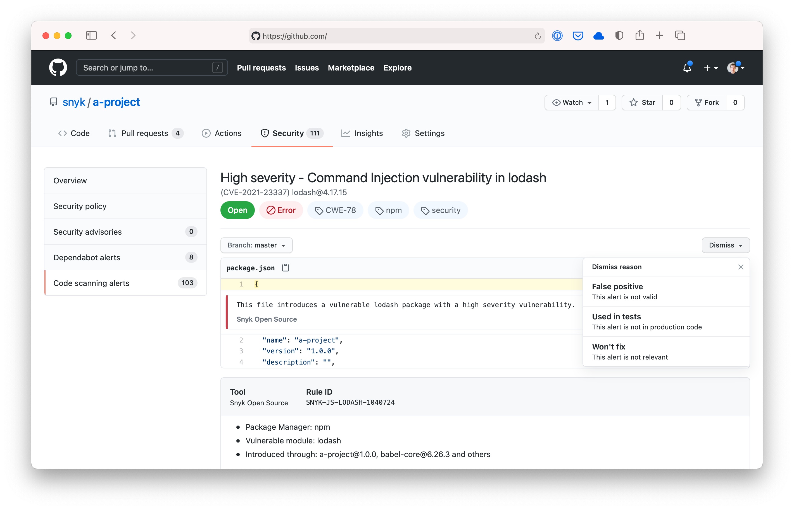

# Snyk 설정 및 취약성 검사를 위한 GitHub Actions

## GitHub Actions 통합 개요

Snyk는 [GitHub 프로젝트의 취약성을 확인](https://github.com/snyk/actions)하기 위해 [Snyk](https://snyk.io/)를 사용하는 데 사용할 수 있는 일련의 GitHub 액션을 제공합니다. 이러한 액션은 [Snyk CLI](https://docs.snyk.io/snyk-cli)를 기반으로 하며 액션의 [속성](https://docs.snyk.io/integrations/ci-cd-integrations/github-actions-integration#snyk-github-action-properties-for-open-source-languages-and-package-managers)에서 `args`를 사용하여 [모든 옵션과 기능](https://docs.snyk.io/snyk-cli/cli-reference)을 사용할 수 있습니다.

[Snyk 설정 액션](https://docs.snyk.io/integrations/ci-cd-integrations/github-actions-integration)도 있습니다.

추가 정보는 [GitHub 액션 기능](https://github.com/features/actions) 페이지와 [GitHub 사용자 지정 액션](https://docs.github.com/en/actions/creating-actions/about-actions) 문서를 참조하십시오.

사용하는 언어나 프로세스에 따라 다른 액션을 사용해야 합니다. 본 페이지는 **모든 Open Source 언어 및 패키지 관리자에 대한 GitHub Actions**에 적용되는 자세한 정보를 제공합니다. **오픈 소스 예시**에 대한 자세한 내용은 다음 섹션에 나열된 페이지 [Open Source 언어 및 패키지 관리자용 GitHub Actions](https://docs.snyk.io/integrations/ci-cd-integrations/github-actions-integration#github-actions-for-open-source-languages-and-package-managers)를 참조하십시오.

**Docker 및 IaC GitHub Actions 및 예시**에 대한 자세한 정보는 다음 섹션에 나열된 페이지 [Snyk Container 및 Snyk Infrastracture as Code용 GitHub Actions](https://docs.snyk.io/integrations/ci-cd-integrations/github-actions-integration#github-actions-for-snyk-container-and-snyk-infrastructure-as-code)를 참조하십시오.

**설정 액션과 예시**에 대한 자세한 정보는 [Snyk 설정 액션](https://docs.snyk.io/integrations/ci-cd-integrations/github-actions-integration/snyk-setup-action)을 참조하십시오.

### Open Source 언어 및 패키지 관리자용 GitHub Actions

* [Snyk CocoaPods 액션](https://docs.snyk.io/integrations/ci-cd-integrations/github-actions-integration/snyk-cocoapods-action)
* [Snyk dotNET 액션](https://docs.snyk.io/integrations/ci-cd-integrations/github-actions-integration/snyk-dotnet-action)
* [Snyk Golang 액션](https://docs.snyk.io/integrations/ci-cd-integrations/github-actions-integration/snyk-golang-action)
* ...

### Snyk Container 및 {{IaC}}용 GitHub Actions

* [Snyk Docker 액션](https://docs.snyk.io/integrations/ci-cd-integrations/github-actions-integration/snyk-docker-action)
* [Snyk Infrastracture as Code 액션](https://docs.snyk.io/integrations/ci-cd-integrations/github-actions-integration/snyk-infrastructure-as-code-action)

## Open Source 언어 및 패키지 관리자용 Snyk GitHub Action 속성

Open Source 언어 및 패키지 관리자를 위한 Snyk GitHub Action에는 `with`를 사용하여 기본 이미지로 전달되는 속성이 있습니다.

| 속성    | 기본값 | 설명                                                                                                                                                           |
| ------- | ------ | -------------------------------------------------------------------------------------------------------------------------------------------------------------- |
| args    |        | Snyk 이미지로의 기본 인수를 재정의합니다. [모든 옵션에 대한 Snyk CLI 명령 및 옵션 요약 참조](https://docs.snyk.io/snyk-cli/cli-reference) |
| command | test   | test 또는 monitor와 같은 실행할 명령을 지정합니다.                                                                                                              |
| json    | false  | stdout에 추가하여 snyk.json으로 결과를 저장합니다.                                                                                                              |

다른 Snyk GitHub Actions에 관련된 속성에 대한 자세한 내용은 [Snyk Container 및 Snyk Infrastracture as Code용 GitHub Actions](https://docs.snyk.io/integrations/ci-cd-integrations/github-actions-integration#github-actions-for-snyk-container-and-snyk-infrastructure-as-code) 및 [Snyk 설정 액션](https://docs.snyk.io/integrations/ci-cd-integrations/github-actions-integration/snyk-setup-action)에 나열된 페이지를 참조하십시오.

## Snyk GitHub Action 사용 예시

다음은 Open Source 프로젝트를 검사하고 모니터링하기 위해 Snyk GitHub Action을 사용하는 예시입니다. `snyk test` 대 `snyk monitor` 사용에 대한 정보는 [snyk test, monitor, and protect 사이의 차이점](https://support.snyk.io/s/article/What-are-the-differences-among-snyk-test-monitor-and-protect)을 참조하십시오.

각 언어, 패키지 관리자 및 프로세스에 특정한 예시는 [Open Source 언어 및 패키지 관리자용 GitHub Actions](https://docs.snyk.io/integrations/ci-cd-integrations/github-actions-integration#github-actions-for-open-source-languages-and-package-managers) 및 [Snyk Container 및 Snyk Infrastracture as Code용 GitHub Actions](https://docs.snyk.io/integrations/ci-cd-integrations/github-actions-integration#github-actions-for-snyk-container-and-snyk-infrastructure-as-code)에 나열된 페이지에서 찾을 수 있습니다.

**참고:** GitHub Actions는 본 저장소에 설정된 비밀번호를 Pull Request에서 사용 중인 fork에 전달하지 않으므로 forked 저장소에서 실행 중인 경우 토큰이 필요한 Snyk 액션이 실행되지 않을 것입니다.

### Snyk 테스트 예시

Node.js 프로젝트를 테스트하기 위해 Snyk GitHub Action을 사용하는 예시는 다음과 같습니다:

```yaml
name: Snyk 사용 예시
on: push
jobs:
  security:
    runs-on: ubuntu-latest
    steps:
      - uses: actions/checkout@master
      - name: 취약성 확인용 Snyk 실행
        uses: snyk/actions/node@master
        env:
          SNYK_TOKEN: ${{ secrets.SNYK_TOKEN }}
```

### Snyk 모니터 예시

Snyk에 데이터를 전송하고 새로운 취약성이 발견될 때 경고를 받으려면 `snyk monitor`를 실행하십시오:

```yaml
name: Snyk 사용 예시
on: push
jobs:
  security:
    runs-on: ubuntu-latest
    steps:
      - uses: actions/checkout@master
      - name: 취약성 확인용 Snyk 실행
        uses: snyk/actions/node@master
        env:
          SNYK_TOKEN: ${{ secrets.SNYK_TOKEN }}
        with:
          command: monitor
```

### 고 심각도 취약성에 대한 보고 예시

액션의 `args` 속성을 사용하여 [Snyk CLI의 모든 옵션 및 기능](https://docs.snyk.io/snyk-cli/cli-reference)을 활용할 수 있습니다. 다음 예시에서는 `--severity-threshold=high` 옵션을 사용하는 방법을 보여줍니다.

```yaml
name: Snyk 사용 예시
on: push
jobs:
  security:
    runs-on: ubuntu-latest
    steps:
      - uses: actions/checkout@master
      - name: 취약성 확인용 Snyk 실행
        uses: snyk/actions/node@master
        env:
          SNYK_TOKEN: ${{ secrets.SNYK_TOKEN }}
        with:
          args: --severity-threshold=high
```

## GitHub Code Scanning 지원

Snyk GitHub Actions은 GitHub Code Scanning과 통합하여 GitHub Security 탭에 취약성 정보를 표시할 수 있습니다. 이는 **Snyk GitHub Open Source 언어 및 패키지 관리자용 Actions**에 해당됩니다. **특정 언어, 패키지 관리자 및 프로세스**에 대한 정보는 [Open Source 언어 및 패키지 관리자용 GitHub Actions](https://docs.snyk.io/integrations/ci-cd-integrations/github-actions-integration#github-actions-for-open-source-languages-and-package-managers) 및 [Snyk Container 및 Snyk Infrastracture as Code용 GitHub Actions](https://docs.snyk.io/integrations/ci-cd-integrations/github-actions-integration#github-actions-for-snyk-container-and-snyk-infrastructure-as-code)에 나열된 페이지를 참조하십시오.

`--sarif-file-output` [Snyk CLI 옵션](https://docs.snyk.io/snyk-cli/cli-reference) 및 [GitHub SARIF 업로드 액션](https://docs.github.com/en/code-security/secure-coding/uploading-a-sarif-file-to-github)을 사용하여 Snyk 스캔 결과를 GitHub Code Scanning에 업로드할 수 있습니다. 다음 예시에서 보여지는 방법을 따릅니다.

Snyk 액션은 취약성이 발견되면 실패합니다. 이는 SARIF 업로드 작업이 실행되지 못하게 하므로 [continue-on-error](https://docs.github.com/en/actions/reference/workflow-syntax-for-github-actions#jobsjob_idstepscontinue-on-error) 옵션을 사용해야 합니다.


이 옵션을 개인 저장소에서 사용하려면 GitHub 고급 보안이 필요합니다.

`Advanced Security must be enabled for this repository to use code scanning`라는 오류가 발생하면 GitHub 고급 보안이 활성화되었는지 확인하십시오. 자세한 내용은 "[Managing security and analysis settings for your repository](https://docs.github.com/en/repositories/managing-your-repositorys-settings-and-features/enabling-features-for-your-repository/managing-security-and-analysis-settings-for-your-repository)"를 참조하십시오.


```yaml
name: Snyk 사용 예시
on: push
jobs:
  security:
    runs-on: ubuntu-latest
    steps:
      - uses: actions/checkout@master
      - name: 취약성 확인용 Snyk 실행
        uses: snyk/actions/node@master
        continue-on-error: true # SARIF 업로드가 호출되도록 확인합니다.
        env:
          SNYK_TOKEN: ${{ secrets.SNYK_TOKEN }}
        with:
          args: --sarif-file-output=snyk.sarif
      - name: GitHub Code Scanning에 결과 업로드
        uses: github/codeql-action/upload-sarif@v2
        with:
          sarif_file: snyk.sarif
```

GitHub Code Scanning에 업로드한 후, 다음 화면에서 GitHub Security 탭에 취약성이 표시됩니다.

<figure><figcaption><p>GitHub Security 탭에 업로드된 취약성이 표시된 이미지</p></figcaption></figure>

## 사용자 자신의 개발 환경 사용

각 언어를 위한 Snyk GitHub Actions는 모두 올바른 종속성 및 따라서 다른 언어 환경의 취약성을 결정하기 위해 필요한 모든 필수 개발 도구를 자동으로 설치합니다. 이미 개발 도구를 설치한 워크플로우가 있는 경우, 대신 `snyk/actions/setup` 액션을 사용하여 [Snyk CLI](https://github.com/snyk/snyk)를 설치할 수 있습니다. 다음은 예시입니다:

```yaml
name: Snyk 예시
on: push
jobs:
  security:
    runs-on: ubuntu-latest
    steps:
      - uses: actions/checkout@master
      - uses: snyk/actions/setup@master
      - uses: actions/setup-go@v1
        with:
          go-version: '1.19'
      - name: Snyk test
        run: snyk test
        env:
          SNYK_TOKEN: ${{ secrets.SNYK_TOKEN }}
```

이 예시에서 `actions/setup-go`를 사용하고 있습니다. 프로젝트의 관련 개발 요구 사항을 설치하기 위해 적절한 액션을 선택해야 합니다. 만약 동일한 파이프라인을 사용하여 응용 프로그램을 빌드하고 테스트 중이라면 이미 관련 개발 요구 사항을 설치하고 있을 가능성이 높습니다.

## Snyk 토큰 가져오기

이 페이지의 Snyk GitHub Actions 예시는 Snyk API 토큰을 참조합니다:

```yaml
env:
  SNYK_TOKEN: ${{ secrets.SNYK_TOKEN }}
```

모든 Snyk 계정에는 이러한 토큰이 있습니다. Snyk 계정을 생성한 후에는 [Snyk에서 찾을 수 있습니다.](https://docs.snyk.io)Snyk API 토큰은 두 가지 방법 중 하나로 가져올 수 있습니다:

1. UI에서 Snyk 계정 [설정 페이지](https://app.snyk.io/account)로 이동하여 [Snyk API 토큰 폐기 및 재생성](https://docs.snyk.io/snyk-api-info/revoking-and-regenerating-snyk-api-tokens)에 설명된 대로 API 토큰을 검색합니다.

2. 로컬에서 [Snyk CLI](https://docs.snyk.io/snyk-cli/getting-started-with-the-cli)를 사용 중이라면 `snyk config get api` 명령을 실행하여 API 토큰을 가져올 수 있습니다.