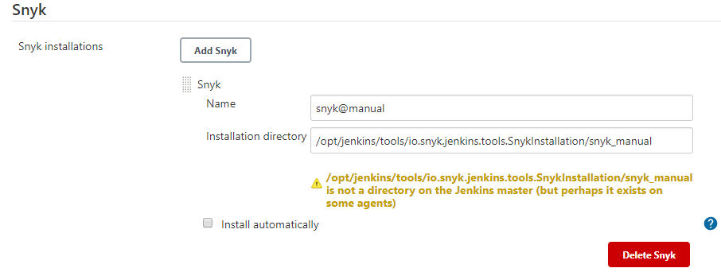
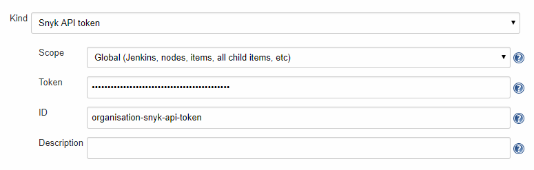
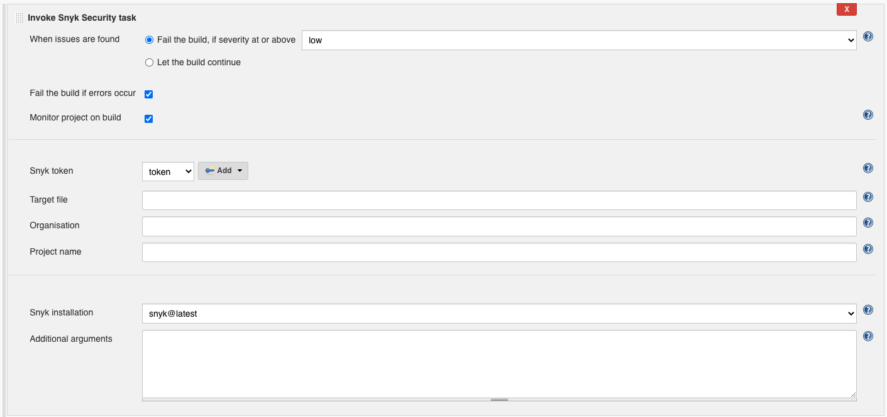
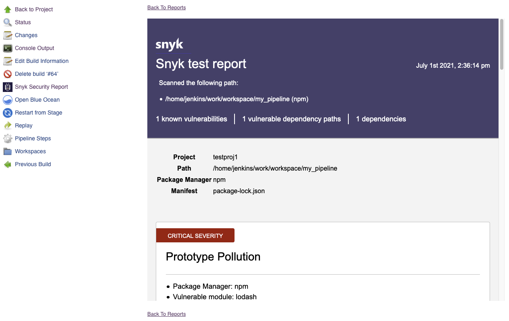

# Jenkins 플러그인과 Snyk의 통합

Snyk은 파이프라인에서 프로젝트를 취약점에 대해 테스트하고 모니터링하기 위해 [Snyk CLI](https://docs.snyk.io/snyk-cli/cli-reference)를 기반으로 하는 Jenkins용 네이티브 플러그인을 제공합니다.


Snyk Jenkins 플러그인은 Snyk Open Source를 지원합니다. 파이프라인에 Snyk Code, Snyk Container, 그리고 Snyk IaC 스캔을 포함하려는 경우 일반적인 [Snyk CLI](../../snyk-cli/)를 사용하십시오.


더 많은 정보는 [Snyk Jenkins 플러그인 저장소](https://github.com/jenkinsci/snyk-security-scanner-plugin)를 참조하십시오.

Snyk Jenkins 플러그인을 사용하기 위한 각 섹션의 단계를 따르십시오:

1. Snyk Security Jenkins 플러그인 설치
2. Snyk 설치 구성
3. Snyk API 토큰 자격 증명 구성
4. 프로젝트에 Snyk Security 추가
5. 빌드 실행 및 Snyk 보고서 보기

## 1. Snyk Security Jenkins 플러그인 설치

* Jenkins 대시보드에서 **Manage Jenkins** > **Manage Plugins**로 이동하고 **Available** 탭을 선택합니다.
* **Snyk Security**를 검색합니다.
* 플러그인을 설치합니다.

## 2. Snyk 설치 구성

* **Manage Jenkins** > **Global Tool Configuration**으로 이동합니다.
* **Snyk Installation**을 추가합니다.
* 설치를 구성합니다.
* 빌드 단계를 구성할 때 사용할 **Name**을 기억해 둡니다.

### 자동 설치

플러그인은 Snyk의 이진 파일의 최신 버전을 다운로드하고 업데이트할 수 있습니다.

<figure><figcaption><p>Snyk Jenkins 플러그인 자동 설치</p></figcaption></figure>

### 수동 설치

* 다음 이진 파일을 다운로드합니다. 에이전트 운영 체제에 적합한 이진 파일을 선택합니다:
  * [Snyk CLI](https://github.com/snyk/snyk/releases/latest)
  * [snyk-to-html](https://github.com/snyk/snyk-to-html/releases/latest)
* 이진 파일을 에이전트의 단일 디렉토리에 배치합니다.
  * 이진 파일의 파일 이름을 변경하지 마십시오.
  * 이진 파일을 실행할 올바른 권한이 있는지 확인하십시오.
* **Installation directory**에 디렉토리의 절대 경로를 제공합니다.

<figure><figcaption><p>Snyk Jenkins 플러그인 수동 설치</p></figcaption></figure>

### 사용자 정의 API 엔드포인트

기본적으로 Snyk은 https://api.snyk.io 엔드포인트를 사용합니다. `SNYK_API` 환경 변수를 변경하여 Snyk을 다른 엔드포인트를 사용하도록 구성할 수 있습니다:

* **Manage Jenkins** > **Configure System**으로 이동합니다.
* **Global Properties** 아래에서 **Environment** 변수 옵션을 선택합니다.
* **Add**를 클릭합니다.
* 이름을 **SNYK\_API**로 설정하고 값은 사용자 정의 엔드포인트로 설정합니다.

자세한 정보는 [Snyk API에 연결하기 위한 Snyk CLI 구성](https://docs.snyk.io/snyk-cli/configure-the-snyk-cli/configure-snyk-cli-to-connect-to-snyk-api)를 참조하십시오.

## 3. Snyk API 토큰 자격 증명 구성

* [Snyk API 토큰](https://docs.snyk.io/snyk-api-info/authentication-for-api)을 가져옵니다.
* **Manage Jenkins** > **Manage Credentials**로 이동합니다.
* 저장소를 선택합니다.
* 도메인을 선택합니다.
* **Add Credentials**로 이동합니다.
* **Snyk API Token**을 선택합니다.
* 자격 증명을 구성합니다.
* 빌드 단계를 구성할 때 사용할 **ID**를 기억해 둡니다.

<figure><figcaption><p>Jenkins 플러그인을 위한 Snyk API 토큰 구성</p></figcaption></figure>

## 4. 프로젝트에 Snyk Security 추가

이 단계는 Freestyle 프로젝트 또는 Pipeline 프로젝트를 사용하는지에 따라 다릅니다.

### Freestyle 프로젝트

* 프로젝트를 선택합니다.
* **Configure**로 이동합니다.
* **Build** 아래에서 **Add build step**을 선택하고 **Invoke Snyk Security Task**를 선택합니다.
* 필요에 따라 구성합니다. 각 옵션에 대한 자세한 정보는 **?** 아이콘을 클릭하여 확인하십시오.

<figure><figcaption><p>Freestyle 프로젝트 구성</p></figcaption></figure>

### Pipeline 프로젝트

파이프라인 스크립트의 일부로 `snykSecurity` 단계를 사용합니다. **Snippet Generator**를 사용하여 웹 폼에서 코드를 생성하고 파이프라인에 복사할 수 있습니다. 아래 예제를 참조하십시오.

```
pipeline {
  agent any

  stages {
    stage('Build') {
      steps {
        echo 'Building...'
      }
    }
    stage('Test') {
      steps {
        echo 'Testing...'
        snykSecurity(
          snykInstallation: '<Your Snyk Installation Name>',
          snykTokenId: '<Your Snyk API Token ID>',
          // 이곳에 다른 매개변수를 넣으십시오
        )
      }
    }
    stage('Deploy') {
      steps {
        echo 'Deploying...'
      }
    }
  }
}
```

`SnykSecurity` 단계에 다음 매개변수를 전달할 수 있습니다.

**`snykInstallation` (필수)**

단계 2에서 구성한 Snyk Installation Name.

**`snykTokenId` (선택 사항, 기본값: \_none**\_**)**

단계 3에서 구성한 Snyk API Token Credential ID.

Snyk API 토큰을 다른 방법으로 제공하려는 경우(대체 자격 증명 바인딩 사용), `SNYK_TOKEN` 빌드 환경 변수를 제공해야 합니다.

**`failOnIssues` (선택 사항, 기본값: `true`)**

문제 및 취약점이 발견되면 단계를 실패로 설정할지 여부.

**`failOnError` (선택 사항, 기본값: `true`)**

Snyk가 프로젝트를 스캔하는 중에 오류로 인해 실패할 경우 단계를 실패로 설정할지 여부. 오류는 Snyk의 이진 파일 다운로드 실패, 잘못된 Jenkins 설정, 잘못된 구성 및 서버 오류와 같은 시나리오를 포함합니다.

**`monitorProjectOnBuild` (선택 사항, 기본값: \_none\_)**

프로젝트를 매 빌드마다 Snyk.io에서 현재 종속성의 스냅샷을 가져와 프로젝트에 새로 공개된 취약점 및 문제 해결 옵션에 대해 알림을 받을지 여부.

**`organization` (선택 사항, 기본값: \_automatic**\_**)**

이 프로젝트를 테스트하고 모니터링할 Snyk 조직. 기본 동작에 대한 [Snyk CLI 명령 및 옵션 요약](https://docs.snyk.io/snyk-cli/cli-reference)에서 `--org`를 참조하십시오.

**`projectName` (선택 사항, 기본값: \_automatic**\_**)**

이 젠킨스 프로젝트에 대해 각 빌드마다 만들어진 Snyk 프로젝트에 대한 사용자 정의 이름. 기본 동작에 대한 [CLI 명령 및 옵션 요약](https://docs.snyk.io/snyk-cli/cli-reference)에서 `--project-name`을 참조하십시오.

**`targetFile` (선택 사항, 기본값: \_automatic**\_**)**

Snyk에서 사용할 매니페스트 파일의 경로. 기본 동작에 대한 [CLI 명령 및 옵션 요약](https://docs.snyk.io/snyk-cli/cli-reference)에서 `--file`을 참조하십시오.

**`severity` (선택 사항, 기본값: \_automatic**\_**)**

검출할 최소 심각도. 다음 중 하나일 수 있습니다: `low`, `medium`, `high`, `critical`. 기본 동작에 대한 [CLI 명령 및 옵션 요약](https://docs.snyk.io/snyk-cli/cli-reference)에서 `--severity-threshold`를 참조하십시오.

**`additionalArguments` (선택 사항, 기본값: \_none**\_**)**

추가 CLI 옵션에 대한 정보는 [CLI 명령 및 옵션 요약](https://docs.snyk.io/snyk-cli/cli-reference)을 참조하십시오.

## 5. Snyk Security 보고서 보기

* 프로젝트의 새로운 빌드를 완료합니다.
* 빌드 페이지로 이동합니다.
* 결과를 보려면 사이드바에서 **Snyk Security Report**를 선택합니다.

<figure><figcaption><p>Jenkins 플러그인을 위한 Snyk Security 보고서</p></figcaption></figure>

오류가 발생하면 보고서를 볼 수 없을 수 있습니다. 아래의 문제 해결 섹션을 참조하십시오.

## 문제 해결

### 로깅 증가

단계별 정보를 더 상세하게 보려면 로깅을 증가시키고 단계를 다시 실행할 수 있습니다.

* 특정 빌드에 대한 **Console Output**을 확인합니다.
* 모든 `io.snyk.jenkins` 로그를 캡처하는 로거를 추가합니다. 문제 해결 및 진단 정보를 위해 [Jenkins에서 로거를 만드는 방법은?](https://docs.cloudbees.com/docs/cloudbees-ci-kb/latest/client-and-managed-masters/how-do-i-create-a-logger-in-jenkins-for-troubleshooting-and-diagnostic-information)를 참조하십시오.
* 추가 인수로 **Additional Arguments**에 `--debug`를 추가하여 모든 Snyk CLI 로그를 캡처합니다. 디버그 출력은 빌드의 **Console Output**에서 확인할 수 있습니다.

### 설치 실패

기본적으로 Snyk Installation은 `downloads.snyk.io`에서 Snyk의 이진 파일을 다운로드하고 여유 엔드포인트로 `static.snyk.io`를 사용합니다. 이 과정에서 문제가 발생하면 네트워크 또는 프록시 문제가 있을 수 있습니다. 문제를 해결할 수 없다면 수동 설치를 수행해야 합니다. 단계 2. Snyk 설치 구성을 참조하십시오.
