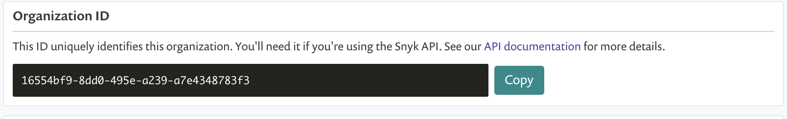

# CI/CD 설정

## CI/CD를 위한 전제 조건

Snyk을 파이프라인에서 실행하려면 Snyk 계정에서 주요 구성 입력을 검색해야 합니다.

### 대상 조직

CI/CD 플랫폼에서 Snyk을 실행할 때, 테스트 결과를 Snyk에 게시하여 검토 및 지속적인 모니터링을 원합니다.

**대상 조직을 정의하지 않으면**, Snyk은 인증 토큰에 대한 기본 조직을 사용합니다:

* 사용자 계정의 경우, 이는 사용자의 설정에서 구성 가능한 사용자의 기본 조직입니다.
* 조직 서비스 계정의 경우, 이는 계정이 생성된 조직입니다.

당신은 Snyk CLI에서 `--org` CLI 옵션을 사용하여 대상 조직을 정의할 수 있으며, `orgslugname` 또는 조직 ID를 사용할 수 있습니다:

* 주소 표시줄에 표시되는 Snyk UI의 `orgslugname`을 사용하여 대상 조직을 정의할 수 있습니다.
* 또는 조직 설정 페이지에서 ORG\_ID를 사용하여 대상 조직을 정의할 수 있습니다.

<figure><figcaption>
조직 ID
</figcaption></figure>

자세한 정보는 [CLI에서 사용할 조직 선택하는 방법](../../../snyk-cli/scan-and-maintain-projects-using-the-cli/how-to-select-the-organization-to-use-in-the-cli.md)을 참조하십시오.

### Snyk 인증

Snyk을 사용한 인증 방법에 대한 지침은 [계정으로 CLI 인증](../../../snyk-cli/authenticate-to-use-the-cli.md)을 참조하십시오.

## 파이프라인에 Snyk 설정

Snyk은 빌드 파이프라인에 테스트를 추가하기 위한 다음 방법을 지원합니다:

* **Snyk 통합 플러그인**: Snyk은 [Jenkins](https://docs.snyk.io/integrations/ci-cd-integrations/jenkins-integration-overview), [Team City](https://docs.snyk.io/integrations/ci-cd-integrations/teamcity-integration-overview), [Bitbucket Pipelines](https://docs.snyk.io/integrations/ci-cd-integrations/bitbucket-pipelines-integration-overview), [Azure Pipelines](https://docs.snyk.io/integrations/ci-cd-integrations/azure-pipelines-integration)을 포함한 여러 CI 서버에 대한 미리 구축된 플러그인을 제공합니다.
* **Snyk CLI:** Snyk 미리 구축된 플러그인이 없거나 더 복잡한 워크플로를 사용하는 팀은 CI/CD 설정 중에 Snyk CLI를 사용할 수 있습니다. 자세한 내용은 [Snyk CLI를 사용한 설정](ci-cd-setup.md#setting-up-using-snyk-cli)을 참조하십시오.
* **Snyk API**: 복잡한 요구 사항을 가진 팀을 위해 Snyk은 REST API를 제공하여 스캔 시작, 신규 프로젝트 등록, 임의 라이브러리 테스트 등의 기능을 사용할 수 있습니다. 자세한 내용은 [Snyk API 문서](../../../snyk-api/)를 참조하십시오.

## Snyk CLI를 사용하여 CI/CD 설정

Snyk CLI는 대부분의 CI/CD 환경으로의 쉬운 통합을 위해 개발자가 직접 스크립트화 할 수 있는 NodeJS 애플리케이션입니다. Snyk CLI는 npm 애플리케이션, 미리 패키지된 이진 파일 또는 컨테이너 이미지로 제공됩니다. 자세한 정보는 [Snyk CLI 설치 또는 업데이트](../../../snyk-cli/install-or-update-the-snyk-cli/)를 참조하십시오.

Snyk CLI는 다음과 같이 구성할 수 있습니다:

* 특정 조건이 충족될 때만 비정상적인 오류 코드를 반환하도록 구성할 수 있습니다. 예를 들어, 높은 심각도의 취약점이 존재할 때만 오류 코드로 종료합니다.
* 더 많은 유연성을 위해 데이터를 JSON으로 출력할 수 있습니다.

## 지속적 통합 구성

의존성에서 알려진 취약점을 계속해서 피하기 위해 Snyk을 지속적 통합(빌드) 시스템에 통합하세요. 이 문서 외에도, Snyk Labs GitHub 리포지토리의 [통합 구성 예제](https://github.com/snyk-labs/snyk-cicd-integration-examples)를 참조하십시오.

### 자동 모니터링 설정

Snyk으로 프로젝트를 모니터링하면 프로젝트의 종속성이 최신으로 유지됨에 따라 새로 공개된 취약점에 영향을 받는지 여부에 대해 알림을 받을 수 있습니다. Snyk이 열린 소스 프로젝트를 위한 종속성 목록이 최신 상태인지 확인하려면 배포 프로세스에서 `snyk monitor`를 계속 실행하여 환경을 구성하세요. 환경을 구성할 때 `SNYK_TOKEN` 환경 변수를 포함시키십시오. Snyk 계정 설정에서 [API 토큰을 찾을 수 있습니다](../../../snyk-api/rest-api/authentication-for-api/).

### API 토큰 구성

개인 Snyk API 토큰을 소스 제어로 체크하지 않도록 조심하세요. 대신 CI 환경 변수를 사용하여 토큰을 구성하세요.

이를 수행하는 방법에 대한 안내는 다음 문서에서 확인하십시오:

* [Travis](https://docs.travis-ci.com/user/environment-variables/)
* [Circle CI](https://circleci.com/docs/set-environment-variable/)
* [Codeship Basic](https://docs.cloudbees.com/docs/cloudbees-codeship/latest/basic-builds-and-configuration/set-environment-variables), [Codeship Pro](https://docs.cloudbees.com/docs/cloudbees-codeship/latest/pro-builds-and-configuration/environment-variables)

`CI에서 환경 변수 설정`으로 웹 검색을 통해 추가 문서를 찾을 수 있습니다.
