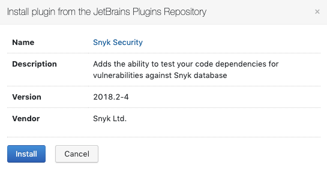

# TeamCity 통합: Snyk 플러그인 설치

이 단계를 따라 Snyk 보안 플러그인을 설치 또는 업그레이드하세요. 설치가 완료되면 프로젝트에 Snyk 단계를 추가할 수 있습니다.

시작하기 전에 Snyk 계정에 등록하세요.

1. Snyk 보안 플러그인을 설치하려면 TeamCity 인스턴스에 로그인하세요. **플러그인 목록**을 구성하여 백그라운드에서 정기적인 자동 업그레이드를 위해 **플러그인 업데이트 주기적으로 확인**하도록 설정합니다.
2. [JetBrains 플러그인 저장소](https://plugins.jetbrains.com/plugin/12227-snyk-security)로 이동하여 Snyk를 검색하고 **가져오기(Get)** 드롭다운 목록에서 TeamCity 설치용 플러그인을 선택하세요.
3. 나타나는 대화 상자에서 **설치**를 클릭하세요.
4. 설치가 완료되고 **관리 플러그인 목록**이 업로드된 플러그인을 알립니다. 플러그인이 활성화되었는지 확인하세요.

통합을 구성하려면 [TeamCity 구성 매개변수](teamcity-configuration-parameters.md)를 참조하세요. Snyk 단계로 빌드를 구성하는 방법에 대한 정보는 [Team City 통합: 빌드에서 Snyk 사용](teamcity-integration-use-snyk-in-your-build.md)를 참조하세요.