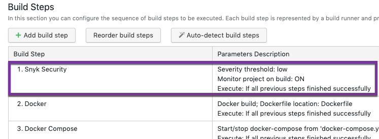
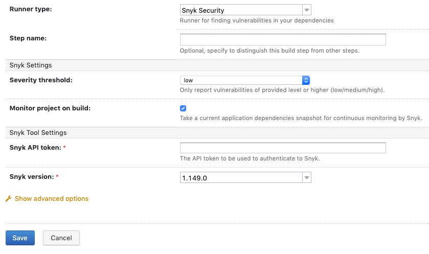
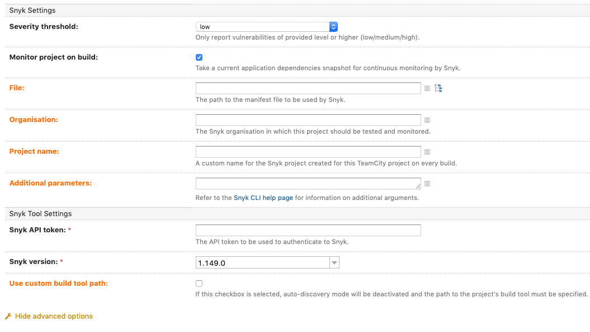
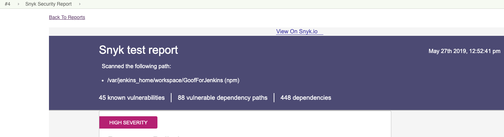

# TeamCity 통합: 빌드에 Snyk 사용

어떤 프로젝트에서든 빌드에 Snyk을 추가하여 빌드하는 동안 코드를 스캔하고 구성에 따라 취약점이 있으면 빌드를 실패하게 할 수 있습니다.

Snyk은 출시 전에 빌드를 실행하여 보안 포지션을 향상시키기 위해 Snyk 보안 단계를 실행하는 것을 권장합니다.

TeamCity와 해당 기능에 대한 자세한 정보는 [TeamCity 문서](https://www.jetbrains.com/help/teamcity/teamcity-documentation.html)를 참조하십시오.

다음은 **빌드를 Snyk 스텝으로 구성하는 방법**을 설명합니다.

* 새 프로젝트 또는 기존 프로젝트에 Snyk 스텝 추가:
  * 새 프로젝트의 경우, 빌드를 생성할 Git 리포지토리를 구성한 후, 자동 감지 기능을 활성화하여 프로젝트 빌드에 관련 단계를 자동으로 식별합니다.
  * 기존 프로젝트의 경우, **프로젝트 빌드 단계 편집**으로 이동합니다.\
    \
    Snyk 스텝이 추가된 경우, **Snyk Security**가 제안된 스텝 목록에 나타나며 **Parameters Description** 열에 현재 테스트 정책이 나타납니다:

* 다음과 같이 Snyk Security 스텝을 구성하려면:
  * **Snyk Security** 행을 클릭하여 구성 화면에 액세스하거나,
  * 기존 프로젝트의 경우, **빌드 스텝 추가**를 클릭하여 구성 화면에 액세스합니다.

* TeamCity 필드 (Runner type, Step name 및 Execute Step(고급 옵션))를 구성하십시오.
* 선택적으로 **고급 옵션 표시**를 클릭하여 추가 필드 및 Snyk 매개변수를 표시할 수 있습니다:

* **Snyk 설정** 및 **Snyk 도구 설정**을 구성하십시오. 자세한 내용은 TeamCity 구성 매개변수를 참조하십시오.
* 구성이 완료되면 빌드를 실행하십시오. Snyk Security 단계가 성공적으로 종료되면 **Snyk Security 보고서** 탭으로 이동하여 TeamCity 내에서 결과를 보고 Snyk UI로서 추가 조치를 취할 수 있습니다:

* 보고서 상단에서 **Snyk.io에서 보기**를 클릭하여 Snyk 웹 UI에서 스냅샷 및 취약성 정보를 직접 확인할 수 있습니다.
