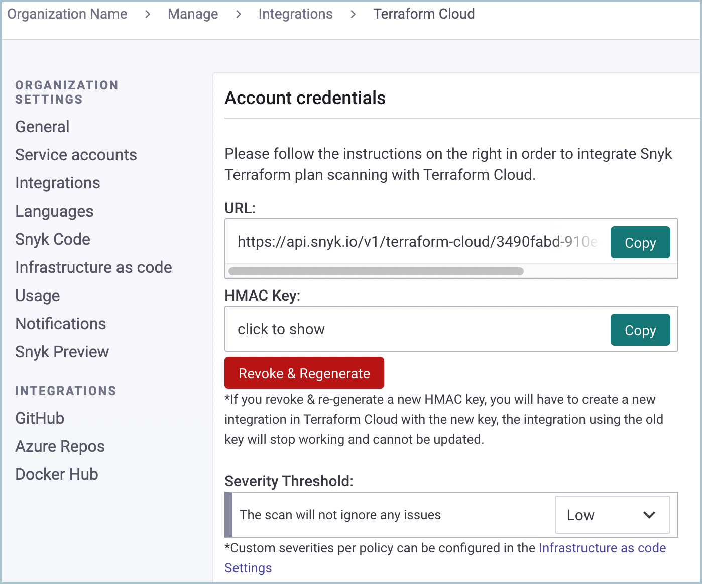

# IaC용 Terraform Cloud 통합 설정하기


Terraform Cloud 통합을 구성하려면 Snyk 조직의 관리자여야 합니다.


Snyk Web UI의 **Integrations** 페이지에서 전용 Terraform Cloud 통합 설정 페이지로 이동한 다음, 다음 단계를 따라 Terraform plan 스캔을 설정하세요:

Snyk Web UI에서 귀하의 조직을 위한 Terraform Cloud 통합 설정 페이지로 이동하세요:\
`https://app.snyk.io/org/{YOUR-SNYK-ORG}/manage/integrations/terraform-cloud`에 제공된 URL 및 HMAC 키를 찾으세요.

## Snyk Run Task 생성 - Terraform Cloud

이제 [Terraform Cloud](https://app.terraform.io)로 이동하여 조직 전체 설정을 확인하세요:

 (1) (2).png>)

1. TFC 조직의 실행 작업 설정으로 이동합니다:\
   `https://app.terraform.io/app/{YOUR_TFC_ORG}/settings/tasks`
2. URL 및 HMAC 키 값으로 Snyk를 위한 새 실행 작업을 생성하세요.\
   HMAC 키는 Terraform Cloud에서 선택 사항으로 표시되지만 Snyk 통합 작동에 필수입니다.

## 실행 작업을 Terraform Cloud Workspace에 연결

1. Terraform Cloud Workspace로 이동한 다음 **Settings** 메뉴에 들어가 **Run Tasks**를 선택하세요.
2. 생성한 실행 작업은 **Available Run Tasks** 아래에서 사용 가능합니다. 연결하려면 \*\*+\*\*를 클릭하세요.
3. 실행 강도를 선택하세요 (**Advisory** 또는 **Mandatory**) 그리고 **Create**를 클릭하세요.

통합이 설정되면 Snyk은 워크스페이스에서 트리거된 각 실행에 대해 Terraform 플랜을 스캔합니다.
