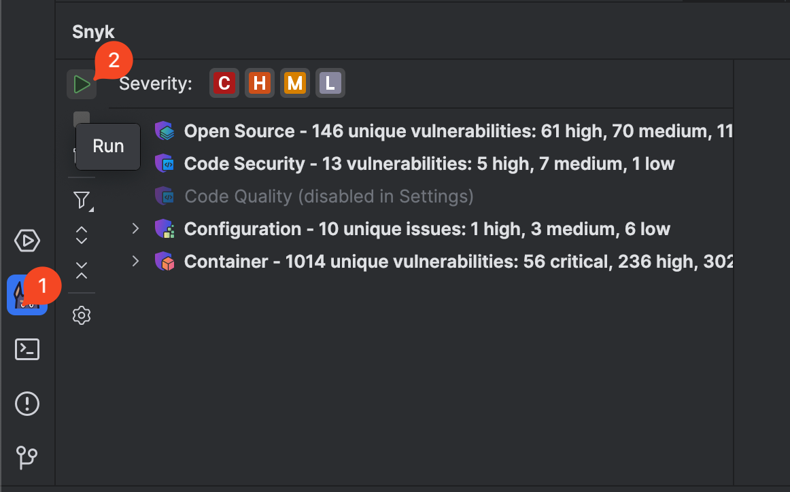
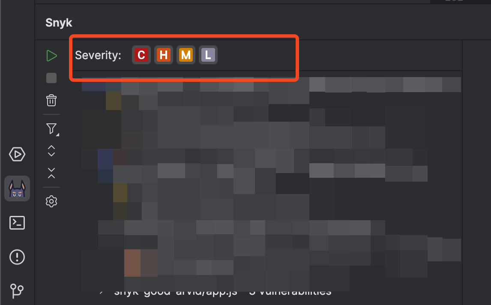
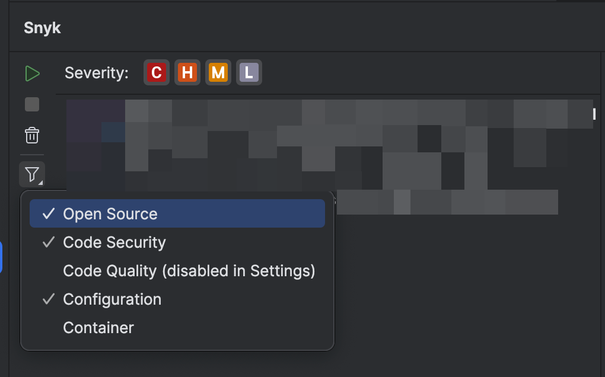
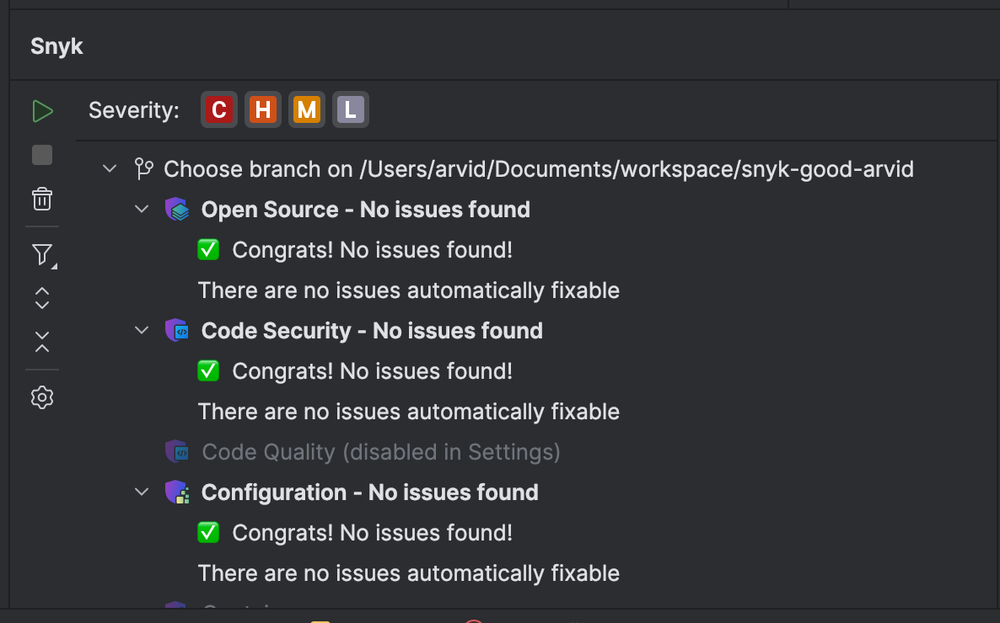
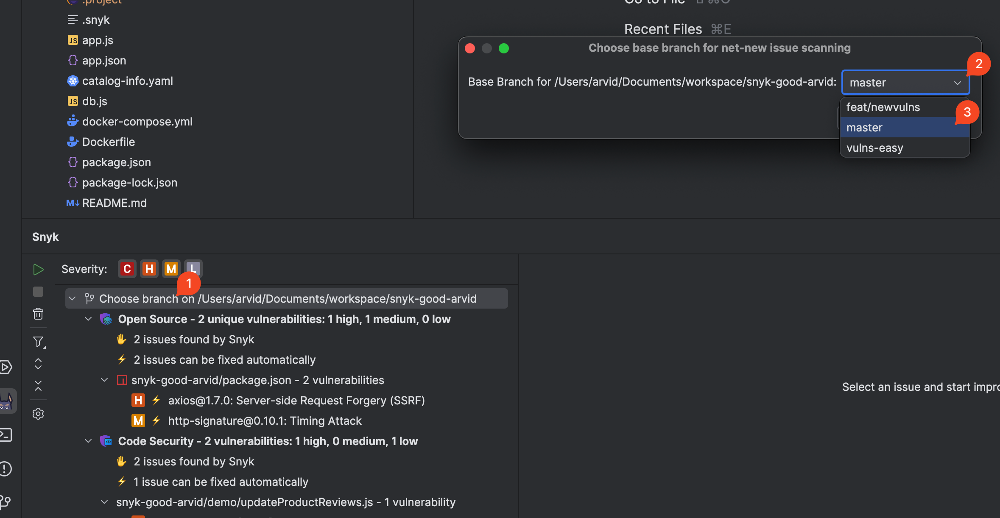
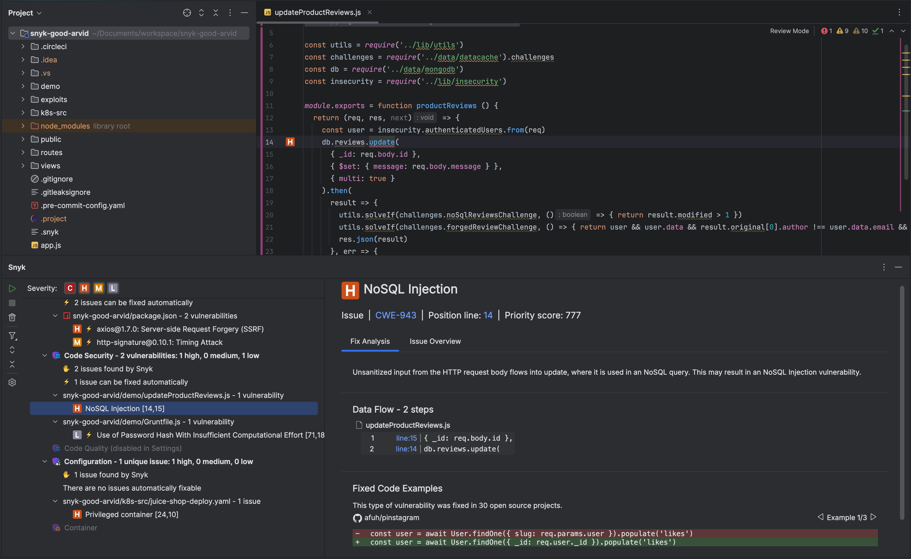
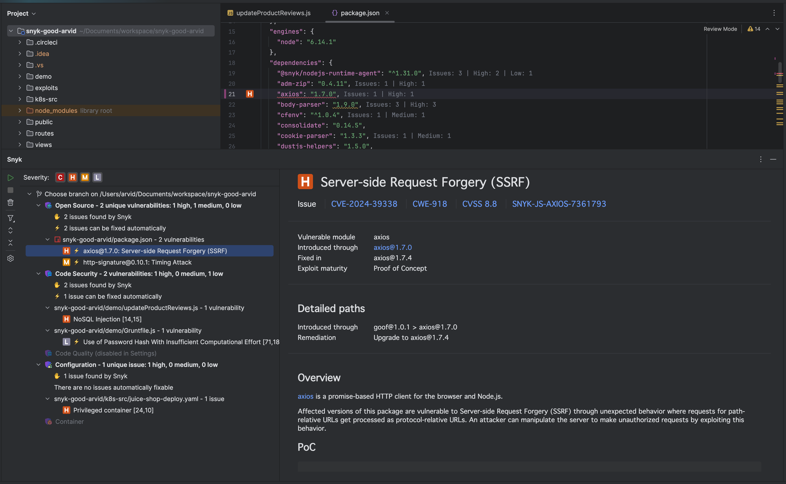
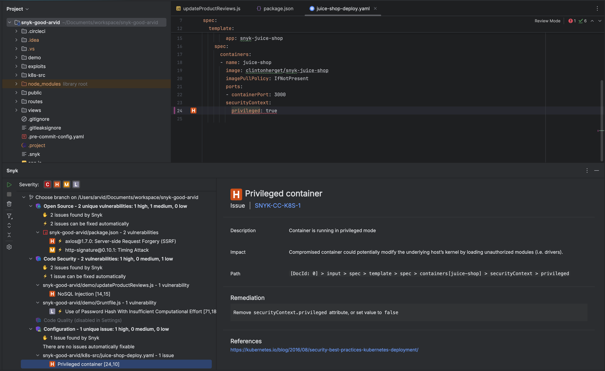

# JetBrains 플러그인을 사용하여 분석 실행


현재 프로젝트에서 Snyk 확장이 구성되어 있고 인증되어 있으며 신뢰할 수 있도록 설정되어 있는지 확인하십시오. 이에 대한 자세한 내용은 구성 및 인증 페이지에서 설명됩니다.


다음 중 하나의 방법으로 `snyk test`를 트리거할 수 있습니다:

- 자동 (기본)
- 수동

프로젝트가 열리거나 지원되는 파일이 저장될 때 Snyk 스캔이 자동으로 트리거됩니다. 이 동작은 [기존 구성](configuration-for-the-snyk-jetbrains-plugin-and-ide-proxy.md#user-experience)을 사용하여 끌 수 있습니다.


수동으로 분석을 실행하기 전에 파일을 저장해야 합니다.


`snyk test`를 수동으로 트리거하는 방법은 다음과 같습니다(아래 이미지 참조):

1. 사이드바에서 Snyk 아이콘을 클릭하여 Snyk 패널을 엽니다.
2. 플러그인 사이드바 상단의 실행(재생) 버튼을 클릭합니다.

<figure><figcaption>
Snyk 분석을 수동으로 트리거하는 방법
</figcaption></figure>

재생 버튼이 회색으로 표시되면 스캔이 진행 중입니다. 다른 작업을 시작하기 전에 완료될 때까지 기다리십시오.

## 스캔 구성

회사 보안 정책을 반영하거나 특정 영역에 중점을 둘 수 있도록 스캔 동작을 사용자 정의할 수 있습니다.

### 심각도 필터

Snyk는 심각, 높음, 중간 및 낮음의 심각성을 보고합니다. 심각도를 제어하는 두 가지 방법이 있습니다:

- 플러그인 설정은 [스캔 구성](configuration-for-the-snyk-jetbrains-plugin-and-ide-proxy.md#scan-configuration)
- 다음 화면 이미지에서 볼 수 있는 Snyk 패널의 문제 상단의 작은 버튼

기본적으로 모든 수준이 선택되어 있습니다. 하나 이상을 선택해야 합니다.

<figure><figcaption>
심각도 레벨 선택
</figcaption></figure>

Snyk 심각도 아이콘의 의미는 다음과 같습니다.

|  (1) (1) (1) (1) (1) (1) (1) (1) (1) (1) (1) (1) (1) (1) (1) (1).png>) 치명적(Critical) 심각도                                                                                                  | 공격자가 애플리케이션에서 민감한 데이터에 접근하고 코드를 실행할 수 있는 가능성이 있습니다.                                                               |
| ------------------------------------------------------------------------------------------------------------------------------------------------------------------------------------------------------------------------------------ | -------------------------------------------------------------------------------------------------------------------------------------------- |
|  (1) (1) (2) (1) (1) (1) (1) (1) (1) (1) (1) (1) (1) (1) (1) (1) (1) (1) (1) (1) (1) (1) (1) (1) (1) (1) (1) (1) (1) (1) (1) (1) (1) (1) (1) (1) (1) (1) (1) (1) (5) (3).png>) 높은(High) 심각도 | 공격자가 애플리케이션에서 민감한 데이터에 접근할 가능성이 있습니다.                                                                            |
|  (1) (1) (1) (1) (1) (1) (1) (1) (1) (1) (1) (1) (1) (1) (1) (1) (1) (1) (1) (1) (1) (1) (1) (1) (1) (1) (1) (1) (1) (5) (6).png>) 중간(Medium) 심각도                                          | 특정 조건에서 공격자가 애플리케이션에서 민감한 데이터에 접근할 가능성이 있습니다.                                                      |
|  (1) (1) (1) (1) (1) (1) (1) (1) (1) (1) (1) (1) (1) (1) (1) (1).png>) 낮음(Low) 심각도                                                                                                         | 애플리케이션이 일부 데이터를 노출하여 다른 취약점과 함께 사용될 경우 애플리케이션을 공격하는 데 활용될 수 있는 취약점 매핑을 허용할 가능성이 있습니다. |

---

### 문제 유형별 필터링

Snyk는 다음과 같은 유형의 문제를 보고합니다:

* **오픈 소스(Open Source)** 문제: 오픈 소스 종속성에서 발견됩니다. 자세한 내용은 [아래 섹션](run-an-analysis-with-the-jetbrains-plugins.md#snyk-open-source-issues)을 참조하세요.  
* **코드 보안(Code Security)** 문제: 애플리케이션 소스 코드에서 발견됩니다. 자세한 내용은 [아래 섹션](run-an-analysis-with-the-jetbrains-plugins.md#snyk-code-security-vulnerabilities-and-quality-issues)을 참조하세요.  
* **코드 품질(Code Quality)** 문제: 애플리케이션 소스 코드에서 발견됩니다. 자세한 내용은 [아래 섹션](run-an-analysis-with-the-jetbrains-plugins.md#snyk-code-security-vulnerabilities-and-quality-issues)을 참조하세요.  
* **코드형 인프라(Infrastructure as Code)** 문제: 코드형 인프라 파일에서 발견됩니다. 자세한 내용은 [아래 섹션](run-an-analysis-with-the-jetbrains-plugins.md#snyk-infrastructure-as-code-issues)을 참조하세요.  
* **컨테이너(Container)** 문제: Kubernetes 워크로드 파일에서 가져온 이미지에서 발견됩니다. 자세한 내용은 [아래 섹션](run-an-analysis-with-the-jetbrains-plugins.md#snyk-container-issues)을 참조하세요.


사용 가능한 기능과 스캐너는 플랜에 따라 다릅니다. IDE 플러그인에서 제품을 구성하기 전에 반드시 조직 관리자(Organization Admin)가 모든 Snyk 제품을 활성화했는지 확인하세요.


특정 문제 유형을 표시하거나 숨기는 두 가지 방법이 있습니다:

1. [스캔 설정](configuration-for-the-snyk-jetbrains-plugin-and-ide-proxy.md#scan-configuration)에서 플러그인 설정 사용  
2. 아래 화면 이미지처럼 패널의 사이드바에서 필터 버튼 사용  

기본적으로 모든 문제 유형이 선택되어 표시됩니다.

<figure><figcaption>
특정 문제 유형 표시 또는 숨기기
</figcaption></figure>

---

### 새로운 문제(Net New Issues) vs 모든 문제(All Issues)

버전 [2.10.0](https://plugins.jetbrains.com/plugin/10972-snyk-security/versions/stable/623034)부터 **새로 도입된 문제만** 볼 수 있는 기능이 추가되었습니다.

이 기능은 _**노이즈를 줄이고**_ 개발자가 _**현재 변경 사항에 집중할 수**_ 있도록 합니다. 개발자는 문제를 조기에 방지하여 CI/CD 파이프라인을 원활하게 하고 전달 속도를 높일 수 있습니다.

로컬 Git 저장소를 사용하여 현재 발견된 문제와 기본 브랜치의 문제 간 차이를 보여줍니다.

이 기능은 [스캔 설정을 통해 구성할 수 있습니다](configuration-for-the-snyk-jetbrains-plugin-and-ide-proxy.md#scan-configuration). 기본적으로 Net New Issues는 꺼져 있으므로 수동으로 켜야 합니다.

기능이 활성화되면 Snyk는 차이점만 보고합니다.

새로 생성된 기능 브랜치에는 보고된 문제가 없을 것입니다. 이는 의도된 상태이며, 개발자는 이를 목표로 합니다. 다음 화면 이미지를 참조하세요:

<figure><figcaption>
성공적인 상태. 새로운 문제가 발견되지 않음
</figcaption></figure>

기본 브랜치는 일반적으로 각 Git 저장소에 대해 자동으로 결정됩니다.

고급 사례에서는 개발자가 다음 단계를 따라 기본 브랜치를 변경할 수 있습니다(아래 화면 이미지를 참조):

1. 문제 트리의 최상위 노드를 클릭  
2. 드롭다운 선택을 사용하여 브랜치를 선택  
3. 확인을 클릭하여 선택 저장  

<figure><figcaption>
새로운 문제 계산을 위한 기본 브랜치 변경
</figcaption></figure>

---

## 사용 가능한 Snyk 문제 유형

### Snyk 코드 보안 취약점 및 품질 문제

Snyk 코드 분석은 애플리케이션 코드에서 발견된 보안 취약점과 코드 품질 문제를 나열합니다.


2025년 6월 24일부터 Snyk 코드 품질 문제는 더 이상 제공되지 않습니다.


자세한 내용과 다른 사람이 문제를 해결하기 위해 사용한 예제를 보려면 보안 취약점이나 코드 보안 문제를 선택하세요.

<figure><figcaption>
Snyk 코드 문제 세부 정보
</figcaption></figure>

---

### Snyk Open Source 문제

Snyk Open Source 분석은 모든 매니페스트 파일에서 발견된 취약점과 라이선스 문제를 나열합니다. 자세한 정보를 보려면 취약점이나 라이선스 문제를 선택하세요.

<figure><figcaption>
Snyk 오픈 소스 문제 세부 정보
</figcaption></figure>

---

### Snyk IaC 문제

Snyk IaC 분석은 Terraform, Kubernetes, AWS CloudFormation, Azure Resource Manager(ARM) 코드에서 문제를 찾아냅니다. 스캔은 Snyk CLI를 기반으로 하며 로컬 개발에 친화적이고 빠릅니다. 자세한 정보를 보려면 문제를 선택하세요.

<figure><figcaption>
Snyk IaC 문제 세부 정보
</figcaption></figure>

---

### Snyk Container 문제


2025년 6월 24일 이후 릴리스된 버전에서 Snyk JetBrains IDE 플러그인은 Kubernetes YAML 파일에 지정된 컨테이너 이미지를 더 이상 감지하지 않습니다.


JetBrains 플러그인은 Kubernetes 구성 파일을 스캔하고 컨테이너 이미지를 검색합니다. 추출된 컨테이너 이미지와 [Snyk 취약점 데이터베이스](https://security.snyk.io)의 최신 정보를 비교 분석하여 취약점을 빠르게 찾습니다.

Snyk 컨테이너 분석은 이미지에 영향을 미칠 수 있는 각 보안 취약점을 보여줍니다. 자세한 정보를 보려면 취약점을 선택하세요.

심각도 수준(치명적, 높음 등)과 관련된 비교 표가 표시됩니다. 이를 통해 현재 이미지와 Snyk에서 권장하는 이미지 간의 취약점 차이를 확인할 수 있습니다. 이러한 비교는 권장 이미지를 업그레이드할지 여부를 결정하고 프로덕션에서 실행 중인 이미지에 대한 신뢰 수준을 높이는 데 도움이 됩니다.