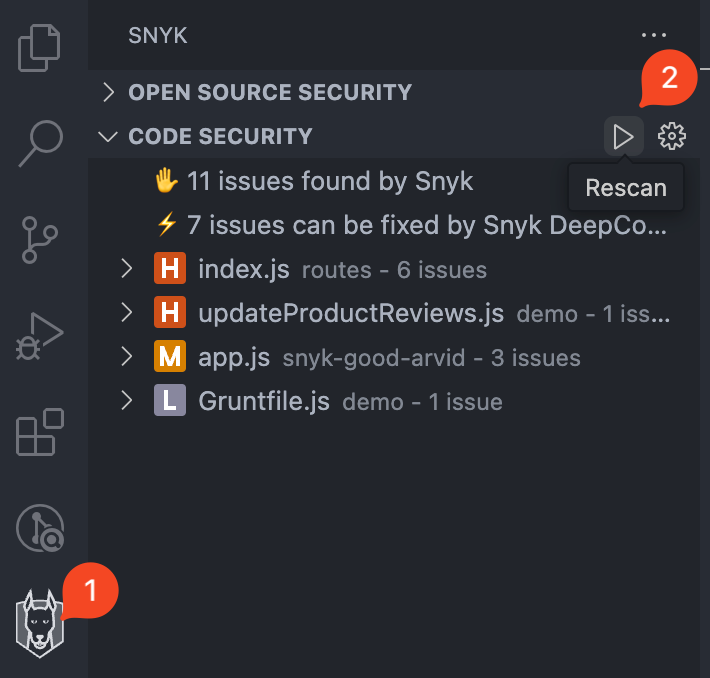

# Visual Studio Code 확장 프로그램을 사용하여 분석 실행


현재 프로젝트에 Snyk 확장이 설정되어 인증되고 신뢰됨을 확인하십시오. 인증 및 구성 페이지에 설명된 대로 설정되어 있어야 합니다.


다음 중 하나의 방법으로 `snyk test`를 실행할 수 있습니다:

* 자동 (기본값)
* 수동

프로젝트가 열리거나 지원되는 파일이 저장될 때 자동으로 [Snyk 확장 구성](visual-studio-code-extension-configuration.md#user-experience)을 사용하여 Snyk Code 및 Iac (구성) 검사가 자동으로 트리거됩니다.

Snyk Open Source는 기본적으로 자동으로 저장하지 않지만 설정에서 자동 스캔을 활성화할 수 있습니다.


수동으로 분석을 실행하기 전에 파일을 저장하십시오.


snyk test를 수동으로 트리거하려면 (다음에 이어지는 화면 이미지 참조):

1. Snyk 아이콘을 사이드바에서 클릭하여 Snyk 패널을 엽니다.
2. 플러그인 패널 상단에 있는 **다시 스캔** (재생) 버튼을 클릭합니다.

<figure><figcaption>
Snyk 분석을 수동으로 트리거하는 방법
</figcaption></figure>

## 스캔하는 동안 사용자 경험

IDE에서는 확장이 이미 파일을 인식하고 분석을 위해 업로드하고 있음을 확인할 수 있습니다.

Snyk Open Source는 Snyk CLI를 필요로 하며, 백그라운드에서 다운로드됩니다.

Snyk Code 분석은 CLI 없이 빠르게 실행되므로 결과가 이미 사용 가능할 수 있습니다. 그렇지 않으면 다음 화면을 볼 수 있으며, Snyk가 취약점과 문제를 검사하기 위해 작업영역을 스캔하는 동안 다음과 같은 화면이 표시됩니다:

<figure><figcaption>
Snyk 스캔 진행중
</figcaption></figure>