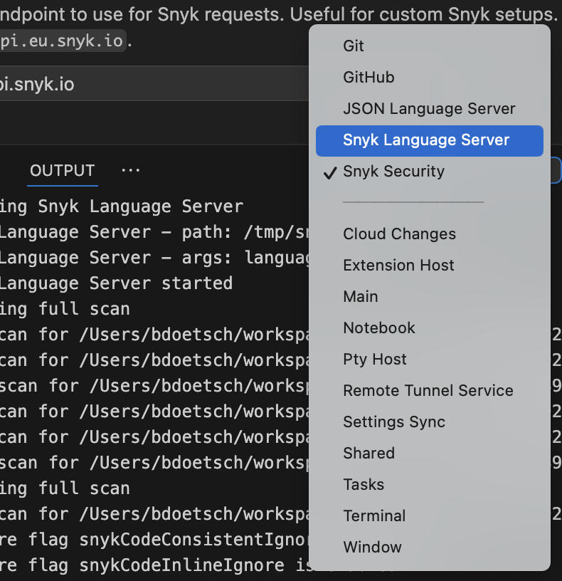

# Visual Studio Code 확장 프로그램에 대한 문제 해결


Snyk 플러그인은 배포 엔드 오브 라이프(EOL)에 도달한 모든 운영 체제에서 지원되지 않습니다.&#x20;


## CLI 다운로드 실패

Visual Studio Code용 Snyk 확장 프로그램은 CLI를 다운로드하여 확장 프로그램이 작동할 수 있습니다. 확장 프로그램이 구성된 릴리스 채널에서 필요한 CLI 버전을 다운로드할 수 없는 경우 다음 중 하나가 그 이유일 수 있습니다:

1. 네트워크 연결 문제
2. 잘못 구성된 릴리스 채널 설정
3. 요청된 CLI 버전이 일시적으로 사용할 수 없음

다음 단계를 따라 문제를 해결할 수 있습니다:

1. 인터넷 연결 및 프록시 설정을 확인합니다.
2. 확장 프로그램 설정에서 릴리스 채널 구성을 확인합니다.
3. 다른 [릴리스 채널](../../../snyk-cli/releases-and-channels-for-the-snyk-cli.md)(예: **stable**에서 **preview**로)로 전환해 봅니다.
4. Visual Studio Code를 다시 시작하고 [확장 프로그램을 다시 설치](./#how-to-install-and-set-up-the-extension)합니다.
5. 문제가 지속되면 [Snyk GitHub VS Code](https://github.com/snyk/vscode-extension/releases) 리포지토리에서 알려진 문제나 업데이트를 확인합니다.

## 로그

Snyk 확장 프로그램 및 Snyk Language Server의 출력 채널에서 VS Code의 로그를 찾을 수 있습니다. 둘 다 문제 해결에 필요합니다.

디버그 로그 레벨을 활성화하려면 터미널에서 다음과 같이 VS Code를 시작합니다:

`cd your-repo SNYK_LOG_LEVEL=debug code .`

또는 Snyk 설정에서 추가 매개변수에 `-d`를 추가할 수 있습니다.

추가 로그를 얻으려면 **도움말, 개발자 도구 토글**로 이동한 다음 추가 출력을 보려면 **출력** 탭을 선택합니다. 표시된 목록에서 **Snyk Security** 채널을 선택한 다음 **Snyk Language Server** 채널을 선택하여 디버깅 정보를 확인할 수 있습니다.

Snyk Security 채널에는 확장 프로그램 자체에 대한 정보가 포함되어 있습니다. Snyk Language Server 채널에는 Language Server 로그가 있으며, 확장 프로그램을 사용할 때 Language Server 및 CLI 내부에서 발생하는 모든 작업이 표시됩니다.

<figure><figcaption>
추가 정보 획득
</figcaption></figure>

## 명령을 찾을 수 없음 (getActiveUser, LoginCommand 등)

이것은 필수 이진 파일을 사용할 수 없다는 것을 나타냅니다. 확장 프로그램을 시작하고 사용하려면 다음이 사용 가능하고 실행 가능한지 확인하십시오:

* Snyk Language Server (snyk-ls)
* Snyk CLI

이들은 일반적으로 확장 프로그램에서 자동으로 다운로드됩니다. 자동으로 다운로드할 수 없는 경우 Language Server가 시작되지 않으며 따라서 VS Code에서 사용되는 명령을 제공하지 않을 것입니다.

이 문제를 해결하려면 다음을 시도해 봅니다:

* 자동 다운로드가 활성화되어 있고 작동하는지 확인합니다.
   * 프록시/SSL 문제가 다운로드를 완료하지 못하는 이유일 수 있습니다.
   * 구성된 경로에 쓰기 권한이 없는 경우 자동 다운로드가 작동하지 않을 수 있습니다.
* 도움을 받기 전에 다음을 확인합니다:
   * 안전한 디버그 로그(`additional parameters`에서 `-d`)
   * 구성
   * 수동 CLI 실행 로그 및 네트워크 정보:
      * 프록시가 있나요?
      * SSL 연결을 가로채는 MITM 프록시인가요?
      * 그렇다면, 사용자 정의 인증 기관이 OS에 사용 가능한가요?
* 의존성의 자동 관리가 활성화되어 있지 않은 경우 다음을 수행하세요:
   * Language Server 및 CLI를 수동으로 다운로드합니다.
   * 실행 가능하게 만듭니다.
   * Snyk 설정에서 해당 필드에 있는 이진 파일의 경로를 제공합니다.