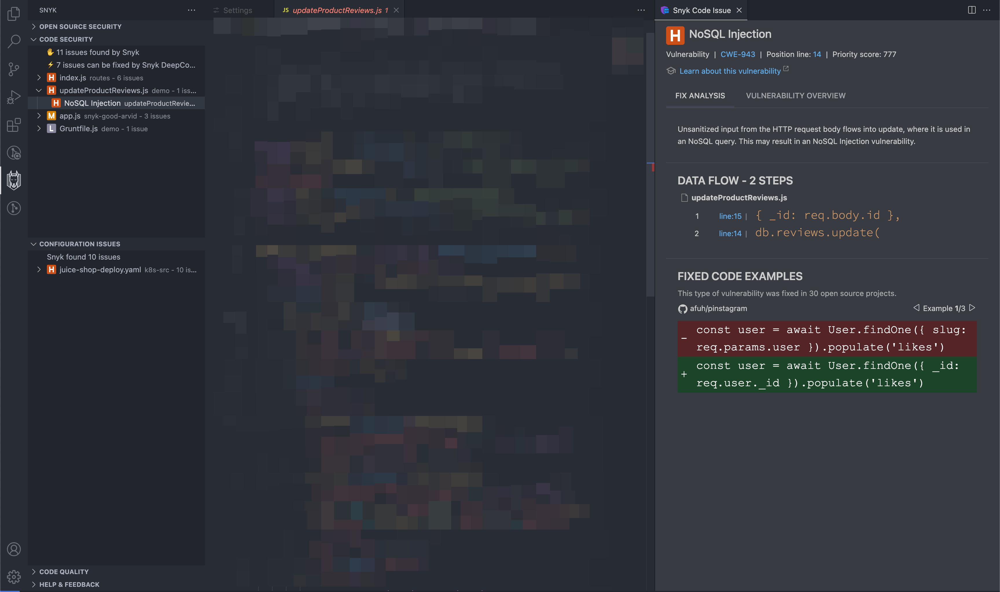
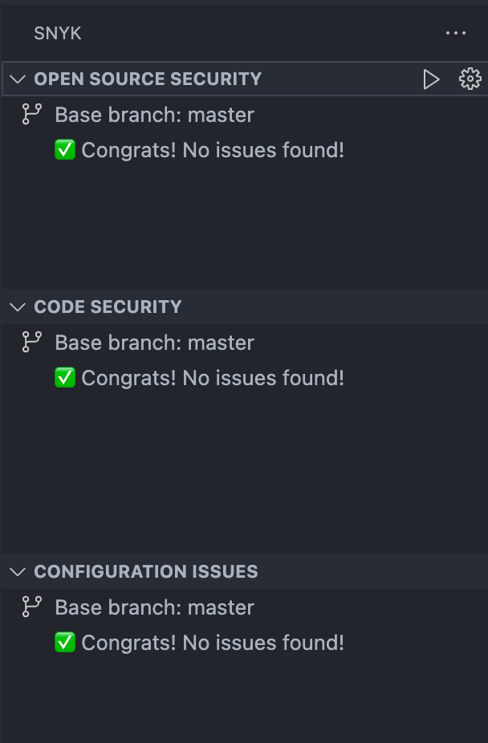
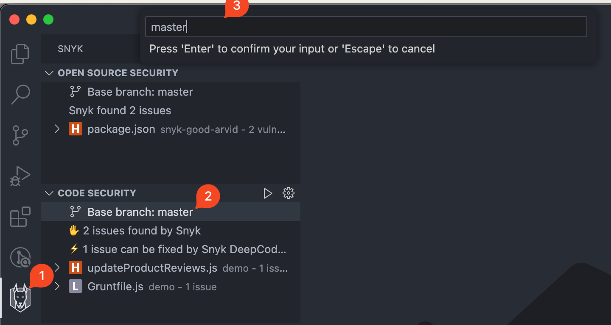

# View analysis results from Visual Studio Code extension

Snyk 분석 결과는 응용 프로그램 코드에서 발견된 보안 취약점 및 코드 문제 목록을 보여줍니다. 보안 취약점 또는 코드 보안 문제를 선택하여 자세한 내용 및 다른 사람들이 문제를 해결한 예시를 확인할 수 있습니다. "Issue details" 패널은 화면 오른쪽에 탭으로 나타납니다.

다음 화면 이미지에서 **Snyk 분석 패널**은 분석에 소요된 시간과 문제 목록을 보여줍니다. 해당 문제에 대한 제안사항이 함께 표시됩니다.

각 문제에는 다음과 같은 심각도 아이콘이 포함되어 있습니다:

|  (1) (1) (1) (1) (1) (1) (1) (1) (1) (1) (1) (1) (1) (1) (1) (1) (1).png>) 심각한 심각도                                                                                                                                                                                                                                                                                                                                                                                                                                                                                                                                                                                                                                                                                                                                     | 공격자가 민감한 데이터에 액세스하고 응용 프로그램에서 코드를 실행할 수 있을 수 있음. |
| ------------------------------------------------------------------------------------------------------------------------------------------------------------------------------------------------------------------------------------------------------------------------------------------------------------------------------------------------------------------------------------------------------------------------------------------------------------------------------------------------------------------------------------------------------------------------------------------------------------------------------------------------------------------------------------------------------------------------------------------------------------------------------------------------------------------------------------------------------------------ | ------------------------------------------------ |
|  높은 심각도 | 공격자가 민감한 데이터에 액세스할 수 있을 수 있음.                    |
|  (1) (1) (1) (1) (1) (1) (1) (1) (1) (1) (1) (1) (1) (1) (1) (1) (1) (1) (1) (1) (1) (1) (1) (1) (1) (1) (1) (1) (1) (5) (6).png>) 중간 심각도                                                                                                                                                                                                                                                                                                                                                                                                                                                                                                                                                                                                                                                                              | 특정 상황에서 공격자가 민감한 데이터에 액세스할 수 있을 수 있음.            |
|  (1) (1) (1) (1) (1) (1) (1) (1) (1) (1) (1) (1) (1) (1) (1) (1).png>) 낮은 심각도                                                                                                                                                                                                                                                                                                                                                                                                                                                                                                                                                                                                                                                                                                                                          | 응용 프로그램이 취약점 매핑을 허용하여 공격자가 다른 취약점을 활용할 수 있음.     |

<figure><figcaption>
Snyk 보안 확장 프로그램
</figcaption></figure>

## 스캔 구성

회사의 보안 정책을 반영하거나 특정 영역에 초점을 맞추기 위해 스캔 동작을 사용자 정의할 수 있습니다.

### 심각도 필터

Snyk는 심각한, 높은, 중간, 낮은 심각도를 보고합니다. 이것은 [스캔 구성](../visual-studio-code-extension-configuration.md#scan-configuration) 설정에서 조정할 수 있습니다.

기본적으로 모든 수준이 선택되어 있습니다. 하나 이상을 선택해야 합니다.

### 문제 유형별 필터링

Snyk는 다음 유형의 문제를 보고합니다:

* **오픈 소스** 문제: 오픈 소스 종속성에서 발견된 문제; 자세한 내용은 [결과](analysis-results-snyk-open-source.md) 참조.
* **코드 보안** 문제: 응용프로그램의 소스 코드에서 발견된 문제; 자세한 내용은 [결과](analysis-results-snyk-code.md) 참조.
* **코드 품질** 문제: 응용프로그램의 소스 코드에서 발견된 문제 (코드 보안과 동일한 구조)
* \*\*\*\* 문제: 인프라스트럭처 as code 파일에서 발견된 문제; 자세한 내용은 [결과](visual-studio-code-extension-analysis-results-snyk-iac-configuration.md) 참조.


구체적인 기능 및 사용 가능한 스캐너는 귀하의 기획에 따라 다릅니다. IDE 플러그인에서 이들 중 하나를 구성하기 전에 귀하의 조직 관리자가 모든 Snyk 제품을 활성화했는지 확인하세요.


표시될 문제 유형은 [스캔 구성](../visual-studio-code-extension-configuration.md#scan-configuration) 설정에서 조정할 수 있습니다.

기본적으로 모든 문제 유형이 선택되어 있습니다.

### 새로운 문제 대 전체 문제

버전 2.19.0부터 **새롭게 포함된 문제만** 볼 수 있습니다.

이 기능은 _**잡음을 줄이고**_ 개발자들이 현재 변경 사항에만 _**집중할 수 있도록**_ 합니다. 개발자들은 일찍 문제를 방지하여 CI/CD 파이프라인을 활성화하고 제공 속도를 높일 수 있습니다.

이 로직은 로컬 Git 리포지토리를 사용하여 현재 결과와 기본 브랜치의 결과를 비교하여 차이를 보여줍니다.

이 기능은 [플러그인 설정](../visual-studio-code-extension-configuration.md#scan-configuration)을 통해 구성할 수 있습니다. 기본적으로 꺼져 있으며, 켜려면 수동 조치가 필요합니다.

이 기능이 활성화된 후에는 Snyk가 델타 결과만 보고합니다.

특성 브랜치를 새롭게 작성할 경우 보고된 문제가 없을 것입니다. 이는 개발자들이 목표로 하는 의도적인 상태이며 아래 화면 이미지에서 확인할 수 있습니다.

<figure><figcaption>
성공 상태. 새로운 문제 없음.
</figcaption></figure>

기본 브랜치는 일반적으로 각 Git 리포지토리에 자동으로 결정됩니다.

고급 경우에서, 개발자들은 기본 브랜치를 변경할 수 있습니다. 다음 단계를 따라 수행할 수 있습니다(다음 화면 이미지 참조):

1. 문제 트리의 최상위 노드를 클릭합니다.
2. 텍스트 입력을 사용하여 어떤 브랜치 이름이든 지정합니다.
3. 선택을 저장하려면 Enter를 클릭합니다.

<figure><figcaption>
새로운 문제 계산을 위한 기본 브랜치 변경
</figcaption></figure>
