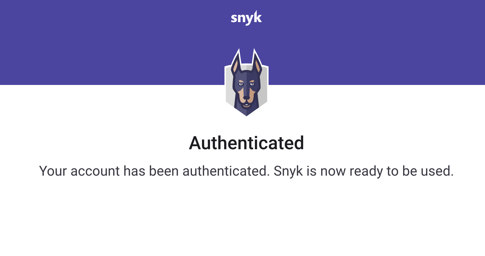

# Visual Studio Code 확장 프로그램 인증

프로젝트를 스캔하려면 Snyk에 인증해야합니다.&#x20;


인증하기 전에 지역을 올바르게 설정했는지 확인하십시오. 자세한 내용은 [지역 호스팅 및 데이터 레지던시](../../../working-with-snyk/regional-hosting-and-data-residency.md)를 참조하십시오. 이 소식지에는 [지역 URL 목록](../../../working-with-snyk/regional-hosting-and-data-residency.md#regional-urls)이 있습니다.


Snyk는 다음 프로토콜을 지원하여 인증합니다:

- OAuth 2.0 (기본)
- Snyk API 토큰 (폴백 옵션)

두 방법 모두 Snyk는 토큰을 안전하게 저장하기 위해 [시크릿 저장소 API](https://code.visualstudio.com/api/references/vscode-api#SecretStorage)를 사용합니다. 이 저장소는 시스템의 키체인을 사용하여 토큰을 관리합니다.

## OAuth 2.0 프로토콜을 사용하여 인증하는 단계

인증하려면 다음 단계를 따르십시오:

1. 확장 프로그램이 설치된 후 ****을 탐색 모음에서 클릭한 다음 **연결 및 Workspace 신뢰**를 클릭하십시오:

    <figure><figcaption>
연결 및 Workspace 신뢰
</figcaption></figure>

2. 확장 프로그램은 기본 브라우저에서 새 페이지를 열고 Snyk 계정에 로그인하라는 메시지를 표시합니다.

    <figure><figcaption>
Snyk 로그인
</figcaption></figure>

3. 다음 페이지에서 IDE가 귀하를 대신하여 작업할 수 있는 권한을 요청합니다. **앱 액세스 승인**을 클릭하십시오.

    <figure><figcaption>
앱 액세스 승인
</figcaption></figure>

4. 성공적으로 인증하면 확인 메시지가 표시됩니다.

    <figure><figcaption>
성공적인 인증
</figcaption></figure>

5. IDE는 귀하의 로컬 기기에 인증을 읽고 저장합니다. 브라우저 창을 닫고 IDE로 돌아갑니다.

분석이 자동으로 시작됩니다. 문제가 발생하는 경우 [OAuth 2.0 인증이 작동하지 않는 경우](../troubleshooting-ides/how-to-set-environment-variables-by-operating-system-os-for-ides-and-cli-1.md)를 참조하십시오.


OAuth 2.0 토큰은 정적이 아니며 Snyk 계정 페이지에서 복사할 수 없습니다.


## Snyk API 토큰을 사용하여 인증하는 단계


이 방법은 OAuth 방법보다 미래성이 낮습니다.


인증하려면 다음 단계를 따르십시오:

1. 확장 프로그램이 설치된 후 ****을 탐색 모음에서 클릭한 다음 **설정** 아이콘을 클릭하여 **인증 방법**을 찾고 **토큰 인증**으로 변경하십시오:

    <figure><figcaption>
인증 방법 변경
</figcaption></figure>

2. 당신의 API 토큰을 복사하십시오. 자세한 내용은 [Snyk API 토큰 얻기 및 사용](../../../getting-started/#obtain-and-use-your-snyk-api-token)를 참조하십시오.
3. 그런 다음 `Snyk: Set Token 명령`을 실행하고 토큰을 텍스트 필드에 붙여넣습니다.

    <figure><figcaption>
수동으로 토큰 설정
</figcaption></figure>

## 계정 전환 방법

다른 계정으로 다시 인증하려면 다음 단계를 따르십시오:

1. 제공된 `Snyk: Log Out` 명령을 실행하십시오.

    <figure><figcaption>
Snyk: Log Out
</figcaption></figure>

2. 로그아웃한 후 처음부터 인증을 시작하십시오.

## Linux 및 Unix를 위한 요구 사항

Snyk와 함께 인증할 때 사용자는 인증 URL을 클립보드로 복사할 수 있습니다.

Linux 및 Unix 사용자는 이를 위해 `xclip` 또는 `xsel` 유틸리티를 설치해야 합니다.