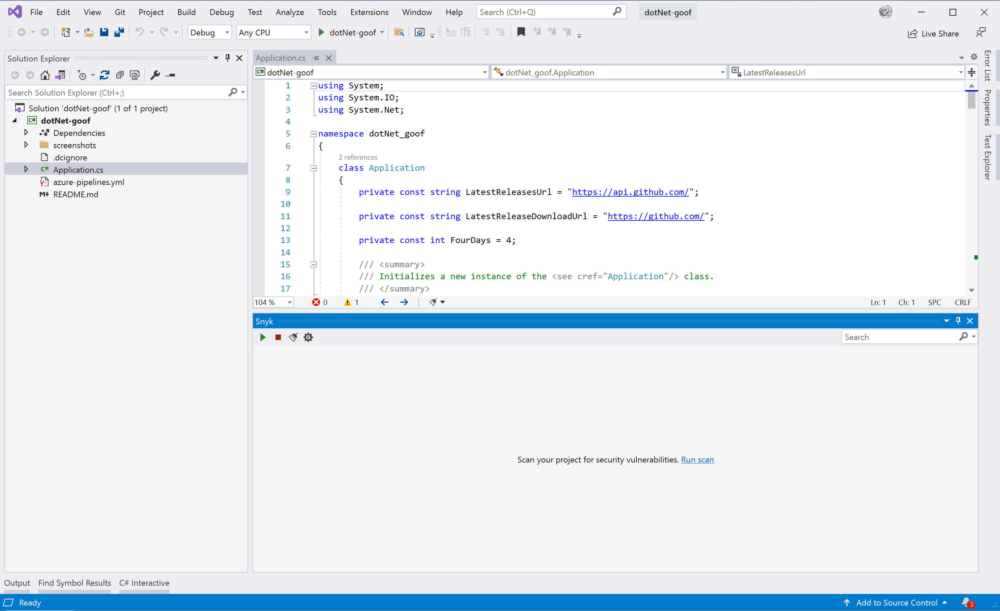
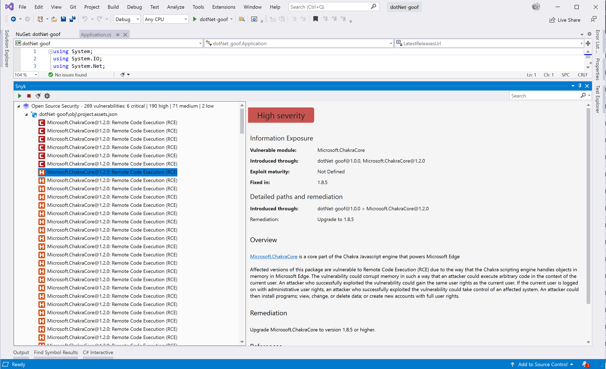

# Visual Studio 확장을 사용한 분석 실행

솔루션을 열고 Snyk 스캔을 실행합니다. 솔루션의 크기와 의존성 그래프를 작성하는 데 필요한 시간에 따라 취약점을 얻는 데 걸리는 시간은 1분 또는 2분 미만입니다.

이 확장은 두 종류의 결과를 제공합니다.

* 오픈 소스 취약점
* Snyk 코드 문제

## 오픈 소스 취약점

솔루션이 CLI가 의존성을 찾고 취약점을 발견할 수 있도록 빌드에 성공해야 함을 주의해야 합니다. 

npm 취약점만 보이거나 C#/.NET 프로젝트와 관련이 없는 취약점이 나타나는 경우, 프로젝트가 성공적으로 빌드되지 않고 CLI에 의해 감지되지 않았을 수 있습니다. 문제 또는 질문이 있으면 [Snyk 지원팀에 요청](https://support.snyk.io)을 제출하십시오.

<figure><figcaption>
스캔 실행
</figcaption></figure>

<figure><figcaption>
오픈 소스 취약점
</figcaption></figure>

## Snyk Code 문제

Snyk Code 분석은 응용 프로그램 코드에서 발견된 보안 취약점 및 코드 문제 목록을 표시합니다. 자세한 내용 및 문제 수정 사례에 대한 예제를 보려면 보안 취약점 또는 코드 보안 문제를 선택하고 Snyk가 제공하는 제안 사항을 확인하십시오.

<figure><figcaption>
Snyk 제안 패널
</figcaption></figure>

Snyk의 제안에는 코드에서 사용하는 변수명과 빨간색으로 표시된 줄번호를 통해 추천 사항이 포함됩니다. 또한 다음을 볼 수 있습니다:

* 버그 패턴을 자세히 설명하는 외부 자원으로의 링크.
* Snyk가 할당한 태그, 예: Security(발견된 문제가 보안 문제임), Database(이슈가 데이터베이스 상호작용과 관련이 있음), 또는 In Test(이슈가 테스트 코드 내에 있음).
* 문제를 해결한 다른 사람들의 코드가 포함된 오픈 소스 리포지토리 링크.