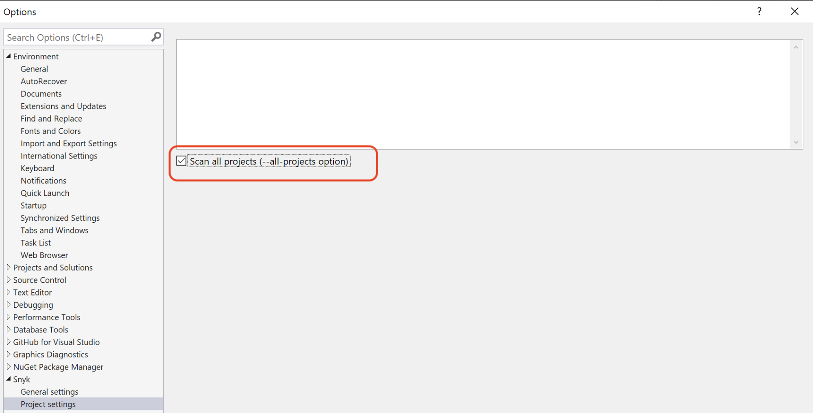

# Visual Studio 확장 프로그램의 문제 해결 및 알려진 문제


Snyk 플러그인은 배포자가 End Of Life (EOL)에 도달한 모든 운영 체제에서 지원되지 않습니다.


## 알려진 문제

### 지원 대상 파일을 감지할 수 없음

**해결 방법:** Snyk 확장 프로그램의 **Project Settings**로 이동하려면 Visual Studio Options를 열고 **Scan all projects**를 확인하세요.

<figure><figcaption><p>모든 프로젝트 스캔 옵션</p></figcaption></figure>

### 지정된 파일을 찾을 수 없음

**해결 방법:** 이 문제는 CLI 파일과 관련이 있습니다. CLI 다운로드를 시작하려면 Snyk 확장 프로그램 창을 닫고 다시 열어주세요.

### 지정된 실행 파일은 이 OS 플랫폼에 유효한 응용 프로그램이 아닙니다

**해결 방법:** 이 문제는 CLI 파일과 그 무결성과 관련이 있습니다. `%HOMEPATH%\AppData\Local\Snyk\snyk-win.exe`에서 CLI를 제거하세요. CLI 다운로드를 시작하려면 Snyk 확장 프로그램 창을 닫고 다시 열어주세요.

### 에서 지원되는 코드를 찾을 수 없음

**해결 방법:** `.gitignore` 및 `.dcignore` 파일 규칙을 확인하세요. 프로젝트의 소스 파일을 제외하는 규칙이 있는지 확인하세요.

## Visual Studio 확장 프로그램 문제 해결

### 로그

사용자 AppData 디렉토리에서 로그를 찾을 수 있습니다.

```
%HOMEPATH%\AppData\Local\Snyk\snyk-extension.log
```

### Visual Studio 버전 설명

#### 현재 VS 버전 찾는 위치 <a href="#where-to-find-the-current-vs-version" id="where-to-find-the-current-vs-version"></a>

`Help → About Microsoft Visual Studio`로 이동하세요. 이 창이 열리어야 합니다.

<figure><figcaption><p>Visual Studio 버전 정보</p></figcaption></figure>

Snyk 지원팀과 통신 중이라면, 이미지의 왼쪽 상단에 강조된 버전 번호가 필요합니다. 이것이 VS 버전입니다.

#### 버전 번호 설명 <a href="#version-numbers-explained" id="version-numbers-explained"></a>

고객이 VS 버전을 사용하고 있다고 말할 때, 일반적으로 "우리는 VS 2022를 사용하고 있습니다" 또는 "VS 2019를 사용 중입니다"와 같은 식으로 말합니다. 연도는 버전의 **주요** 부분을 나타냅니다. "실제" 버전은 다음과 같습니다:

| 2022 | 17.\* |
| ---- | ----- |
| 2019 | 16.\* |
| 2017 | 15.\* |
| 2015 | 14.\* |

버전의 다른 두 부분은 _부_ 및 _개_ 부분입니다.

예를 들어, 현재 사용 중인 VS 2022 버전이 17.2.6이라면, \_부\_는 2이고 \_개\_는 6입니다.

#### 업그레이드 방법

`Help → Check for Updates`로 이동하세요. VS가 최신 상태인지 또는 업데이트가 필요한지를 나타내는 창이 열립니다.

#### Snyk이 지원하는 버전은 무엇인가요? <a href="#what-does-snyk-support" id="what-does-snyk-support"></a>

Snyk은 사용자가 최신의 부 및 개 버전을 사용 중이라면 VS 2015, 2017, 2019 및 2022의 최신 버전을 지원합니다. 간단한 업그레이드로 보장할 수 있습니다.

사용자가 Snyk 플러그인에서 버그가 있을 경우(특히 플러그인이 로드되지 않고 파일/DLL이 누락됐다는 오류가 있는 경우), 대부분의 경우 VS를 업그레이드하여 버그를 해결할 수 있습니다.

### 무시

를 통해 개발자들은 코드베이스에서 파일을 무시할 수 있습니다. 이것은 무시를 사용하여 수행됩니다. 그러나 Visual Studio에서 `.snyk` 파일을 사용하여 C# 프로젝트에 대한 코드 무시를 관리할 수 없습니다. 대신, 개발자는 C# 프로젝트를 위해 Code Ignores를 관리하기 위해 `.dcignore` 또는 `.gitignore` 파일을 사용해야 합니다.

### 설정 저장

* `%HOME%/.config/configstore/snyk.json`에 CLI 설정이 저장됩니다. Visual Studio 플러그인은 CLI 구성에서 다음 매개변수를 사용합니다.
  * API 토큰
  * API 엔드포인트
* 추가 설정은 `settings.json`이라는 구성 파일에 저장됩니다. 이 파일은 `%LocalAppData%\\Microsoft\\VisualStudio\\`로 시작하는 경로에 위치합니다. 예: `C:\\Users\\bdoetsch\\AppData\\Local\\Microsoft\\VisualStudio\\17.0_b97950dd\\Extensions\\dnzygpqo.juy`

Visual Studio를 위한 Snyk 플러그인은 **두** 위치에 설정을 저장합니다.
