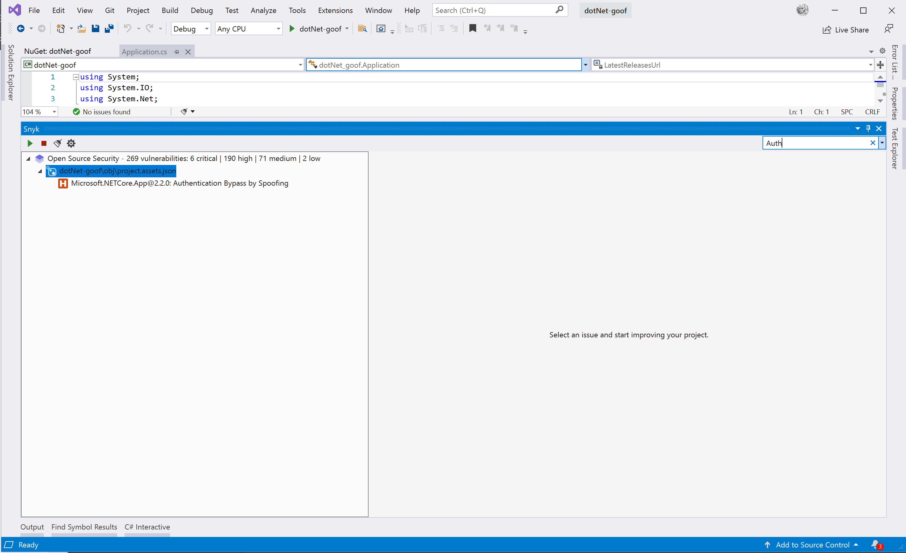

# Visual Studio 확장 프로그램에서 분석 결과 보기

이름 또는 심각도에 따라 취약점을 필터링할 수 있습니다.

이름으로 필터링하려면 검색 창에 취약점의 이름을 입력하세요.

심각도로 필터링하려면 검색 창 필터를 열고 하나 이상의 심각도를 선택하세요.

사용자는 **프로젝트 설정**을 통해 Snyk 확장 프로그램을 구성할 수 있습니다.

"모든 프로젝트 스캔" 옵션이 기본적으로 활성화되어 있음에 유의하십시오. 이는 Snyk CLI에 `--all-projects` 옵션을 추가하여 기본적으로 모든 프로젝트를 스캔하게 합니다.

