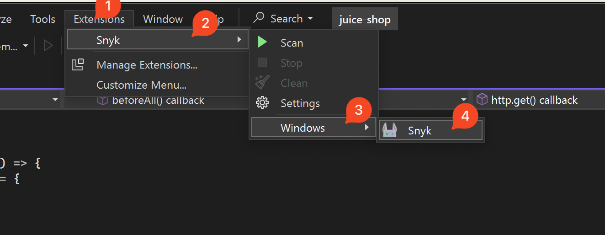
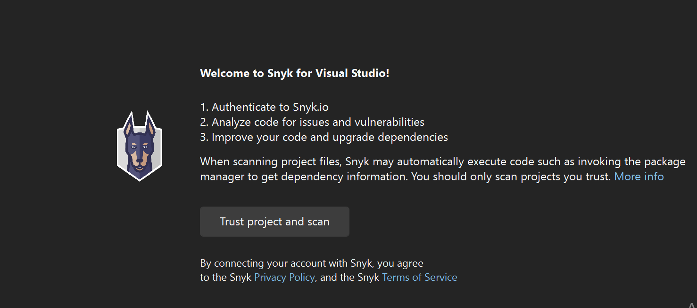
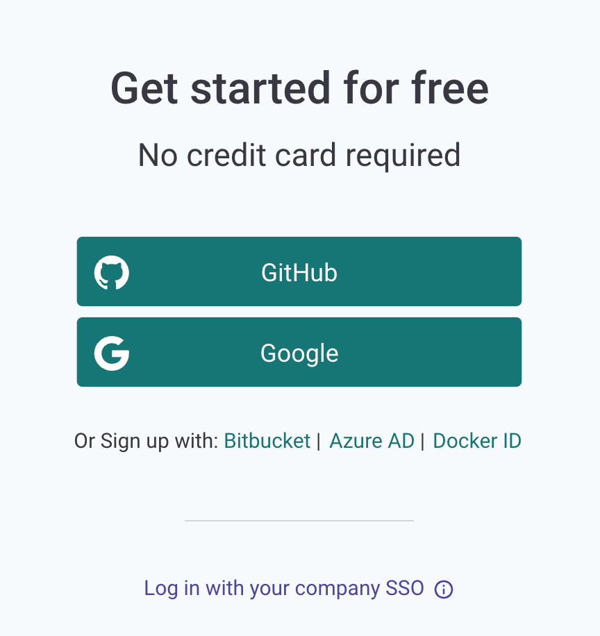
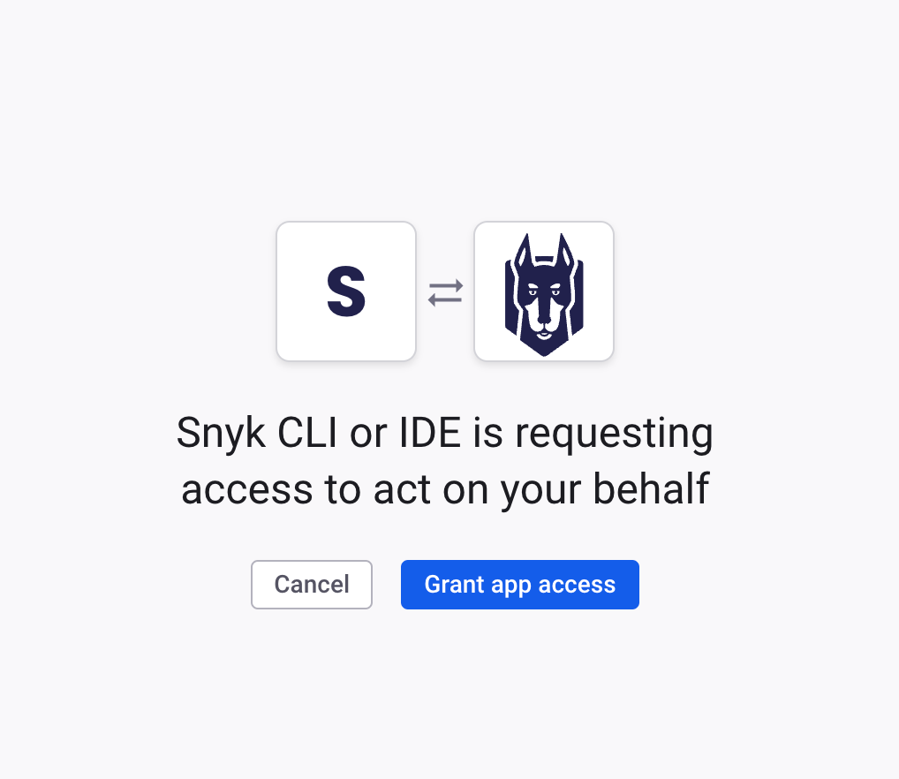
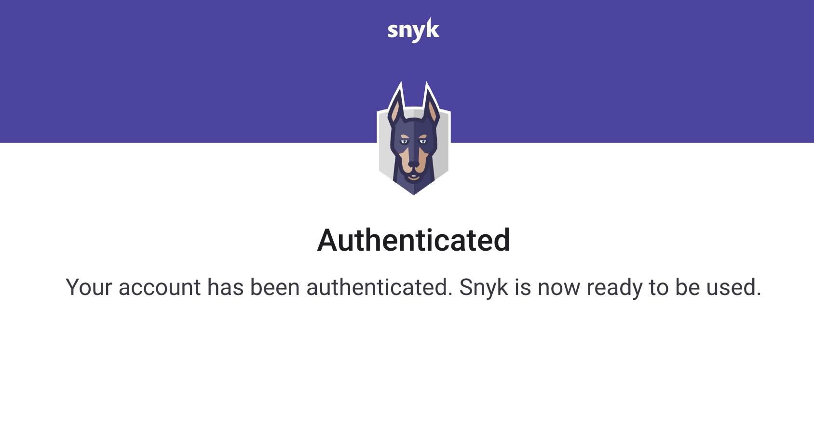
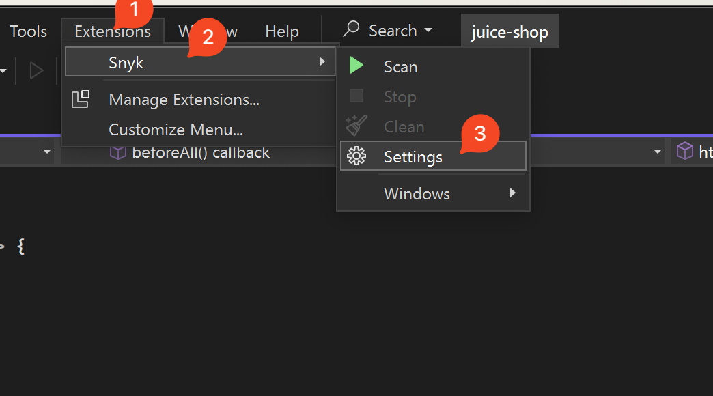

# Visual Studio 확장 프로그램 인증

프로젝트를 스캔하려면 Snyk로 인증해야 합니다.&#x20;


인증하기 전에 지역을 올바르게 설정했는지 확인하세요. 자세한 내용은 [지역 호스팅 및 데이터 수용](../../../working-with-snyk/regional-hosting-and-data-residency.md)를 참조하십시오. 해당 문서에는 [지역별 URL 목록](../../../working-with-snyk/regional-hosting-and-data-residency.md#regional-urls)이 있습니다.


Snyk는 다음 프로토콜을 지원합니다:

- OAuth 2.0 (기본)
- Snyk API 토큰 (대체 옵션)

## OAuth 2.0 프로토콜을 사용하여 인증하는 단계

다음 단계에 따라 인증하세요:

1. 확장 프로그램을 설치한 후 **Extensions > Snyk > Windows > Snyk**로 이동한 다음 열려 있는 패널을 찾으세요.&#x20;

<figure><figcaption>
Snyk 확장 프로그램 탐색
</figcaption></figure>

2. 환영 화면에서 **프로젝트 신뢰 및 스캔**을 클릭하세요.

<figure><figcaption>
프로젝트 신뢰 및 스캔
</figcaption></figure>

3. 확장 프로그램은 브라우저에서 새 페이지를 열고 Snyk 계정에 로그인하도록 요청합니다:

<figure><figcaption>
Snyk 로그인
</figcaption></figure>

4. 다음 페이지에서 IDE가 당신을 대신해서 작동할 권한을 요청합니다. **앱 액세스 부여**를 클릭하세요.

<figure><figcaption>
앱 액세스 부여
</figcaption></figure>

5. 성공적으로 인증한 후 확인 메시지를 확인하세요.

<figure><figcaption>
성공적으로 인증
</figcaption></figure>

5. IDE는 인증을 읽고 로컬 컴퓨터에 저장합니다. 브라우저 창을 닫고 IDE로 돌아갑니다.

분석이 자동으로 시작됩니다. 문제가 있으면 [OAuth 2.0 인증 작동 안 함](../troubleshooting-ides/how-to-set-environment-variables-by-operating-system-os-for-ides-and-cli-1.md)을 참조하세요.


OAuth 2.0 토큰은 정적이 아니며 Snyk 계정 페이지에서 복사할 수 없습니다.


## Snyk API 토큰을 사용하여 인증하는 단계


이 방법은 OAuth 방법보다 불량합니다.


다음 단계에 따라 인증하세요:

1. 확장 프로그램을 설치한 후, **Extensions > Snyk > Settings**로 이동하세요:

<figure><figcaption>
Snyk 설정 탐색
</figcaption></figure>

2. **인증 방식**을 찾아 **토큰 인증**으로 변경하세요.
3. API 토큰을 복사하세요. 자세한 내용은 [Snyk API 토큰 얻고 사용하기](../../../getting-started/#obtain-and-use-your-snyk-api-token)를 참조하세요.
4. 개인 토큰을 사용하는지 확인하세요. **토큰** 필드에 토큰을 붙여넣거나 입력하세요.
5. **OK**를 클릭하세요.&#x20;

## 계정 전환하는 방법

다른 계정으로 다시 인증하려면 다음 단계를 따르세요:

1. **Extensions > Snyk > Settings**로 이동하세요.
2. **토큰** 필드의 값을 지워주세요.
3. **OK**를 클릭하세요.
4. 로그아웃한 후 처음부터 인증을 시작하세요.