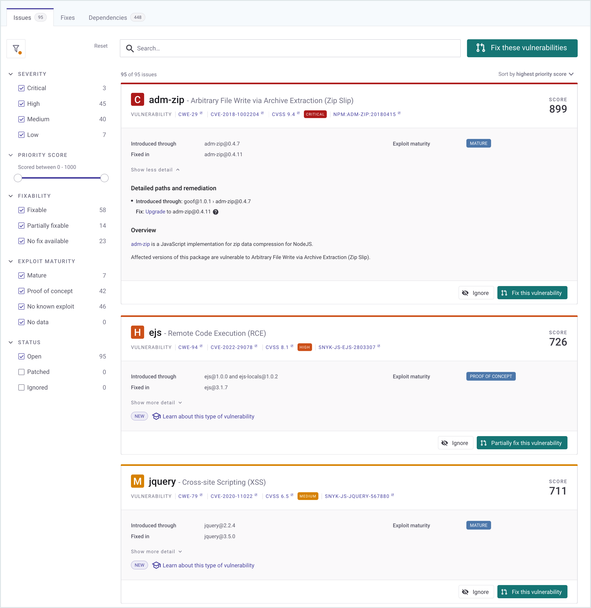

# Bitbucket Cloud 앱

Snyk 계정에 새 통합을 추가하려면 먼저 통합을 설치할 수 있는 레벨 유형을 결정해야 합니다.

* [그룹 레벨](bitbucket-cloud-app.md#group-level-snyk-apprisk-integrations) - Snyk 응용프로그램에 통합을 추가하여 Snyk AppRisk Essentials 또는 Snyk AppRisk Pro에서 사용할 수 있습니다. Snyk AppRisk를 위해 통합을 설정하려면 그룹 레벨의 Integrations 메뉴를 사용하세요.
* [조직 레벨](bitbucket-cloud-app.md#organization-level-snyk-integrations) - 모든 Snyk 제품을 위해 사용 가능한 Snyk 응용프로그램에 통합을 추가합니다.Snyk AppRisk를 제외한 제품에 사용할 수 있습니다.

## 조직 레벨 - Snyk 통합

Bitbucket Cloud 앱은 기본 Bitbucket Cloud 통합으로 위치해 있습니다.

Bitbucket Cloud 앱 통합을 통해 Snyk 조직을 Bitbucket Cloud 워크스페이스에 연결하고 모든 Snyk 핵심 SCM 통합 기능을 제공받을 수 있습니다.

* 통합된 모든 저장소에서 연속적으로 보안 스캔 수행.
* 오픈 소스 구성 요소의 취약점 탐지
* 자동 수정 및 업그레이드 제공
* 보안 문제에 대한 개발팀에 첫 번째 개발 우선 보기 제공


Snyk는 더 부드러운 통합과 장기 지원을 보장하기 위해 Bitbucket Cloud 앱 통합을 사용할 것을 권장합니다.

[Bitbucket Cloud 개인 액세스 토큰 통합](bitbucket-cloud.md)을 사용 중이라면 더 많은 정보가 필요하면.


### Bitbucket Cloud 앱 설정

Bitbucket 계정에 Snyk 액세스하려면 Bitbucket Cloud 워크스페이스에서 Snyk 앱을 설치해야 합니다.


Bitbucket Cloud 워크스페이스에 Snyk 앱을 설치하려면 Bitbucket에 대한 **관리자** 권한이 있어야 합니다.


1. Snyk에서 **Integrations(소스 제어) >** **Bitbucket Cloud App** 타일로 이동하여 **Connect**를 클릭하여 Snyk Bitbucket Cloud 앱을 Bitbucket Cloud 워크스페이스에 설치하세요.
2. 새 Bitbucket 탭에서 목록에서 Snyk 조직에 연결할 해당 워크스페이스를 선택하고 [**Grant access** to let Snyk](bitbucket-cloud-app.md#required-snyk-bitbucket-cloud-app-permissions-scope)를 클릭하세요:

    * 계정 정보 읽기
    * 리포지토리 및 풀 리퀘스트 읽기 및 수정
    * 리포지토리의 웹훅 읽기 및 수정

    <figure><figcaption>
Snyk에 Bitbucket Cloud 액세스 허용
</figcaption></figure>
3. Snyk 조직에 대한 액세스 권한을 부여하세요(프롬프트가 표시됩니다).

    <figure><figcaption>
Bitbucket Cloud가 Snyk 조직에 액세스 허용 
</figcaption></figure>

    Snyk 조직에 액세스를 허용하고 난 뒤, Snyk **Organization Settings** 페이지가 열리며 Bitbucket Cloud 앱이 연결되었음이 확인됩니다.\

Snyk가 Bitbucket Cloud와 통합되면 저장소 페이지에서 새 Snyk 보안 탭을 볼 수 있으며 Bitbucket에서 직접 프로젝트의 문제와 취약성을 가져오고 탐색할 수 있습니다.

<figure><figcaption>
Snyk Bitbucket Cloud 앱으로 Bitbucket 보안 인사이트
</figcaption></figure>

**Snyk 보안**을 Bitbucket Cloud에서 설정하는 방법을 보려면 이 짧은 동영상을 시청하세요.


Set up Snyk security in Bitbucket Cloud


### Bitbucket Cloud에서 Snyk 앱 설치

필요한 경우 Bitbucket Cloud에 있는 동안 Snyk Bitbucket Cloud 앱 통합을 설치할 수도 있습니다.

Bitbucket Cloud 워크스페이스 중 하나에서 **보안** 탭으로 이동하여 **지금 실행**을 클릭하고 절차를 따릅니다.

<figure><figcaption>
Bitbucket에서 Snyk Bitbucket Cloud 앱 설치하기
</figcaption></figure>

### Bitbucket 리포지토리를 Snyk에 추가

Snyk를 Bitbucket Cloud 계정에 연결한 후 Snyk가 모니터링할 리포지토리를 선택할 수 있습니다.

1. Snyk에서 **Integrations** > **Bitbucket Cloud App** 카드로 이동하여 Snyk에 리포지토리를 가져오는 것을 시작하는 클릭하세요.
2. 가져올 리포지토리를 선택하고 **선택한 리포지토리 추가**를 클릭하세요.

추가한 후에는 선택한 리포지토리에서 의존성 파일을 전체 디렉토리 트리(예: `package.json`, `pom.xml` 등)에서 스캔하고 이를 프로젝트로 가져와 취약점을 지속적으로 확인합니다.

가져온 프로젝트는 **프로젝트** 페이지에 표시되며 취약점이 계속 검사됩니다.

### Bitbucket 통합 기능

통합이 완료되면 다음과 같은 기능을 사용할 수 있습니다:

* [프로젝트 레벨 보안 보고서](bitbucket-cloud-app.md#project-level-security-reports)
* [풀 리퀘스트 테스트](bitbucket-cloud-app.md#pull-request-tests)
* [Bitbucket Cloud의 제1자 인터페이스](bitbucket-cloud-app.md#first-party-interface-in-bitbucket-cloud)

#### 프로젝트 레벨 보안 보고서

Snyk는 저장소에서 발견된 취약성을 즉시 고침하기 위해 필요한 업그레이드 또는 패치가 포함된 고침 풀 리퀘스트를 열어 바로 고치기 위한 고급 [보안 보고서](../../manage-issues/reporting/legacy-reports/legacy-reports-overview.md)를 제공합니다.

다음은 프로젝트 레벨 보안 보고서의 예시입니다.

<figure><figcaption>
프로젝트 레벨 보안 보고서
</figcaption></figure>

Snyk는 프로젝트를 매일 또는 매주 스캔합니다. 새로운 취약점이 발견되면 Snyk가 고침을 위한 자동으로 풀 리퀘스트를 열거나 이를 이메일 통지합니다.

다음은 Snyk가 열어진 고침 풀 리퀘스트의 예시입니다.

<figure><figcaption>
Snyk가 열어진 고침 풀 리퀘스트
</figcaption></figure>

자동 고침 풀 리퀘스트 설정을 검토하고 조정하려면:

1. Snyk에서 **Organization settings** > **Integrations > Source control > Bitbucket Cloud App**로 이동하여 **Edit Settings**를 클릭합니다.
2. **Automatic fix PRs** 섹션으로 스크롤하고 관련 옵션을 구성합니다.

    

    <figure><figcaption>
자동 고침 PR 설정 
</figcaption></figure>

    


Bitbucket Cloud 계정의 기본 리뷰어 집합에 자동으로 할당되지 않습니다.

자세한 정보는 [새로운 고치기 위한 자동 풀 리퀘스트 생성](../../scan-with-snyk/pull-requests/snyk-pull-or-merge-requests/create-automatic-prs-for-new-fixes-fix-prs.md)를 참조하세요.


#### 풀 리퀘스트 테스트

Snyk는 저장소의 새로 생성된 풀 리퀘스트를 보안 취약성에 대해 테스트하고 빌드 체크를 Bitbucket Cloud로 보냅니다. Bitbucket Cloud에서 풀 리퀘스트가 새로운 보안 문제를 도입하는지 여부를 직접 확인할 수 있습니다.

다음은 Bitbucket Cloud **Pull Request** 페이지에서 보는 Snyk 풀 리퀘스트 빌드 체크의 예시입니다.

<figure><figcaption>
BitBucket Cloud에서 Snyk 풀 리퀘스트를 보여주는 페이지
</figcaption></figure>

풀 리퀘스트 테스트 설정을 검토하고 조정하려면 다음 단계를 따르세요:

1. Snyk에서 Organization settings > **Integrations > Source control > Bitbucket Cloud App**를 클릭하여 **Edit Settings**를 클릭합니다.
2. 기본 **Snyk test for pull requests > Open Source Security & Licenses**로 스크롤하고 관련 옵션을 구성합니다. 자세한 내용은 [PR Checks 구성하기](../../scan-with-snyk/pull-requests/pull-request-checks/configure-pull-request-checks.md)를 참조하세요.

#### Bitbucket Cloud의 제1자 인터페이스

Bitbucket 워크스페이스에 Snyk Bitbucket Cloud 앱 통합을 설치하면 워크스페이스 구성원은 Bitbucket Cloud에서 관련 저장소의 보안 문제를 볼 수 있는 전용 Snyk 보안 탭을 볼 수 있습니다.

<figure><figcaption>
Bitbucket Cloud에 있는 Snyk 보안 탭
</figcaption></figure>


제1자 인터페이스는 현재 [Snyk Open Source](../../scan-with-snyk/snyk-open-source/) 및 [Snyk Container](../../scan-with-snyk/snyk-container/) 제품만 지원합니다. 다른 Snyk 제품에서 나타나는 문제는 이 페이지에 표시되지 않습니다.


**다른 Snyk 계정 또는 조직에 제1자 인터페이스 연결** 할 수 있습니다.

처음으로 Bitbucket Cloud 앱 게시 프로세스 중에 제1자 인터페이스가 특정 Snyk 조직과 연관됩니다. 이는 Bitbucket 사용자가 가져올 저장소 및 Snyk 문제를 보는 Snyk 조직입니다.

onboarding 이후에 Snyk Organization을 변경하려면 작업 공간 설정으로 이동하여 **Security for Bitbucket Cloud > Integration Settings**를 클릭한 후 **Connect via a different Snyk user/organization**를 클릭하세요.

<figure><figcaption>
다른 조직을 위한 통합 설정 만들기
</figcaption></figure>

### Bitbucket Cloud 앱 통합을 위한 필요한 권한 범위

이 통합에 필요한 권한에 대한 자세한 정보는 [Bitbucket permission requirements](./#bitbucket-permission-requirements)를 참조하세요.

### Bitbucket Cloud 앱 통합 비활성화


Snyk와 리포지토리 프로젝트의 연결을 해제하면 자격 증명이 Snyk에서 제거되며 Snyk에서 모니터링하는 인터그레이션별 프로젝트가 비활성화됩니다.

추후에 이 통합을 다시 활성화하려면 자격 증명을 다시 입력하고 프로젝트를 활성화해야 합니다.


이 통합을 비활성화하려면 **Organization settings** > **Integrations > Source Control > Bitbucket Cloud App**에서:

1. 비활성화할 Bitbucket Cloud App 통합을 선택하고 **Edit settings**를 클릭하여 현재 통합 상태를 표시하는 페이지가 열립니다.
2. **Disconnect** 섹션으로 스크롤하여 **Remove**를 클릭하여 통합을 제거합니다.


Snyk 측에서 통합 연결을 해제하는 것은 Bitbucket Cloud의 워크스페이스에서 앱을 제거하지 않습니다. Bitbucket.org의 워크스페이스 설정으로 이동하여 설치된 앱을 제거하지 않는 이상 **Snyk Security for Bitbucket Cloud** 앱은 제거되지 않습니다.


## 그룹 레벨 - Snyk AppRisk 통합

그룹 레