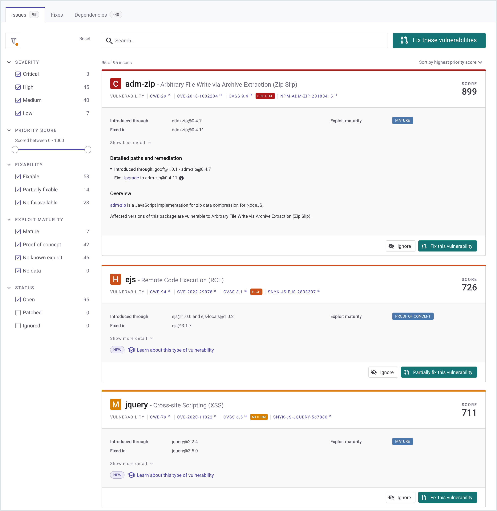
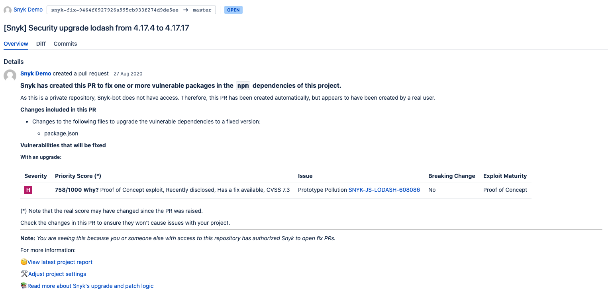
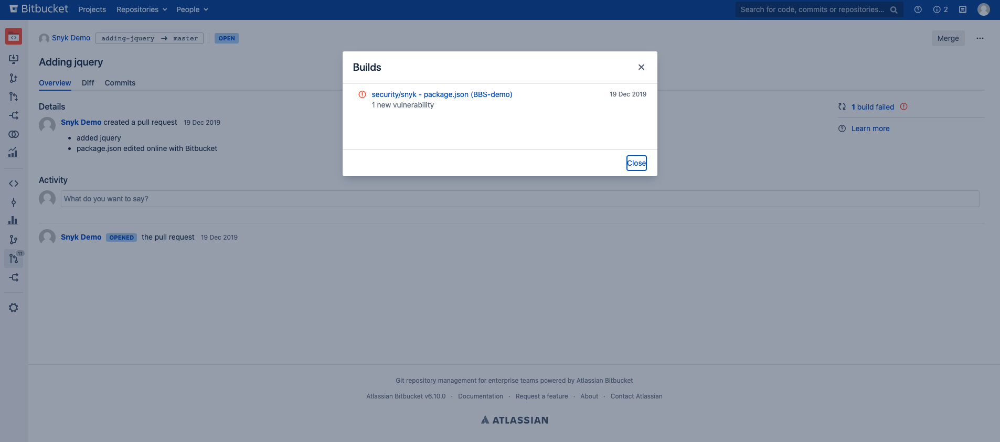
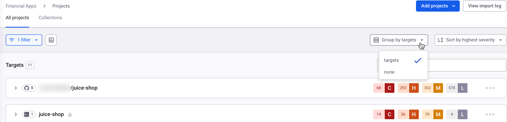
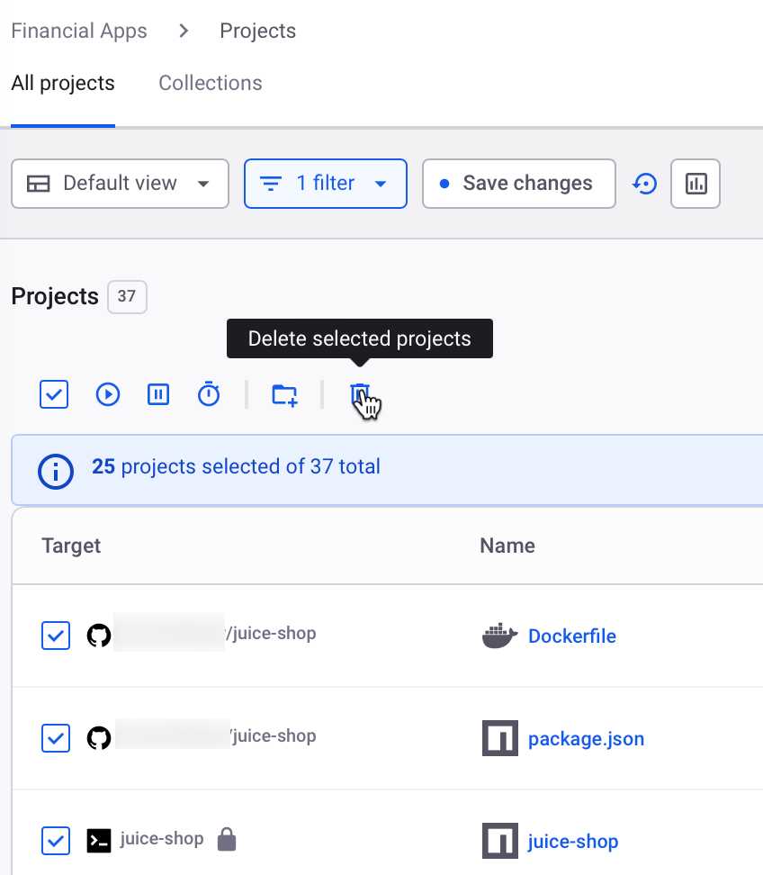
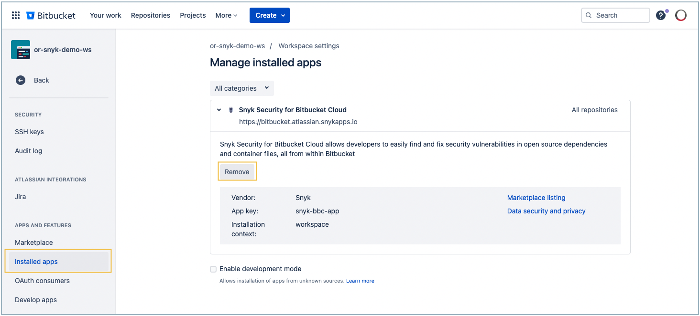

# Bitbucket Cloud

Snyk 계정에 새 통합을 추가하려면 먼저 통합을 설치할 수준 유형을 결정해야 합니다.

* [그룹 수준](bitbucket-cloud.md#group-level-snyk-apprisk-integrations) - Snyk AppRisk Essentials 또는 Snyk AppRisk Pro에서 사용할 수 있는 Snyk 응용 프로그램에 통합을 추가할 수 있습니다. Snyk AppRisk에 대한 통합을 설정하려면 그룹 수준의 통합 메뉴를 사용하십시오.
* [조직 수준](bitbucket-cloud.md#organization-level-snyk-integrations) - 모든 Snyk 제품에 사용할 수 있는 Snyk 응용 프로그램에 통합을 추가할 수 있습니다. 단, Snyk AppRisk는 제외됩니다.

## 조직 수준 - Snyk 통합


Snyk은 더 부드러운 통합 및 장기 지원을 위해 [Bitbucket Cloud 애플리케이션](bitbucket-cloud-app.md)을 설치하거나 이관하는 것을 권장합니다.


Bitbucket Cloud (PAT) 통합을 통해 다음을 수행할 수 있습니다.

* 통합된 저장소 전체에서 지속적으로 보안 스캔 수행
* 오픈 소스 구성 요소에서 취약점 감지
* 자동 수정 및 업그레이드 제공

### Bitbucket Cloud 통합 설정 방법


관리 권한이 필요하지만 Snyk의 액세스는 최종적으로 [App 비밀번호에 할당된 권한](https://support.atlassian.com/bitbucket-cloud/docs/app-passwords/)에 의해 제한됩니다.


1. Snyk에 Bitbucket 계정에 액세스 권한을 부여하려면 Bitbucket에서 관리자 권한을 가진 전용 서비스 계정을 설정하십시오. 작업 영역에 사용자 추가에 대한 자세한 내용은 [Bitbucket 문서](https://support.atlassian.com/bitbucket-cloud/docs/grant-access-to-a-workspace/)를 참조하십시오.\
   새로 만든 사용자는 Snyk으로 모니터할 필요가 있는 모든 저장소에 **관리자** 권한이 있어야 합니다.
2. Snyk에서 **통합** 페이지로 이동하여 **Bitbucket Cloud** 카드를 열고 **계정 자격 정보**를 구성하십시오.
3. Snyk의 **계정 자격 정보 >** **앱 비밀번호 생성** 섹션에서 링크 **앱 비밀번호 생성**을 사용하여 Bitbucket Cloud 계정으로 이동하십시오.
4.  다음 권한이 할당된 계정을 설정하기 위해 Bitbucket 절차를 따르십시오.

    * **계정: 이메일 및 읽기**
    * **작업 영역 멤버십: 읽기**
    * **프로젝트: 읽기**
    * **저장소: 읽기 및 쓰기**
    * **풀 리퀘스트: 읽기 및 쓰기**
    * **웹훅: 읽기 및 쓰기**

    절차에 대한 자세한 내용은 [Bitbucket 문서](https://confluence.atlassian.com/bitbucket/app-passwords-828781300.html)를 참조하십시오.
5. Bitbucket 계정의 사용자 이름 및 [비트 버킷 계정의 앱 비밀번호](https://support.atlassian.com/bitbucket-cloud/docs/app-passwords/)를 입력하고 **저장**을 클릭하십시오.\
   사용자 이름은 Bitbucket **개인 설정** 아래에서 찾을 수 있습니다.\
   Snyk Bitbucket Cloud 계정에 연결됩니다. 연결에 성공하면 확인 메시지 "**Bitbucket Cloud 설정이 성공적으로 업데이트되었습니다**"가 표시됩니다.

### Snyk에 Bitbucket 저장소 추가하는 방법

Snyk을 Bitbucket Cloud 계정에 연결한 후 Snyk이 모니터링할 저장소를 선택할 수 있습니다.

1. Snyk에서 **통합** > **Bitbucket Cloud** 카드로 이동한 다음 **Snyk에 Bitbucket Cloud 저장소 추가**를 클릭하여 Snyk에 저장소를 가져올 수 있습니다.
2. 가져오려는 저장소를 선택하고 **선택한 저장소 추가**를 클릭하십시오.

선택한 저장소를 추가한 후 Snyk은 해당 저장소를 전체 디렉토리 트리(`package.json`, `pom.xml` 등)에서 종속성 파일을 스캔하고 프로젝트로 가져옵니다.

가져온 프로젝트는 **프로젝트** 페이지에 표시되며 지속적으로 취약점을 확인합니다.

### Bitbucket 통합 기능

통합 설치 후 다음 기능을 사용할 수 있습니다.

* [프로젝트 수준 보안 보고서](bitbucket-cloud.md#project-level-security-reports)
* [프로젝트 모니터링 및 자동 수정 풀 리퀘스트](bitbucket-cloud.md#project-monitoring-and-automatic-fix-pull-requests)
* [풀 리퀘스트 테스트](bitbucket-cloud.md#pull-request-tests)

#### 프로젝트 수준 보안 보고서

Snyk이 발견한 취약점을 즉시 해결하기 위해 필요한 업그레이드 또는 패치가 포함된 보안 보고서를 통해 저장소에서 발견된 취약점을 살펴보고 즉시 수정 풀 리퀘스트를 열 수 있습니다.

다음의 예시는 프로젝트 수준 보안 보고서를 보여줍니다.

<figure><figcaption>
프로젝트 수준 보안 보고서 예시
</figcaption></figure>

#### 프로젝트 모니터링 및 자동 수정 풀 리퀘스트

Snyk이 프로젝트를 매일 또는 매주 스캔합니다. 새로운 취약점이 발견되면 Snyk은 이메일과 함께 자동화된 수정 풀 리퀘스트를 여는 방법으로 알림을 보냅니다.

다음의 예시는 Snyk에 의해 열린 자동 수정 풀 리퀘스트를 보여줍니다.

<figure><figcaption>
Snyk에 의해 열린 자동 수정 풀 리퀘스트 예시
</figcaption></figure>

자동 수정 풀 리퀘스트 설정을 검토하고 조정하려면:

1. Snyk에서 **조직 설정** > **통합 > 소스 제어 > Bitbucket Cloud**로 이동하여 **설정 편집**을 클릭하십시오.
2. **자동 수정 풀 리퀘스트** 섹션으로 스크롤하고 관련 옵션을 구성하십시오.

<figure><figcaption>
자동 수정 풀 리퀘스트 구성
</figcaption></figure>


Bitbucket Cloud 인터페이스에서 수동으로 열리는 풀 리퀘스트와 달리, Snyk 풀 리퀘스트는 기본 리뷰어에서 자동으로 할당되지 않습니다.

자세한 내용은 [Snyk 자동화된 풀 리퀘스트](../../scan-with-snyk/pull-requests/snyk-pull-or-merge-requests/create-automatic-prs-for-new-fixes-fix-prs.md)를 참조하십시오.


#### 풀 리퀘스트 테스트

Snyk 저장소의 새로 생성된 풀 리퀘스트를 보안 취약점에 대해 테스트하고 빌드 확인을 Bitbucket Cloud에 전송합니다. Bitbucket Cloud에서 바로 새 보안 문제가 소개되었는지 확인할 수 있습니다.

다음의 예시는 Bitbucket Cloud **풀 리퀘스트** 페이지에서의 Snyk 풀 리퀘스트 빌드 확인을 보여줍니다.

<figure><figcaption>
Bitbucket Cloud 풀 리퀘스트 페이지에서의 Snyk 풀 리퀘스트 빌드 확인 예시
</figcaption></figure>

풀 리퀘스트 테스트 설정을 검토하고 조정하려면:

1. Snyk에서 **조직 설정** > **통합 > 소스 제어 > Bitbucket Cloud**로 이동하여 **설정 편집**을 클릭하십시오.
2. **기본 Snyk 풀 리퀘스트 테스트 > 오픈 소스 보안 및 라이선스**로 스크롤하고 관련 옵션을 구성하십시오.

<figure><figcaption>
풀 리퀘스트 오픈 소스 보안 &#x26; 라이선스를 위한 옵션 구성
</figcaption></figure>

### Bitbucket Cloud 통합을 위한 필요한 권한 범위

수동으로 또는 자동으로 트리거된 모든 작업은 통합 설정단계에서 사용된 Bitbucket Cloud [서비스 계정](https://docs.snyk.io/features/user-and-group-management/managing-groups-and-organizations/service-accounts)에서 수행됩니다. 이 서비스 계정은 **통합 설정**에서 구성된 토큰(App 비밀번호)을 가지고 있어야 합니다.

Snyk이 모니터링 중인 저장소에서 매니페스트 파일을 주기적으로 읽고 수정 또는 업그레이드 PR을 열기 위해 필요한 작업을 수행하려면 통합된 Bitbucket Cloud 서비스 계정이 가져온 저장소에 대한 **관리자** 권한이 필요합니다.

필요한 권한 범위에 대한 자세한 정보는 [Bitbucket 권한 요구 사항](./#bitbucket-permission-requirements)을 참조하십시오.

### Snyk을 Bitbucket Cloud에서 연결 해제하는 방법


Snyk에서 귀하의 저장소 프로젝트에서 Snyk의 자격 정보를 제거하고 Snyk이 모니터링 중인 전용 프로젝트를 비활성화합니다. 이 통합을 다시 활성화하려면 자격 정보를 다시 입력하고 프로젝트를 활성화해야 합니다.


이 통합을 해제하려면 **조직 설정** > **통합**에서 다음을 수행하십시오.

1. 표시된 통합 목록에서 해제하려는 Bitbucket 통합을 선택하고 **설정 편집**을 클릭하여 현재 통합 상태가 표시되는 페이지를 엽니다.\
   \
   각 통합에 맞는 섹션이 있는 페이지를 통해 자격 정보, API 키, 서비스 주요 등을 관리할 수 있습니다.
2. 관련 섹션으로 스크롤하여 **연결 해제**를 클릭하십시오.

### Bitbucket Cloud 앱으로 이관

이 항목에서는 기존 [Bitbucket Cloud Personal Access Token (PAT) 통합](bitbucket-cloud.md)을 Snyk에서 표시된 Bitbucket Cloud로 이전하여 [**Bitbucket Cloud 앱**](bitbucket-cloud-app.md) 통합으로 이전하는 방법을 설명합니다.

새 앱 통합으로 이전하려면 이전에 가져온 모든 프로젝트를 Snyk에서 삭제하고 PAT 통합과 해당 프로젝트를 삭제한 다음 새 앱 통합을 설정하고 새 통합에서 프로젝트를 다시 가져와야 합니다.


이전 프로젝트 수준 정보가 유지되지 않음을 주의하십시오:

* 취약점 수정 트렌드 숫자를 포함한 이력 기반 프로젝트 데이터
* 프로젝트 메타데이터: 무시 및 태그


### 마이그레이션 프로세스

마이그레이션 프로세스는 다음 단계를 포함합니다:

1. Snyk에서 Bitbucket Cloud PAT 통합과 연결된 기존 [프로젝트 삭제](bitbucket-cloud.md#delete-existing-projects).
2. Snyk에서 [PAT 통합 연결 끊기](bitbucket-cloud.md#disconnect-the-pat-integration).
3. Bitbucket에서 [첫 번째 파티 확장 제거](bitbucket-cloud.md#remove-the-snyk-tab-for-the-pat-integration-in-bitbucket-cloud-optional) (선택 사항).
4. [Bitbucket Cloud App 연결](bitbucket-cloud.md#set-up-the-bitbucket-cloud-app-integration) 및 프로젝트 가져오기.

#### 기존 프로젝트 삭제

Snyk에서 이전에 Legacy 통합을 통해 가져온 기존 프로젝트를 모두 삭제합니다. 프로젝트 페이지에서 일괄 삭제 작업을 사용하려면 **Group by none**으로 그룹화 필터를 변경하세요. 이제 목록에서 여러 프로젝트를 개별적으로 선택하거나 상단의 체크박스를 선택하여 **모든 표시된 프로젝트 선택**을 선택할 수 있습니다. 프로젝트를 삭제하려면 휴지통 아이콘을 선택하고 **선택한 프로젝트 삭제**를 클릭하세요.

<figure><figcaption>
그룹화 필터를 <strong>Group by none</strong>으로 변경
</figcaption></figure>

<figure><figcaption>
선택한 프로젝트 일괄 삭제
</figcaption></figure>

#### PAT 통합 연결 끊기

Bitbucket Cloud PAT 통합을 연결 끊으려면 Bitbucket Cloud 통합의 설정 페이지로 이동하여 해당 섹션을 찾은 후 **연결 끊기**를 클릭하세요.

#### Bitbucket에서 Snyk 탭 제거 (선택 사항)

Bitbucket Cloud 통합에는 선택적인 첫 번째 파티 인터페이스 앱이 있습니다.

이 앱은 Bitbucket Cloud 워크스페이스에 설치되어 "_**Snyk**_" 탭으로 PAT 통합에 첫 번째 파티 인터페이스를 추가할 수 있습니다.

이 앱을 사용한 경우, 다음 단계에서 Snyk Bitbucket Cloud App을 설정하기 전에 Bitbucket Cloud에서 이전 인터페이스 앱을 제거하세요. 이 기능은 Snyk App 통합에서 기본적으로 지원됩니다.

**Bitbucket.org > 설치된 앱 관리**로 이동하여 **Snyk Security for Bitbucket Cloud** 앱을 확장한 후 **제거**를 클릭하세요.

<figure><figcaption>
Bitbucket에서 첫 번째 파티 Snyk Legacy 인터페이스 앱 제거
</figcaption></figure>

#### Bitbucket Cloud App 통합 설정

[Bitbucket Cloud App 통합](bitbucket-cloud-app.md) 주제를 참조하여 지침을 확인하세요.

#### 마이그레이션 데모

Snyk의 Partner Solutions Architect인 Marco Morales는 Snyk Bitbucket Cloud App에 대해 설명하고 기존 Bitbucket Cloud 통합을 Snyk Bitbucket Cloud App으로 마이그레이션하는 프로세스를 진행합니다.

_데모로 바로 가려면 2:34에서 시작하세요._


Snyk Bitbucket Cloud App 통합으로 마이그레이션하는 방법


## 그룹 수준 - Snyk AppRisk 통합

통합 페이지는 모든 활성 통합을 표시하며, 기존 Snyk 조직에서 자동으로 동기화된 데이터를 포함하고 통합 허브에 대한 액세스를 제공합니다.

### Bitbucket 설정 가이드


Bitbucket Server와 Bitbucket Cloud는 자동 언어 감지를 지원하지 않습니다. Bitbucket Cloud 리포지토리에 언어 태그를 수동으로 추가할 수 있습니다.\
Bitbucket 프로젝트에서 언어를 수동으로 설정한 후, Snyk Snyk AppRisk 애플리케이션에서 자동으로 해당 언어를 감지하고 수집할 수 있습니다.


#### 가져온 엔터티 

* 사용자
* 리포지토리

#### Snyk AppRisk를 사용하여 통합하기 

* 프로필 이름 (`필수`): 통합 프로필 이름을 입력하세요.


액세스 토큰 또는 브로커 토큰을 사용하여 통합을 선택할 수 있습니다.


**액세스 토큰 사용**

액세스 토큰 (`필수`)을 사용하여 Bitbucket 조직에서 Bitbucket PAT를 생성하세요.

* API URL (`필수`) - API URL을 입력하세요.
* 사용자 이름 (`필수`): Bitbucket 조직의 사용자 이름을 입력하세요.
* 앱 비밀번호 (`필수`): [API 토큰](https://developer.atlassian.com/cloud/bitbucket/rest/intro/#app-passwords)을 Bitbucket 계정에서 생성하고 다음 권한을 부여하세요:
  * **계정** - 읽기
  * **프로젝트** - 읽기


Bitbucket 앱 비밀번호를 생성하는 방법은 다음과 같습니다:

1. Bitbucket 계정을 엽니다.
2. 설정 옵션을 클릭합니다.
3. 개인 Bitbucket 설정 옵션을 클릭합니다.
4. **액세스 관리** 섹션에서 **앱 비밀번호** 하위 섹션으로 이동합니다.


**브로커 토큰 사용**

브로커 토큰 (`필수`)을 사용하여 Snyk 브로커를 AppRisk에 사용하려면 브로커 토큰을 생성하고 추가하세요.

* [Snyk 브로커용 브로커 토큰 얻기](../../enterprise-setup/snyk-broker/snyk-broker-code-agent/install-snyk-broker-code-agent-using-docker/obtain-the-required-tokens-for-setup.md#obtain-your-broker-token-for-snyk-broker-code-agent) 페이지의 지침을 따라 브로커 토큰을 생성하세요.
* 통합 설정 메뉴에서 Integration Hub로부터 브로커 토큰을 복사하여 붙여넣기 하세요.

**공통 옵션**

다음 옵션은 액세스 토큰과 브로커 토큰 모두에 적용됩니다.

* 서비스 유형 (`필수`): 서비스 유형을 선택하세요, 클라우드 또는 온프레미스.
* Backstage 카탈로그 추가 (`선택 사항`): Backstage 카탈로그를 추가하려면 [SCM 통합용 Backstage 파일](application-context-for-scm-integrations/) 페이지의 지침을 따르세요.

#### API 버전 

[BitBucket REST API V2](https://developer.atlassian.com/bitbucket/api/2/reference/resource/) 리포지토리를 사용하여 API에 대한 정보를 확인할 수 있습니다.
