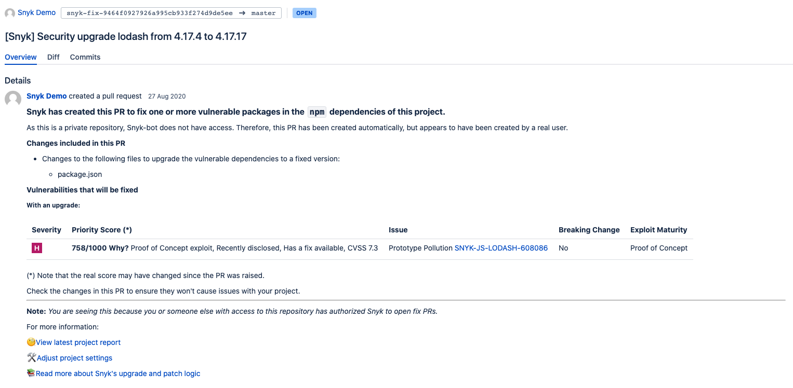
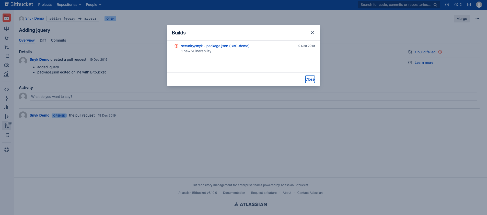

# Bitbucket 데이터 센터/서버

새 통합을 Snyk 계정에 추가하려면 통합을 설치할 레벨 유형을 먼저 결정해야 합니다.

* [그룹 레벨](bitbucket-data-center-server.md#group-level-snyk-apprisk-integrations) - Snyk AppRisk Essentials 또는 Snyk AppRisk Pro용으로 사용할 Snyk 애플리케이션에 통합을 추가합니다. Snyk AppRisk용 통합을 설정하려면 그룹 레벨의 Integrations 메뉴를 사용하세요.
* [조직 레벨](bitbucket-data-center-server.md#organization-level-snyk-integrations) - Snyk AppRisk를 제외한 모든 Snyk 제품에 사용할 Snyk 애플리케이션용 통합을 추가하세요.

## 조직 레벨 - Snyk 통합

Bitbucket Data Center/Server 통합을 사용하면 통합된 모든 리포지토리에서 지속적으로 보안 스캔을 수행하고 오픈 소스 구성 요소에서 취약점을 감지하며 자동 수정을 사용할 수 있습니다. 이 통합은 Bitbucket Data Center/Server 버전 4.0 이상을 지원합니다.

자세한 내용은 Snyk 블로그의 [Snyk 및 Bitbucket 최상의 관행 가이드](https://snyk.io/blog/snyk-bitbucket-best-practices-cheat-sheet/)를 참조하세요.

### Bitbucket DC/Server 통합 설정 방법

1. Snyk이 Bitbucket DC/Server 계정에 액세스할 수 있도록 하려면 Bitbucket DC/Server에서 관리 권한을 가진 전용 서비스 계정을 설정하세요.\
   자세한 내용은 [Bitbucket Server 문서](https://confluence.atlassian.com/bitbucketserver/users-and-groups-776640439.html#Usersandgroups-Creatingauser)를 참조하세요.\
   새로 생성한 사용자가 Snyk으로 모니터링해야 하는 모든 리포지토리에 대해 **관리자** 권한을 가지도록 확인하세요.
2. Snyk에서 **Integrations** 페이지로 이동하고 **Bitbucket Server** 카드를 클릭합니다.
3. Bitbucket DC/Server URL 및 생성한 서비스 계정의 사용자 이름과 암호를 입력하세요. 대신 [개인 액세스 토큰](https://confluence.atlassian.com/bitbucketserver075/personal-access-tokens-1018784848.html)을 생성하고 암호 대신 사용할 수도 있습니다.
   1. Bitbucket DC/Server 인스턴스에서 기본 인증이 비활성화된 경우 개인 액세스 토큰을 사용해야 합니다.
   2. 사용자 이름에 `x-access-token`을 지정하고 암호 대신 개인 액세스 토큰을 제공하세요.
4. **저장**을 클릭합니다.\
   Snyk이 Bitbucket DC/Server 인스턴스에 연결됩니다.\
   연결에 성공하면 통합 화면에 확인 메시지가 나타납니다.

### Bitbucket Server 리포지토리 가져오기 방법

Snyk이 모니터링할 리포지토리를 선택하려면 다음을 수행하세요:

1. **Snyk**에서 **Snyk에 Bitbucket Server 리포지토리 추가**를 클릭하여 Snyk에 리포지토리를 가져오기 시작합니다.
2. 요청된대로 리포지토리를 선택한 후 **선택한 리포지토리 추가**를 클릭합니다.

추가된 후에 선택한 리포지토리는 전체 디렉토리 트리에서 종속성 파일(예: `package.json`, `pom.xml` 등)을 스캔하고 이를 프로젝트로 가져와서 Snyk에서 가져옵니다.\
\
가져온 프로젝트는 Snyk **프로젝트** 페이지에 나타나며 지속적으로 취약점을 확인합니다.

### Bitbucket DC/Server 통합 기능

통합이 완료되면 다음과 같은 기능을 사용할 수 있습니다:

* [프로젝트 수준 보안 보고서](bitbucket-data-center-server.md#project-level-security-reports)
* [프로젝트 모니터링 및 자동 수정 풀 리퀘스트](bitbucket-data-center-server.md#projects-monitoring-and-automatic-fix-pull-requests)
* [풀 리퀘스트 테스트](bitbucket-data-center-server.md#pull-request-testing)

#### **프로젝트 수준 보안 보고서**

Snyk 저장소에서 발견된 취약점을 탐색하고 필요한 업그레이드 또는 패치를 가진 수정 풀 리퀘스트를 직접 저장소로 열어 즉시 해결할 수 있도록 하는 [고급 보안 보고서](../../manage-issues/reporting/legacy-reports/legacy-reports-overview.md)를 생성합니다.

다음 예는 프로젝트 수준 보안 보고서를 보여줍니다.

<figure><figcaption>
프로젝트 수준 보안 보고서
</figcaption></figure>

#### **프로젝트 모니터링 및 자동 수정 풀 리퀘스트**

Snyk은 프로젝트를 매일 또는 매주 스캔합니다. 새로운 취약점이 발견되면 Snyk이 이메일로 알림을 보내고 리포지토리에 대한 자동 Snyk 수정 풀 리퀘스트를 엽니다.

다음 예는 Snyk이 열린 수정 풀 리퀘스트를 보여줍니다.

<figure><figcaption>
Snyk이 열린 풀 리퀘스트
</figcaption></figure>

자동 수정 풀 리퀘스트 설정을 검토하고 조정하려면 다음을 수행하세요:

1. Snyk에서 **Organization settings** > **Integrations** > **Source control** > **Bitbucket Server**로 이동하고 **Edit Settings**를 클릭합니다.
2. **Automatic fix PRs** 섹션으로 스크롤하여 관련 옵션을 구성합니다.

<figure><figcaption>
자동 수정 PR 설정
</figcaption></figure>


Snyk 풀 리퀘스트는 Bitbucket Server/Data Center 계정에서 기본 리뷰어로 자동으로 할당됩니다.

Bitbucket 인터페이스에서 열린 수동 풀 리퀘스트와 달리, Snyk Bitbucket 클라우드 통합에서는 Snyk 풀 리퀘스트가 기본 리뷰어에 자동으로 할당되지 않습니다.

자세한 정보는 [새로운 수정 사항을 위한 자동 풀 리퀘스트 생성](../../scan-with-snyk/pull-requests/snyk-pull-or-merge-requests/create-automatic-prs-for-new-fixes-fix-prs.md)를 참조하세요.


#### **풀 리퀘스트 테스트**


Snyk Code PR Checks는 Bitbucket DC/Server 버전 7.0 이상에서만 사용할 수 있습니다.


Snyk은은 저장소에서 새로 생성된 각 풀 리퀘스트를 보안 취약점에 대해 테스트하고 Bitbucket DC/Server에 빌드 확인을 보냅니다. Bitbucket DC/Server에서 풀 리퀘스트가 새로운 보안 문제를 도입했는지 여부를 직접 확인할 수 있습니다.

다음 예는 Bitbucket DC/Server **Pull Request** 페이지에서 Snyk 풀 리퀘스트 빌드 확인을 보여줍니다.

풀 리퀘스트 테스트 설정을 검토하고 조정하려면 다음을 수행하세요:

1. Snyk에서 **Organization settings** > **Integrations** > **Source control** > **Bitbucket Server**로 이동하고 **Edit Settings**를 클릭합니다.
2. **Default Snyk test for pull requests** > **Open Source Security & Licenses**로 스크롤하고 관련 옵션을 구성합니다.

<figure><figcaption>
통합에 대한 PR 체크 구성
</figcaption></figure>

### Bitbucket DC/Server 통합에 필요한 권한 범위

Snyk은 통합된 서비스 계정을 통해 모든 Bitbucket DC/Server 작업을 수행합니다.

Snyk이 주기적으로 매니페스트 파일을 읽고 수정 또는 업그레이드 PR를 열기 위해 필요한 작업을 수행할 수 있도록 Bitbucket DC/Server에서 모니터링 중인 리포지토리에 통합된 Bitbucket DC/Server 서비스 계정은 가져온 리포지토리에 **관리자** 권한이 필요합니다.

보안 웹훅을 설정하는 것도 **관리자** 권한이 필요합니다. Snyk은 PR 체크뿐만 아니라 병합 이벤트에 대한 커밋 테스트와 향후 자동 가져오기와 같은 다양한 작업에 웹훅을 사용합니다. 이 이벤트가 귀하의 시스템에서만 발생하도록 하기 위해 우리는 저희가 연결된 시스템에서 공유한 권장 메소드를 사용하여 웹훅을 안전하게 유지합니다. Bitbucket Server의 경우 다음 링크를 참조하세요: [이 링크](https://urldefense.proofpoint.com/v2/url?u=https-3A__confluence.atlassian.com_bitbucketserver_manage-2Dwebhooks-2D938025878.html-23Managewebhooks-2DwebhooksecretsSecuringyourwebhook\&d=DwMGaQ\&c=wwDYKmuffy0jxUGHACmjf\&r=Ck2O4F9WHPBs7KXjKQbW8v6LYdkZzI7TbBwtHf0DvoQ\&m=aKqZjXlWOErUgMQ_jsYYcqqKiHpEYfZS1BT-ru1umJEnIorIvvNt1QshbHugekFP\&s=khA_g0Unp0YP0qTeBtQyma-KHpa1vgWwT0kzcA5tQr0\&e=).\
이를 위해 각 안전한 웹훅에 대해 생성된 시크릿 토큰이 있습니다. Snyk가 웹훅을 설정하면 확장성 제한을 해결하고 토큰 노출을 제거하며 귀하에게 통합 작업 부하를 줄여줍니다.

자세한 정보는 필요한 권한 스코프에 대해 [Bitbucket 권한 필요 사항](./#bitbucket-permission-requirements)을 참조하세요.

### **Bitbucket Data Center/Server 통합 해제 방법**


Snyk을 Bitbucket 리포지토리 프로젝트에서 분리하면 귀하의 자격 증명은 Snyk에서 제거되며 Snyk에서 모니터링 중인 통합별 프로젝트가 Snyk에서 비활성화됩니다.\
나중에 이 통합을 다시 활성화하려면 자격 증명을 다시 입력하고 프로젝트를 활성화해야 합니다.


이 통합을 비활성화하기 위해 **Organization settings** > **Integrations**에서 다음 단계를 따르세요:

1. 통합 목록에서 비활성화하려는 Bitbucket 통합을 선택하고 **Edit settings**를 클릭하여 현재 통합 상태를 나타내는 페이지를 엽니다.\
   \
   페이지에는 각 통합을 위해 자격 증명, API 키, 서비스 프린시펄 또는 연결 세부 정보를 관리할 수 있는 섹션이 포함되어 있습니다.
2. 관련 섹션으로 스크롤하여 **Remove Bitbucket Server**를 클릭합니다.

### Bitbucket Server에서 Bitbucket Data Center로 마이그레이션

일반적으로 Bitbucket Server에서 Bitbucket Data Center로 마이그레이션하면 추가 조치가 필요하지 않습니다. Snyk 통합은 Bitbucket Server와 Bitbucket Data Center API가 동일하기 때문에 계속 작동해야 합니다.

새로운 Bitbucket Data Center 인스턴스 URL이 Bitbucket Server 인스턴스 URL과 다른 경우에만 작업이 필요합니다. 이 경우 Snyk에서 Bitbucket Server-Bitbucket Data Center 통합 페이지에서 통합을 다시 연결해야 합니다. 다시 연결하려면 [Bitbucket DC/Server 통합 설정 방법](bitbucket-data-center-server.md#how-to-set-up-a-bitbucket-dc-server-integration)의 단계를 따르세요.

## 그룹 레벨 - Snyk AppRisk 통합

통합 페이지에는 자동으로 동기화된 기존 Snyk 조직 데이터와 Integration Hub에 액세스하는 모든 활성 통합이 표시됩니다.

Snyk AppRisk용 BitBucket 통합을 설정하는 방법에 대한 자세한 내용은 [Snyk AppRisk용 BitBucket 설정 가이드](bitbucket-cloud.md#bitbucket-setup-guide)를 참조하세요.
