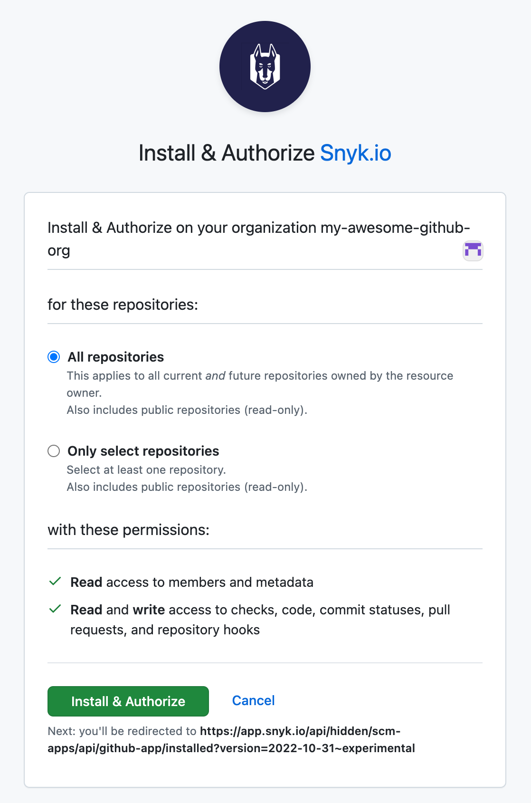

# GitHub Cloud App


**기능 가용성**

브로커를 사용 중이라면 [Universal Broker 문서](https://docs.snyk.io/enterprise-setup/snyk-broker/universal-broker)를 참조하십시오.

자체 GitHub 앱을 사용하려면 Snyk 계정팀에 문의하십시오.

GitHub 클라우드 앱에는 자동으로 추가할 수 있는 사전 구성된 IP 주소가 없습니다. 수동으로 추가하기 위해 Snyk 계정팀에 연락하십시오.


Snyk 계정에 새로운 통합을 추가하려면 먼저 통합을 설치할 수준 유형을 결정해야 합니다.

* [그룹 수준](github-cloud-app.md#group-level-snyk-apprisk-integrations) - Snyk 앱리스크 에센셜 또는 Snyk 앱리스크 프로용으로 사용할 통합을 Snyk 애플리케이션에 추가합니다. Snyk 앱리스크를 위한 통합을 설정하려면 그룹 수준의 통합 메뉴를 사용하세요.
* [조직 수준](github-cloud-app.md#organization-level-snyk-integrations) -Snyk 앱리스크를 제외한 모든 Snyk 제품에 사용할 통합을 Snyk 애플리케이션에 추가합니다.

## 조직 수준 - Snyk 통합

### GitHub 클라우드 앱을 위한 사전 요구 사항

* Snyk 조직 관리자 사용자 역할.
* GitHub 조직 관리자 사용자 역할.
* 공용 또는 비공개 GitHub 저장소.
* 필요한 앱 권한. 자세한 정보는 [GitHub 클라우드 앱 권한 요구 사항](./#github-cloud-app-permission-requirements)을 참조하십시오.


사용자는 GitHub UI를 통해 Repository Admin으로 있는 GitHub 조직에 앱을 설치할 수 있습니다.


### GitHub 클라우드 앱의 혜택

GitHub 클라우드 앱은 현재 GitHub 통합과 비교하여 많은 기능을 개선하며 롤 기반, 세분화된 액세스 제어, 증가된 API 속도 제한, 그리고 확장된 개발자 경험을 위한 진입점을 만드는 등 다양한 기능을 제공합니다.

* **RBAC (롤 기반 액세스 제어) 규정 준수**: GitHub 클라우드 앱을 사용하면 접근 제어 메커니즘이 개별 사용자 계정과 분리됩니다. 대신, 앱 엔티티 자체에 연결됩니다. 이 분리로 인해 액세스 제어가 개별 사용자 계정에 묶이는 대신 애플리케이션 수준에서 처리되므로 RBAC 정책을 더 잘 관리하고 시행할 수 있습니다.
* **세분화된 액세스 제어**: GitHub 클라우드 앱은 저장소 수준에서 액세스 권한을 세밀하게 제어할 수 있습니다.
* **증가된 API 속도 제한**: GitHub 클라우드 앱은 더 높은 속도 제한을 제공하여 Snyk이 더 많은 API 요청을 수행할 수 있습니다. 이 증가된 제한은 대규모 사용 사례를 처리하는 데 도움이 되며, 이에는 많은 프로젝트가 있는 모노 리포지토리, 많은 저장소가 있는 GitHub 조직 등이 포함됩니다.
* **향상된 개발자 경험을 위한 활성화:**
  * 풀 리퀘스트 확인: GitHub의 체크 탭 경험은 GitHub 클라우드 앱을 통해서만 접근할 수 있어 잠재적인 미래 PR 체크 워크플로우 개선의 일환으로 SCM 네이티브 경험을 제공합니다.
  * 버그 수정 및 업그레이드 풀 리퀘스트: Snyk에서 시작된 풀 리퀘스트는 GitHub 앱이 직접 수행하며 서비스 계정이 아닙니다.

### GitHub 클라우드 앱 설정 방법


GitHub 클라우드 앱을 설정할 때 다음 시나리오 중 하나만 실행할 수 있습니다:

* 한 GitHub 조직을 한 Snyk 조직에 연결
* 한 GitHub 조직을 여러 Snyk 조직에 연결


Snyk 계정에 로그인하고 GitHub 클라우드 앱을 설정하려는 Snyk 조직 내의 통합 섹션으로 이동하십시오.

**GitHub 클라우드 앱** 타일을 선택하십시오.

<figure><figcaption>
통합 페이지의 GitHub 클라우드 앱 타일
</figcaption></figure>

확인 모달에서 **GitHub 클라우드 앱 구성**을 선택하십시오.

<figure><figcaption>
GitHub 클라우드 앱 구성 안내
</figcaption></figure>

그런 다음, 앱이 사용자대신 작동할 수 있도록 승인을 요청합니다. 이 정보를 사용하여 앱이 설치할 수 있는 권한이 있는 GitHub 조직을 확인합니다.

<figure><figcaption>
앱을 위한 사용자 승인
</figcaption></figure>

GitHub의 설치 화면이 열리면, 앱을 설치할 GitHub 조직을 선택할 수 있습니다.

<figure><figcaption>
앱을 설치할 GitHub 조직 선택
</figcaption></figure>

GitHub 클라우드 앱이 이미 특정 GitHub 조직에 설치되어 있는 경우, 다른 Snyk 조직을 위해 통합 프로세스 중에 해당 GitHub 조직을 선택할 수 있습니다.

<figure><figcaption>
Snyk 조직으로 다른 GitHub 조직 연결
</figcaption></figure>

선택한 GitHub 조직에 속한 모든 저장소에 앱을 설치할지, GitHub 조직에 속한 일부 저장소에만 앱을 설치할지를 지정한 후 **설치 및 승인**을 클릭하십시오.

<figure><figcaption>
GitHub 클라우드 앱을 설치하는 GitHub 조직을 위한 설치 및 승인 설정
</figcaption></figure>


GitHub 클라우드 앱은 GitHub 조직에서 제거되거나 앱 인스턴스가 액세스하는 저장소가 편집되면 Snyk에 대한 액세스 권한을 상실할 수 있습니다.


### GitHub 클라우드 앱으로의 마이그레이션 방법

엔터프라이즈 계획 고객이라면 [snyk-migrate-to-github-app](https://github.com/snyk-labs/snyk-migrate-to-github-app) 툴을 사용하여 Snyk Targets을 GitHub 클라우드 앱으로 마이그레이션할 수 있습니다. [도구 저장소](https://github.com/snyk-labs/snyk-migrate-to-github-app)에 해당하는 [GitHub 설정 가이드](github-enterprise.md#github-setup-guide-for-snyk-apprisk)에서 모든 세부 정보를 확인하세요.

### GitHub 클라우드 앱에 대한 피드백

피드백을 제공하려면 회계 담당자 또는 [Snyk 지원팀](https://support.snyk.io)에 문의하십시오.

## 그룹 수준 - Snyk AppRisk 통합

Snyk AppRisk에 대한 조직을 위한 [GitHub 설정 가이드](github-enterprise.md#github-setup-guide-for-snyk-apprisk)에서 Snyk AppRisk를 위한 GitHub 통합을 설정하는 방법에 대한 자세한 내용을 확인하세요.