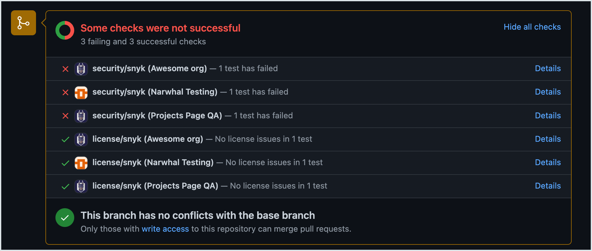

# GitHub 엔터프라이즈

새로운 통합 기능을 Snyk 계정에 추가하려면 먼저 통합을 설치할 수준 유형을 결정해야 합니다.

* [그룹 수준](github-enterprise.md#group-level-snyk-apprisk-integrations) - Snyk 앱에서 Snyk AppRisk Essentials 또는 Snyk AppRisk Pro에 사용할 수 있는 통합을 추가합니다. Snyk AppRisk용 통합을 설정하려면 그룹 수준에서 'Integrations' 메뉴를 사용하십시오.
* [조직 수준](github-enterprise.md#organization-level-snyk-integrations) - Snyk AppRisk를 제외한 모든 Snyk 제품에서 사용할 수 있는 Snyk 애플리케이션용 통합을 추가합니다.

## 조직 수준 - Snyk 통합


**기능 가용성**

GitHub Enterprise 통합은 엔터프라이즈 플랜에서만 사용할 수 있습니다. 자세한 정보는 [플랜 및 가격](https://snyk.io/plans/)을 참조하십시오.


Snyk 엔터프라이즈 플랜 고객이라면, Snyk는 GitHub Enterprise 통합을 사용할 것을 권장합니다. 자체 호스팅된 GitHub Enterprise 제품을 사용하는 경우, GitHub Enterprise 통합을 사용해야 합니다.

### GitHub Enterprise 통합 사전 준비 사항

* 인터넷에 접근할 수 있는 저장소.\
  저장소가 인터넷에 접근할 수 없는 경우, [Snyk 브로커](../../enterprise-setup/snyk-broker/)를 사용해야 합니다. 이 때 스타트업 스크립트를 생성해야 합니다. 스크립트 및 지침은 [GitHub Enterprise - 도커를 사용하여 설치 및 구성](../../enterprise-setup/snyk-broker/install-and-configure-snyk-broker/github-enterprise-prerequisites-and-steps-to-install-and-configure-broker/github-enterprise-install-and-configure-using-docker.md)를 참조하세요.
* 공개 또는 비공개 GitHub 프로젝트.
* 필수 [PAT](github-enterprise.md#how-to-generate-a-personal-access-token) 및 GitHub 저장소 액세스 범위 권한. 자세한 정보는 [GitHub 및 GitHub Enterprise 권한 요구 사항](./#github-and-github-enterprise-permission-requirements)을 참조하십시오.


Snyk GitHub Enterprise 통합을 사용하려면 GitHub Enterprise 수준 플랜에 있을 필요가 없습니다.


### GitHub Enterprise 통합 기능

GitHub Enterprise 통합을 통해 다음을 수행할 수 있습니다.

* 모든 연동된 저장소에서 [주기적 보안 검사](github-enterprise.md#obtain-project-level-security-reports) 수행.
* 오픈 소스 구성 요소에서 취약점을 [감지](github-enterprise.md#monitor-projects-and-generate-automatic-fix-pull-requests).
* GitHub에서 상태 확인을 통한 [자동 수정](github-enterprise.md#test-new-pull-requests) 및 업데이트 제공.

### GitHub Enterprise 통합 설정 방법

Snyk를 GitHub 저장소와 연결하려면 다음 단계를 따르세요.

1. GitHub Enterprise에서 쓰기 권한 또는 더 높은 범위의 서비스 계정을 작성하세요.\
   자세한 내용은 [GitHub 계정 유형](https://docs.github.com/en/get-started/learning-about-github/types-of-github-accounts) 및 [필요한 액세스 범위](github-enterprise.md#required-access-scopes-for-snyk-github-enterprise-integration)를 참조하십시오.\
   참고로, PR 확인을위한 웹훅을 생성하려면 계정의 저장소 권한이 `관리자`여야 합니다. GitHub 사용자 정의 역할은 지원되지 않습니다.
2. [개인 액세스 토큰 생성](github-enterprise.md#how-to-generate-a-personal-access-token).
3. [개인 액세스 토큰 승인 및 SSO 활성화](github-enterprise.md#how-to-authorize-your-personal-access-token-and-enable-sso)하기.
4. [GitHub 저장소 가져오기](github-enterprise.md#how-to-import-github-repositories).

#### 개인 액세스 토큰 생성

GitHub Enterprise에서 개인 액세스 토큰(PAT) 또는 세분화된 PAT은 **개발자 설정**에서 생성되어야 합니다.

액세스 범위 요구 사항에 대한 자세한 내용은 [GitHub 및 GitHub Enterprise 권한 요구 사항](./#github-and-github-enterprise-permission-requirements)을 참조하십시오.

#### **개인 액세스 토큰 승인 및 SSO 활성화 방법**

1. Snyk에서 **Integrations** 페이지로 이동하고 **GitHub Enterprise** 카드를 클릭하세요.
2. GitHub Enterprise URL 및 작성한 서비스 계정의 개인 액세스 토큰(PAT)을 입력하고 **저장**을 클릭하세요. Snyk가 GitHub 인스턴스에 성공적으로 연결하면 사용할 수 있는 저장소 목록이 표시됩니다.
3. GitHub Enterprise 조직이 SAML/SSO를 실행하는 경우, PAT가 만들어진 후 GitHub에서 PAT 옆에 **SSO 설정 구성**을 선택하세요.\
   때로는 PAT 및 통합이 구성된 후 GitHub Enterprise 조직에서 SSO가 적용될 수 있습니다. 이 경우 Snyk에 이미 표시된 프로젝트들은 보여지지만 재검사, PR 확인 등이 수행되지 않습니다. 이를 해결하려면 **SSO 구성** 설정을 확인하여 GitHub Enterprise 조직이 **Authorized**되었는지 확인하세요.\
   조직이 **Authorized**로 표시되지만 문제가 계속되는 경우, 조직의 권한을 취소한 후 다시 권한을 부여하는 방법을 시도해보세요.


GitHub Enterprise Cloud와 통합을 사용하려면 URL `https://api.github.com`을 추가하세요. 자체 호스팅된 GitHub Enterprise와 통합하려면 단계 두에 URL `https://your.github-enterprise.host`를 추가하세요.

URL 뒤에 `/`와 같은 나머지 문자가 없는지 확인하세요. URL에 나머지 문자가 있는 통합은 성공적으로 연결되지만 GitHub 파일로 잘못된 링크를 제공할 수 있습니다.



GitHub에서 PAT 토큰이 변경되거나 만료되면 Snyk와의 통합이 작동하지 않을 수 있습니다. 이 문제를 해결하려면 Snyk의 **GitHub Enterprise Integration settings** 에서 토큰을 업데이트하십시오.


#### GitHub 저장소 가져오기 방법

Snyk에 가져오려는 저장소를 선택하고 **선택한 저장소 추가**를 클릭하세요.

Snyk은 선택한 저장소에서 dependency 파일(ex: `package.json`)에 대해 전체 디렉토리 트리에서 스캔을 시작하고 해당 저장소를 프로젝트로 가져옵니다.

가져온 프로젝트는 **프로젝트** 페이지에 나타나며 지속적으로 취약점을 확인합니다.

<figure><figcaption>
Snyk에 선택한 저장소 가져오기
</figcaption></figure>

### GitHub Enterprise 통합의 사용

#### **프로젝트 수준 보안 보고서 획득**

Snyk은 고급 보안 보고서를 생성하여 저장소에서 발견한 취약점을 살펴보고 필요한 업그레이드 또는 패치로 보완합니다.

다음 예시는 프로젝트 수준 보안 보고서를 보여줍니다.

<figure><figcaption>
프로젝트 수준 보안 보고서
</figcaption></figure>

#### **프로젝트 모니터링 및 자동 보완 PR 생성**

Snyk은 프로젝트를 매일 또는 매주 스캔합니다. 새로운 취약점이 발견되면 Snyk이 이메일로 알려주고 해당하는 저장소에 보완을 위한 자동 PR을 엽니다.

다음 예시는 Snyk에서 생성된 보완 PR을 보여줍니다.

<figure><figcaption>
Snyk가 작성한 보완 PR
</figcaption></figure>

자동 보완 PR 설정을 검토하고 업데이트하려면:

1. Snyk에서 **Settings** > **Integrations** > **Source control** > **GitHub Enterprise** > **Edit Settings** 로 이동합니다.
2. **Automatic fix pull requests** 섹션으로 스크롤하여 필요에 따라 옵션을 선택합니다:

<figure><figcaption>
자동 PR 요청 설정
</figcaption></figure>

#### **새 PR 테스트**

[PR Checks](../../scan-with-snyk/pull-requests/pull-request-checks/) 기능을 사용하면 Snyk이 저장소의 새로 생성된 PR을 보안 취약점에 대해 테스트하고 GitHub에 상태 확인을 보냅니다. 이를 통해 GitHub에서 업무를 직접 확인하여 PR이 새로운 보안 문제를 도입하는지 확인할 수 있습니다.

다음 예시는 GitHub에서 표시된 Snyk PR 확인이 PR 페이지에 나타나는 방식을 보여줍니다.

<figure><figcaption>
GitHub Enterprise에 표시된 PR 테스트
</figcaption></figure>

PR 테스트 설정을 검토하고 조정하려면 다음을 수행하세요. Snyk에서 조직 **Settings** > **Integrations** > **Source control** > **GitHub Enterprise**로 이동한 후 **Edit Settings**를 선택하세요.

1. **Snyk PR 상태 확인**으로 스크롤하여 세부 정보를 확인하세요. 자세한 내용은 [PR Checks 구성](../../scan-with-snyk/pull-requests/pull-request-checks/configure-pull-request-checks.md)을 참조하세요.

<figure><figcaption>
기본 Snyk PR 테스트 설정 활성화
</figcaption></figure>

### **Pull Request를 사용자에게 할당하는 방법** 


**기능 가용성**

Pull Request 자동 할당 기능은 비공개 저장소에 대해서만 지원됩니다.


Snyk은 자동으로 할당된 Pull Request를 사용하여 해당 작업을 올바른 팀원이 처리되도록 보증할 수 있습니다.

GitHub 및 GitHub Enterprise 통합을 통해 PR에 대한 자동 할당을 활성화할 수 있으며 GitHub를 통해 가져온 모든 프로젝트 또는 개별 프로젝트에 적용할 수 있습니다.

사용자는 수동으로 지정하거나 마지막 커밋 사용자 계정을 기반으로 자동으로 선택할 수 있습니다.

#### **GitHub Enterprise 통합의 모든 프로젝트에 자동 할당 활성화**

가져온 비공개 저장소에서 모든 프로젝트에 대한 자동 할당 설정을 구성하려면 조직 **Settings** **>** **Integrations > Source control > GitHub**를 방문하고 **Enable pull request assignees**를 선택하세요.

PR를 마지막으로 수정한 사용자 또는 지정된 기여자에게 PR을 할당할 수 있습니다.

<figure><figcaption>
비공개 저장소에서 PR 할당
</figcaption></figure>


PR 할당에 대한 옵션 **The last user to change the manifest file**은 Git 커밋이 아닌 커밋 데이터를 기반으로 합니다.


#### **단일 프로젝트에 대한 자동 할당 활성화**

가져온 비공개 저장소의 특정 프로젝트에 대한 자동 할당 설정을 구성하려면 다음 단계를 따르세요.

1. 조직의 **Projects** 탭에서 관련 비공개 저장소를 선택하고 확장한 후 대상을 선택하고 **Settings** 동그라미를 클릭하세요. 이렇게 하면 프로젝트 페이지가 열립니다.
2. 프로젝트 페이지에서 해당 특정 프로젝트에 대한 고유한 설정을 적용합니다.\
   오른쪽 상단의 **Settings** 탭을 선택하고 **Github integration** 옵션을 왼쪽 사이드바에서 선택합니다.
3. 페이지 하단의 **Pull request assignees for private repos** 섹션으로 이동하고 **Inherit from integration settings** 또는 **Customize only for this Project**를 선택하세요.
4. **이 비공개 프로젝트에 대한 PR 자동 할당**이 활성화되었는지 확인하십시오.
5. PR를 마지막으로 수정한 사용자 또는 명명된 기여자에게 PR을 할당할 수 있습니다.

<figure><figcaption>
비공개 프로젝트에 대한 PR 자동 할당
</figcaption></figure>

### GitHub Enterprise 통합 해제 방법

Snyk GitHub Enterprise 통합을 해제하면 가져온 저장소에 대한 모든 스캔이 중지되며 PR 확인을 수행할 수 없으며 Snyk Web UI에서 프로젝20;

* SAML SSO를 구성했다면 GitHub PAT를 인증하십시오. 자세한 내용은 [How to authorize your Personal Access Token and enable SSO](github-enterprise.md#how-to-authorize-your-personal-access-token-and-enable-sso) 페이지를 참조하십시오.

4. Broker Token (`필수`): AppRisk에 Snyk 브로커를 사용하는 경우 브로커 토큰을 생성하고 추가하십시오.
   * [Snyk Broker를 위한 Broker 토큰 얻기](../../enterprise-setup/snyk-broker/snyk-broker-code-agent/install-snyk-broker-code-agent-using-docker/obtain-the-required-tokens-for-setup.md#obtain-your-broker-token-for-snyk-broker-code-agent) 페이지에서 지침에 따라 브로커 토큰 생성.
   * 브로커 토큰을 복사하여 통합 허브에서 상호 작용 설정 메뉴에 붙여넣기.
5. API URL (`필수`) - API URL을 입력하십시오. 기본 URL은 `https://api.github.com`입니다.
6. 개인 저장소 불러오기 (`선택사항`): 소유한 저장소만 불러오고 싶은 경우 이 옵션을 활성화하십시오.
7. Backstage Catalog 추가 (`선택사항`): Backstage 카탈로그를 추가하려는 경우, [SCM 통합을 위한 Backstage 파일](application-context-for-scm-integrations/) 페이지의 지침을 따르십시오.


**개인 저장소 불러오기** 옵션을 활성화하면 개인 저장소만 불러옵니다. 공개 저장소는 불러오지 않습니다.

조직 및 개인 저장소에서 데이터를 불러오려면 별도의 프로필을 설정해야 합니다.


#### GitHub 설정에서 개인 액세스 토큰 생성

1. GitHub을 열고 프로필에 대한 설정 메뉴를 클릭합니다.
2. 왼쪽 사이드바에서 개발자 설정을 선택합니다.
3. 개인 액세스 토큰을 선택한 다음 토큰(클래식)을 선택합니다.
4. 새 토큰 생성을 클릭하고 드롭다운에서 새 토큰 생성(클래식)을 선택합니다.
5. 노트 필드에 토큰 설명을 추가합니다.
6. 필요한 권한을 선택합니다:
   * `repo`
   * `read:org`
   * `read:user`
   * `user:email`.
7. 토큰 생성을 클릭합니다.
8. 표시된 키를 복사하여 안전한 곳에 보관합니다.


세부적인 개인 액세스 토큰은 지원되지 않습니다.


#### API 버전 

GitHub REST API를 사용하여 API에 관한 정보에 접근할 수 있습니다. [GitHub REST API](https://docs.github.com/en/rest?apiVersion=2022-11-28) 저장소를 사용할 수 있습니다.

호스트 주소로 GitHub 서버의 IP/URL을 사용할 수 있습니다. 기본 URL은 [`https://api.github.com`](https://api.github.com)입니다.

토큰과 연관된 사용자는 관련 저장소에 쓰기 권한이 있어야 스캔 문제의 분류를 수집할 수 있습니다.
