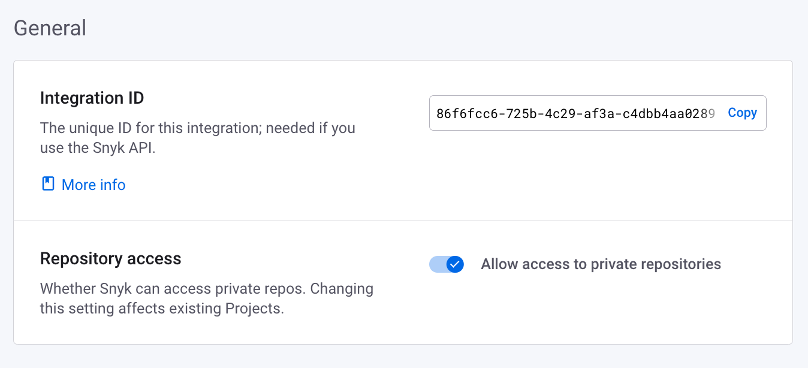
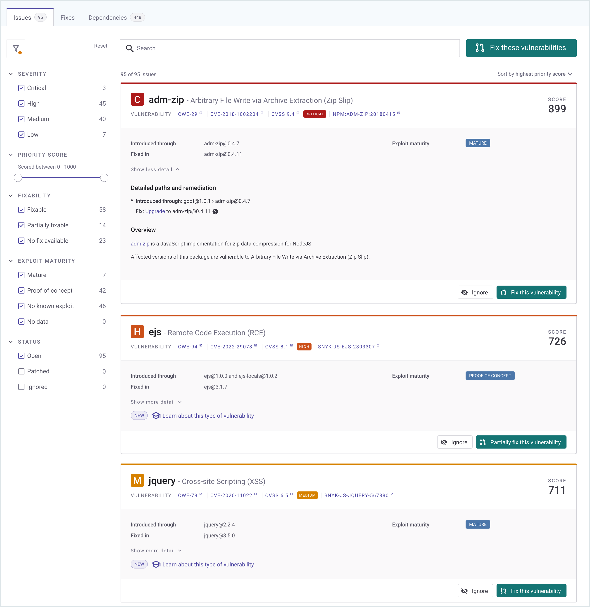
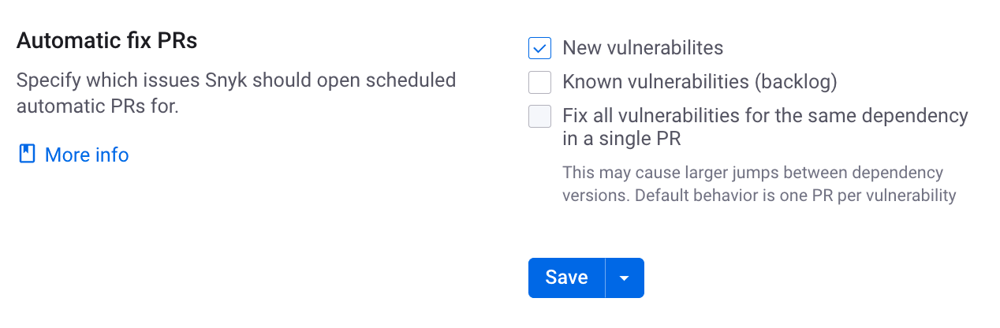
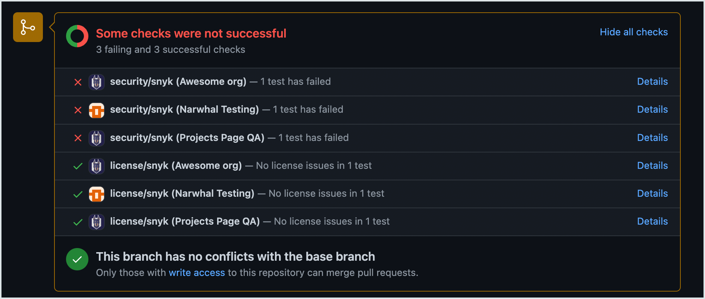
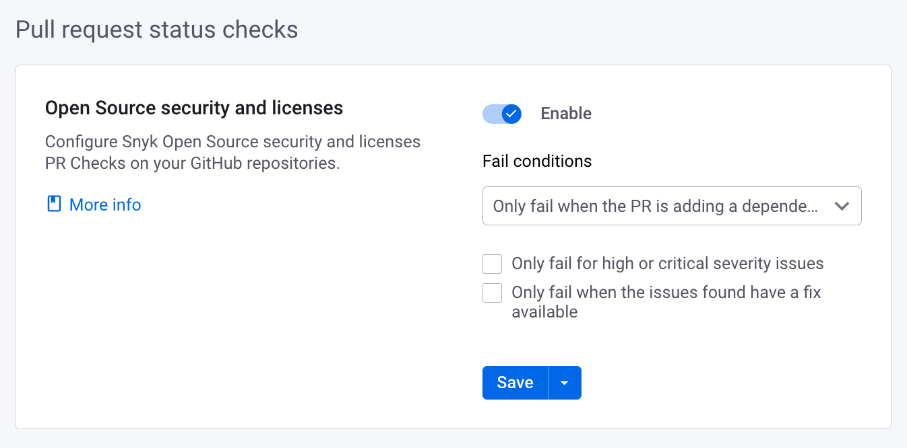
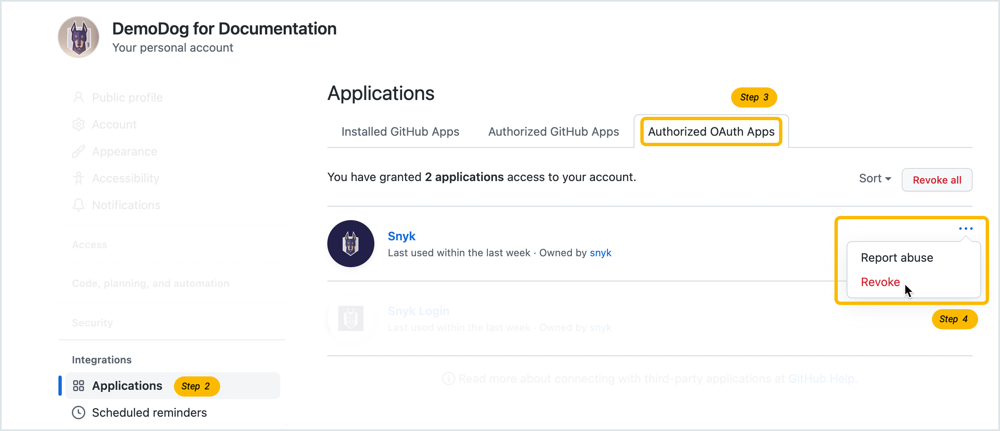

# GitHub

Snyk 계정에 새 통합을 추가하려면 먼저 설치할 통합의 레벨 유형을 결정해야 합니다.

- [그룹 레벨](github.md#group-level-snyk-apprisk-integrations) - Snyk AppRisk Essentials 또는 Snyk AppRisk Pro에 사용 가능한 Snyk 응용 프로그램에 통합을 추가할 수 있습니다. Snyk AppRisk의 통합을 설정하려면 그룹 레벨의 Integrations 메뉴를 사용합니다.
- [조직 레벨](github.md#organization-level-snyk-integrations) - Snyk AppRisk를 제외한 모든 Snyk 제품에 대해 사용 가능한 Snyk 응용 프로그램에 통합을 추가합니다.

## 조직 레벨 - Snyk 통합

### GitHub 통합의 전제 조건

* 인터넷에서 액세스할 수 있는 저장소.\
  저장소가 인터넷에서 액세스할 수 없는 경우, [Snyk Broker](../../enterprise-setup/snyk-broker/)를 사용해야 합니다.
* 공개 또는 비공개 GitHub 프로젝트.
* 필요한 PAT 및 GitHub 저장소 액세스 범위 권한. 자세한 내용은 [GitHub 및 GitHub Enterprise 권한 요구 사항](./#github-and-github-enterprise-permissions-requirements)을 참조하십시오.

### GitHub 통합의 알려진 제한 사항

Snyk [서비스 계정](../../enterprise-setup/service-accounts/)에서 GitHub 통합을 사용할 수 없습니다. GitHub 통합은 Snyk 조직이 아닌 사용자 계정과 관련되기 때문입니다.

Snyk 서비스 계정을 사용하여 API를 통해 공개 및 비공개 프로젝트를 가져오려면 [GitHub Enterprise 통합](github-enterprise.md)을 사용하십시오.

### GitHub 통합 기능

GitHub 통합을 사용하면 다음을 수행할 수 있습니다.

* 통합된 모든 저장소에서 지속적으로 보안 스캔 수행
* 오픈 소스 구성 요소의 취약점 탐지
* 자동 수정 및 업그레이드 제공

### 조직이 아닌 사용자 당 설정

GitHub 통합은 Snyk 조직이 아닌 사용자 계정에 대해 설정됩니다. GitHub 통합 설정은 사용자 계정과 연관된 모든 조직에 적용되지만 다른 사용자 계정에는 자동으로 적용되지 않습니다.

Snyk 통합이 활성화된 GitHub 통합을 사용하여 Snyk PR 기능이 활성화된 상태에서 Snyk 프로젝트를 가져오면 해당 프로젝트에 대해 Snyk PR이 생성됩니다. 그러나 다른 사용자가 Snyk PR 기능을 비활성화한 후에는 해당 기능을 비활성화한 후에 사용자가 프로젝트를 가져오면 해당 프로젝트에 대해 Snyk PR이 생성되지 않습니다.

### GitHub 통합 설정 방법

GitHub 저장소를 Snyk에 연결하여 스캔하려면 통합을 설정한 후 프로젝트를 가져와야 합니다. 자세한 내용은 [시작하기](../../getting-started/)를 참조하십시오.

### GitHub 통합 설정

GitHub 통합의 모든 설정을 보려면 GitHub 통합 설정 페이지로 이동한 다음 조직 **Settings**로 이동하여 **Integrations** 섹션에서 **GitHub**을 선택하십시오.

그런 다음 필요한 섹션으로 스크롤하고 옵션을 설정하십시오.

* [일반 설정](github.md#github-integration-general-settings)
* 풀 리퀘스트:
  * [고정된 GitHub 계정에서 수정 및 업그레이드 풀 리퀘스트 열기](../../scan-with-snyk/pull-requests/snyk-pull-or-merge-requests/opening-fix-and-upgrade-pull-requests-from-a-fixed-github-account.md)
  * [자동 수정 PR](github.md#project-monitoring-and-automatic-fix-pull-requests)
  * [자동 의존성 업그레이드 PR](../../scan-with-snyk/pull-requests/snyk-pull-or-merge-requests/upgrade-dependencies-with-automatic-prs-upgrade-prs/)
  * [풀 리퀘스트 담당자](github.md#pr-assignment)
  * [Snyk 취약성 패치](../../scan-with-snyk/snyk-open-source/manage-vulnerabilities/snyk-patches-to-fix-vulnerabilities.md)
* 풀 리퀘스트 상태 확인 ([PR Checks](../../scan-with-snyk/pull-requests/pull-request-checks/))
  * [오픈 소스 보안 및 라이선스](../../scan-with-snyk/pull-requests/pull-request-checks/configure-pull-request-checks.md#configure-pr-checks-at-the-integration-level)
  * [코드 분석](../../scan-with-snyk/pull-requests/pull-request-checks/configure-pull-request-checks.md#configure-pr-checks-at-the-integration-level)
* Dockerfiles
  * [Dockerfile 스캔](../../scan-with-snyk/snyk-container/scan-your-dockerfile/)
  * [Dockerfile의 취약한 베이스 이미지 수정](../../scan-with-snyk/snyk-container/scan-your-dockerfile/fix-vulnerable-base-images-in-your-dockerfile.md)

### 일반 GitHub 통합 설정

**일반**을 선택하여 일반 설정을 확인하십시오.

<figure><figcaption>
GitHub 통합 일반 설정
</figcaption></figure>

* **통합 ID**: 이 통합을 위해 필요한 고유 ID. [Snyk API](../../snyk-api/)를 사용하는 경우 필요합니다.
* **저장소 액세스**: Snyk가 공개 저장소에 액세스할 수 있는지 여부 (공개 저장소 외에 비공개 저장소도 포함). 이 설정을 변경하면 기존 프로젝트에 영향을 줍니다.

### GitHub 통합 기능

GitHub를 Snyk에 연결한 후 다음과 같은 기능을 사용할 수 있습니다.

* [프로젝트 수준 보안 보고서](github.md#project-level-security-reports)
* [프로젝트 모니터링 및 자동 수정 풀 리퀘스트](github.md#project-monitoring-and-automatic-fix-pull-requests)
* [커밋 서명](github.md#commit-signing)
* [풀 리퀘스트 테스팅](github.md#pull-request-testing)

#### **프로젝트 수준 보안 보고서**


**기능 가용성**

보고서는 엔터프라이즈 플랜에서만 사용 가능합니다. 자세한 내용은 [요금제 및 가격정책](https://snyk.io/plans/)을 참조하십시오.


Snyk는 고급 [보안 보고서](../../manage-issues/reporting/legacy-reports/legacy-reports-overview.md)를 제공하여 저장소에서 발견된 취약점을 탐색하고 필요한 업그레이드 또는 패치로 바로 수정 풀 리퀘스트를 여는 등의 처리 방법을 제공합니다.

이 예제는 프로젝트 수준 보안 보고서를 보여줍니다.

<figure><figcaption>
프로젝트 수준 보안 보고서
</figcaption></figure>

#### **프로젝트 모니터링 및 자동 수정 풀 리퀘스트**

Snyk는 프로젝트를 매일 또는 매주 스캔합니다. 새로운 취약점이 발견되면 Snyk가 이메일을 통해 알림을 보내고 저장소에 대한 수정을 자동으로 하는 풀 리퀘스트를 엽니다.

다음 예제는 Snyk에 의해 열린 수정 풀 리퀘스트를 보여줍니다.

<figure><figcaption>
Snyk에 의해 열린 수정 풀 리퀘스트
</figcaption></figure>

Snyk GitHub 통합 설정 페이지에서 자동 수정 풀 리퀘스트 설정을 검토하고 조정하려면 조직 **Settings** **>** **Integrations > Source control > GitHub**로 이동하십시오.

자동 수정 PR 옵션을 설정하려면 페이지의 하단으로 스크롤하여 옵션을 설정하십시오. 정의에 대해서는 [통합 수준에서 자동 수정 PR 구성](../../scan-with-snyk/pull-requests/snyk-pull-or-merge-requests/create-automatic-prs-for-backlog-issues-and-known-vulnerabilities-backlog-prs.md#configure-automatic-fix-prs-at-the-integration-level)을 참조하십시오.

<figure><figcaption>
자동 수정 풀 리퀘스트 설정
</figcaption></figure>

#### 커밋 서명


**기능 가용성**

Snyk 브로커에서 사용 가능한 경우 [커밋 서명](../../enterprise-setup/snyk-broker/snyk-broker-commit-signing.md) 페이지의 브로커 문서를 참조하십시오.


Snyk의 풀 리퀘스트에서 수행되는 모든 커밋은 `snyk-bot@snyk.io`로 (GitHub에서 확인된 사용자) 수행되며 PGP 키로 서명됩니다. 모든 Snyk 풀 리퀘스트는 GitHub에서 확인된 것으로 나타나므로 개발자들이 수정 및 업그레이드 풀 리퀘스트가 신뢰할 수 있는 소스에서 생성되었음을 확신할 수 있습니다.

#### **풀 리퀘스트 상태 확인**

Snyk의 [PR Checks](../../scan-with-snyk/pull-requests/pull-request-checks/) 기능을 사용하면 저장소에서 새 PR을 보안 취약점에 대해 테스트하고 GitHub에 상태 확인을 보내어 새 보안 문제를 도입하는지 여부를 직접 확인할 수 있습니다.

다음 예제는 GitHub 풀 리퀘스트 페이지에 나타나는 Snyk PR 확인을 보여줍니다.

<figure><figcaption>
GitHub 풀 리퀘스트 페이지에 표시되는 Snyk 풀 리퀘스트 확인
</figcaption></figure>

Snyk GitHub 통합 설정 페이지에서 풀 리퀘스트 테스트 설정을 검토하고 조정하려면 조직 **Settings** **>** **Integrations > Source control > GitHub**로 이동하십시오.

<figure><figcaption>
풀 리퀘스트 상태 확인 설정
</figcaption></figure>

### GitHub 사용자 권한 및 작업

브로커 없는 GitHub 통합에서 Snyk 웹 UI를 통해 트리거되는 작업(예: 수정 PR 열기, 프로젝트 재테스트)은 행동 중인 사용자를 대신하여 수행됩니다.

따라서 Snyk UI를 통해 GitHub에서 이러한 작업을 수행하려는 사용자는 이러한 작업을 수행하고 싶은 저장소의 필요 권한 범위로 자신의 GitHub 계정을 Snyk에 연결해야 합니다. 자세한 내용은 [GitHub 및 GitHub Enterprise 권한 요구 사항](./#github-and-github-enterprise-permissions-requirements)을 참조하십시오.

Snyk 웹 UI를 통해 트리거되지 않는 작업(예: 매일 및 매주 테스트 및 자동 PR (고정 및 업그레이드))은 해당 저장소에 대한 필요한 권한 범위를 가진 무작위 Snyk 조직 구성원에 의해 수행됩니다.

브로커가 없는 공개 저장소의 경우, PR 생성과 같은 일부 작업은 때때로 `snyk-bot@snyk.io`로 수행될 수 있습니다.


Snyk 조직 관리자는 [특정 GitHub 계정을 지정하여 수정 및 업그레이드 PR을 열도록 지정할 수 있습니다](../../scan-with-snyk/pull-requests/snyk-pull-or-merge-requests/opening-fix-and-upgrade-pull-requests-from-a-fixed-github-account.md).

이 기능을 사용해도 다른 모든 작업은 계속해서 무작위 Snyk 조직 구성원의 GitHub 계정을 사용하여 수행됩니다. 따라서 이 기능을 사용하더라도 사용자의 GitHub 계정을 Snyk에 연결해야 하는 필요성이 없어지지 않습니다.


### **Snyk PR을 열려면 GitHub 계정 설정하는 방법**

Snyk를 사용하여 고치기 및 업그레이드 PR을 열려면 특정 GitHub 계정을 지정할 수 있습니다.


구성된 계정은 PR을 열 때만 사용됩니다. 다른 모든 작업은 여전히 무작위 Snyk 조직 구성원의 GitHub 계정을 사용하여 수행됩니다.


이 기능을 사용하려면 다음 단계를 따르십시오.

1. 조직 **Settings** **>** **Integrations > Source control > GitHub**을 통해 Snyk 웹 UI의 GitHub 통합 설정 페이지로 이동하십시오.
2. **고정된 GitHub 계정에서 자동 PR 열기** 섹션에서 GitHub 개인 액세스 토큰을 입력하십시오.\
   이것은 [GitHub 계정에서 생성할 수 있습니다](https://docs.github.com/en/authentication/keeping-your-account-and-data-secure/creating-a-personal-access-tokenSnyk 브로커를 사용하지 않고 GitHub를 연결 해제하려면 다음 단계를 따르십시오:

1. GitHub에서 통합을 생성한 GitHub 계정으로 로그인하십시오.
2. GitHub 계정 설정으로 이동하여 왼쪽 사이드 바에서 **Applications** 옵션을 선택하십시오.
3. **Authorized OAuth Apps** 탭을 선택하십시오.\
   직접 [Authorized OAuth Apps tab](https://github.com/settings/applications)에 이동할 수도 있습니다.
4. **Snyk** 항목을 찾아 오른쪽에 있는 세 개의 점을 클릭하고 **Revoke**를 선택하십시오.

<figure><figcaption>
Revoke OAuth authorization
</figcaption></figure>

이 액세스를 취소하면 Snyk가 해당 GitHub 계정에 대한 액세스를 끊게 됩니다.

* 기존 가져온 스냅샷은 Snyk에서 계속 유지되며 삭제될 때까지 기존 스냅샷을 기반으로 다시 스캔됩니다.
* Snyk는 더 이상 GitHub 통합에서 새 프로젝트를 가져오거나 새 코드 병합에 대해 다시 스캔할 수 없게 됩니다.

또한, 기존 **Branch protection rules**에서 Snyk가 사용 중이지 않아야 합니다.


branch protection은 PR이 올라갔을 때에만 활성화됩니다.


1. GitHub 리포지토리의 메인 페이지에서 **Settings > Branches > Branch protection rules**로 이동하십시오.
2. **이 리포지토리에 대한 지난 일주일 동안의 상태 확인이 없습니다.**를 확인하십시오.


연결이 끊긴 GitHub 통합은 여전히 Snyk UI의 Integrations 메뉴에서 구성된 것으로 나타납니다. 그러나 해당 통합 설정을 클릭하면 연결되지 않은 것으로 표시됩니다. 이 경우 "구성된" 통합은 안전하게 무시할 수 있습니다.&#x20;


### GitHub Enterprise 통합으로 마이그레이션


GitHub 통합을 사용하여 가져온 Snyk 프로젝트를 삭제하기 전에 보고서에 미치는 영향을 고려하십시오. 프로젝트를 삭제하기로 결정하고 대상에 프로젝트가 남아 있지 않으면 해당 대상도 삭제하십시오. 자세한 내용은 Snyk 계정 팀 또는 Snyk 지원에 문의하십시오.


[GitHub Enterprise 통합](github-enterprise.md)을 사용하여 프로젝트를 설정하고 가져오기 전에 이미 GitHub 통합을 사용하여 가져온 모든 프로젝트를 삭제하는 것이 좋습니다. 이렇게 하면 중복되는 Snyk 프로젝트가 발생하는 것을 피할 수 있습니다.

GitHub 통합을 사용하여 가져온 프로젝트를 수동으로 제거하려면 Snyk에서 해당 프로젝트를 삭제하십시오. 그러나 이미 GitHub 통합을 사용하여 가져온 프로젝트가 많은 경우, 새로운 Snyk 조직을 생성하는 것이 더 쉬울 수 있습니다.

이미 여러 Snyk 조직을 만들었고 각 조직으로부터 GitHub에서 프로젝트를 가져온 경우, 각각을 수동으로 업데이트하는 것보다 Snyk GitHub Enterprise 통합을 사용하기 위해 새로운 Snyk 조직을 만드는 것이 더 간편할 수 있습니다. 이렇게 하면 다른 통합을 다시 구성하지 않고 기존 조직에서 통합 설정을 복사할 수 있습니다.

#### 마이그레이션 단계

이미 GitHub 통합을 사용하여 가져온 여러 Snyk 조직이 있는 경우, GitHub 통합에서 GitHub Enterprise 통합으로 마이그레이션하는 단계는 다음과 같습니다.

1. 다른 모든 조직의 템플릿으로 사용될 새 Snyk 조직을 만듭니다. 필요한 경우 기존 조직에서 통합 설정을 복사할 수 있습니다.
2. 이 새로운 템플릿 조직에서 [GitHub Enterprise 통합을 설정](https://docs.snyk.io/scm-ide-and-ci-cd-integrations/snyk-scm-integrations/github-enterprise#how-to-set-up-a-github-enterprise-integration)합니다. 해당 단계의 전용 GitHub 서비스 계정은 Snyk와 GitHub 간의 연결로 사용할 별도의 사용자 계정입니다.
3. Snyk GitHub Enterprise 통합이 구성되면 예상대로 작동하는지 확인하기 위해 템플릿 조직으로 프로젝트를 가져올 수 있습니다.
4. 새로운 조직을 만들어 기존의 GitHub 통합을 구성한 조직을 대체할 수 있습니다. 각 새 조직을 만들 때 이 템플릿 조직에서 통합 설정을 복사하여 GitHub Enterprise 통합을 사용할 수 있도록합니다.
5. 새로운 조직을 만든 후 소스를 선택할 때 GitHub Enterprise 통합을 선택하여 프로젝트를 가져올 수 있습니다.
6. GitHub 통합을 사용하여 구성된 이전 조직을 제거할 수 있습니다.

GitHub 통합은 조직 단위가 아니라 사용자 계정 단위로 구성되기 때문에 GitHub 통합을 설정한 각 사용자는 해당 연결 프로세스를 개별적으로 완료해야 합니다.

## 그룹 수준 - Snyk AppRisk 통합

Snyk AppRisk를 위한 GitHub 설정 가이드를 확인하려면 [GitHub setup guide for Snyk AppRisk](github-enterprise.md#github-setup-guide-for-snyk-apprisk)를 참조하십시오.