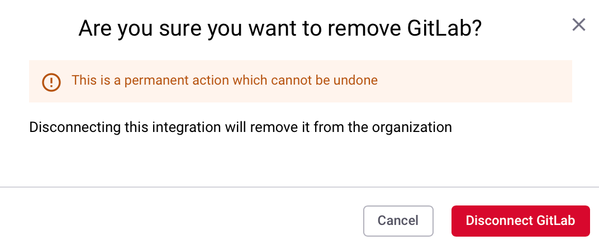
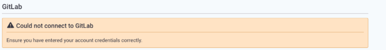

# GitLab

Snyk 계정에 새 통합을 추가하려면 먼저 통합을 설치할 수준 유형을 결정해야 합니다.

* [그룹 레벨](gitlab.md#group-level-snyk-apprisk-integrations) - Snyk 응용 프로그램에 새로운 통합을 추가하고 Snyk AppRisk Essentials 또는 Snyk AppRisk Pro에 사용할 수 있는 통합을 추가합니다. Snyk AppRisk를 위한 통합을 설정하려면 그룹 레벨의 통합 메뉴를 사용하세요.
* [조직 레벨](gitlab.md#organization-level-snyk-integrations) - Snyk 응용 프로그램에 모든 Snyk 제품(단 Snyk AppRisk 제외)에 사용할 수 있는 통합을 추가합니다.

## 조직 레벨 - Snyk 통합


**기능 이용 가능성**

GitLab 통합은 엔터프라이즈 요금제에서만 사용할 수 있습니다. 자세한 정보는 [요금제 및 가격 정책](https://snyk.io/plans/)을 참조하세요.

개인 네트워크에서 통합하는 경우 [Snyk 브로커](../../enterprise-setup/snyk-broker/)가 필요합니다.


### GitLab 통합 사전 요구 사항

* GitLab 버전 9.5 이상 (API v4).
* 공개 또는 비공개 GitLab 그룹 또는 프로젝트.

### GitLab 통합 기능

GitLab 통합을 사용하면 다음을 수행할 수 있습니다:

1. 풀 리퀘스트에서 취약점을 확인합니다.
2. **보고서** 페이지 또는 **프로젝트** 페이지에서 Snyk 웹 UI에서 나열된 수정 사항에 대한 [Snyk 풀 리퀘스트를 트리거](gitlab.md#fix-vulnerabilities-with-snyk-merge-requests)할 수 있습니다.
3. 레포지토리를 영향을 주는 새로운 취약점이 발생하거나 해당 취약점에 대한 수정 사항이 표시될 경우 [이메일 알림](gitlab.md#receive-email-alerts-for-new-vulnerabilities)을 받습니다.
4. 취약점의 새로운 업그레이드나 패치가 가능하면 새로운 풀 리퀘스트가 포함된 [이메일 알림](gitlab.md#receive-email-alerts-for-new-upgrades-or-patches)을 받습니다.

### GitLab 액세스 토큰

Snyk와 GitLab 통합을 설정하려면 GitLab 액세스 토큰을 생성하고 이를 Snyk 응용 프로그램에 입력해야 합니다.

일반적으로 Snyk 조직의 첫 번째 사용자, [Snyk 관리자](../../snyk-admin/#user-types) 및 GitLab 소유자 또는 유지 관리자는 **GitLab 개인 액세스 토큰** 또는 **그룹 액세스 토큰**을 사용하여 통합을 설정합니다. 이 토큰은 GitLab 계정의 리포지토리에 Snyk에 의한 액세스를 허용하는 방식으로 GitLab과 인증됩니다.

* **GitLab 개인 액세스 토큰**은 개인 GitLab 프로젝트에서 동작하고 관리하는 데 사용됩니다. 이는 그룹 액세스 토큰과 달리 GitLab 그룹이 아닌 사용자에 연결되어 있습니다. AppRisk에서 GitLab의 모든 리포지토리를 표시하려면 PAT를 생성하는 사용자는 그 GitLab 권한이 최소한 게스트여야 합니다.
* **GitLab 그룹 액세스 토큰**은 GitLab 그룹 내에서 하나 이상의 GitLab 프로젝트를 처리하고 관리하는 데 사용됩니다. 또한 그룹 액세스 토큰은 GitLab 그룹이나 서브그룹의 모든 GitLab 프로젝트에 액세스하는 권한을 부여하며 GitLab의 라이선스된 사용자 수에 기여하지 않습니다.

수동으로 수정 풀 리퀘스트를 생성하려면 Snyk 조직의 모든 사용자는 관련 Snyk 프로젝트를 추가하고 작업할 수 있지만, 풀 리퀘스트 자체는 GitLab에 삽입된 것으로 나타납니다.


그룹 액세스 토큰은 GitLab 소유자만 GitLab 프리미엄 또는 얼티밋 [계정 계층](https://about.gitlab.com/pricing/)을 사용하여 생성할 수 있습니다. 이는 [GitLab Web UI](https://docs.gitlab.com/ee/user/group/settings/group_access_tokens.html), Rails 콘솔 또는 GitLab API를 통해 수행할 수 있습니다.


### GitLab 통합 설정 방법

#### GitLab 개인 액세스 토큰 추가

1. GitLab 인스턴스에서 GitLab 개인 액세스 토큰을 생성합니다.\
   프로필 아이콘을 선택한 다음 **프로필 편집 > 액세스 토큰**을 선택합니다.\
   토큰 이름(예: Snyk)을 설정하고 **api** 범위를 선택합니다. **api** 범위는 모든 그룹 및 프로젝트, 컨테이너 레지스트리 및 패키지 레지스트리를 포함한 API에 대한 완전한 읽기/쓰기 액세스를 부여합니다.
2. Snyk [**통합**](https://app.snyk.io/integrations) 페이지로 이동하여 GitLab 통합 타일을 선택하고 GitLab 인스턴스의 URL 및 생성한 토큰을 입력합니다.
3. **저장**을 클릭합니다.
4. **통합** 페이지의 타일이 통합이 **구성됨**을 나타내는 경우 **타일**을 클릭하고 테스트할 GitLab 프로젝트를 선택하거나 **Snyk 대시보드**에서 **프로젝트 추가**를 선택합니다.

#### GitLab 그룹 액세스 토큰 추가

GitLab 그룹 액세스 토큰을 생성하려면 Maintainer 역할을 선택해야 합니다.

**Maintainer** 역할과 **api** 범위를 선택하면 다음을 가능하게 합니다:

* 풀 리퀘스트 및 풀 리퀘스트에 대한 Snyk 테스트 자동화
* 수정 풀 리퀘스트의 수동 생성
* 테스트 재시도의 수동 생성

#### GitLab 그룹 액세스 토큰 생성

1. GitLab 그룹을 찾아 **설정** > **액세스 토큰**을 선택합니다.
2. `SnykToken`과 같은 설명적인 토큰 이름을 입력한 다음 **Maintainer** 역할을 선택하고 **api** 범위를 확인합니다.

#### Snyk에 GitLab 그룹 액세스 토큰 추가

1. GitLab에서 생성된 토큰을 복사합니다.
2. 타일을 선택하여 Snyk GitLab 통합 페이지로 이동합니다.
3. GitLab 그룹 액세스 토큰을 Snyk 응용 프로그램에 추가하는 방법은 GitLab 개인 액세스 토큰을 추가하는 방식과 동일합니다.

### GitLab 통합 사용 방법

#### **Snyk 머지 리퀘스트를 사용하여 취약점 수정**

Snyk 프로젝트 또는 Snyk가 감시하는 GitLab 프로젝트에 대한 Snyk 테스트 보고서를 보면 취약점을 수정하는 두 가지 옵션이 표시됩니다:

* **이 취약점 수정:** Snyk 프로젝트의 감지된 모든 취약점을 수정하는 데 필요한 최소한의 변경 사항으로 Snyk 머지 리퀘스트를 생성합니다.
* **이 취약점 수정:** 개별 문제에 대한 Snyk 머지 리퀘스트를 생성하여 해당 취약점을 수정합니다.

수정할 취약점을 검토하고 선택란을 사용하여 선택 사항을 변경하고 현재 수정할 수 없는 취약점을 무시한 후 **수정 머지 리퀘스트를 엽니다** 페이지에서 머지 리퀘스트를 엽니다.


GitLab 웹훅은 머지 리퀘스트가 발생하면 Snyk로 이벤트를 전송합니다. 이로 인해 GitLab 프로젝트 파일을 가져오고 테스트 프로세스를 실행하여 결과를 GitLab에 게시하는 일련의 이벤트가 발생합니다.


#### 새로운 취약점에 대한 이메일 알림 받기

Snyk에서 감시하고 있는 Snyk 프로젝트에 새 취약점이 감지되면 Snyk가 해당 취약점을 해결하기 위한 Snyk 머지 리퀘스트를 생성하는 이메일을 보냅니다.

#### 새 업그레이드 또는 패치에 대한 이메일 알림 받기

취약점에 대한 업그레이드가 발견되지 않고 패치만 가능한 상황에 처할 수 있습니다. 해결이 가능해지면 Snyk가 알람 이메일을 보내고 새로운 수정 사항이 포함된 머지 리퀘스트를 생성합니다.


패칭은 Node.js 프로젝트에서만 가능합니다.


### GitLab 통합 해제 방법


GitLab 통합을 해제하면 Snyk 웹훅, Snyk 자격 증명 및 Snyk 웹 UI의 GitLab 프로젝트가 모두 제거되며 Pull 요청, Snyk 테스트 및 알림을 더 이상 받을 수 없습니다.


1. Snyk GitLab 통합 **설정**으로 이동합니다.
2. 페이지 하단에서 **GitLab 제거**를 선택합니다.
3. 확인 화면이 열립니다. 계속하려면 **GitLab 연결 끊기**를 선택합니다.

    <figure><figcaption>
GitLab 연결 끊기 확인
</figcaption></figure>

GitLab이 연결 해제되면 GitLab에서 가져온 Snyk 프로젝트가 비활성화되고 풀 요청에 대한 알림, 풀 리퀘스트, 또는 Snyk 테스트를 더 이상 받을 수 없습니다. 이 저장소에 대한 통합을 활성화하는 웹훅도 제거됩니다.

언제든지 다시 연결할 수 있지만 GitLab 프로젝트를 모니터링하기 위한 다시 초기화가 필요합니다.

### GitLab 통합 문제 해결

#### 오류 메시지: GitLab에 연결할 수 없음

통합 설정을 위해 환경 URL 및 액세스 토큰을 추가하는 중 다음 메시지가 표시될 수 있습니다:

<figure><figcaption>
GitLab 통합 연결할 수 없음 오류 메시지
</figcaption></figure>

이는 [Snyk Broker](https://support.snyk.io/s/article/Gitlab-Broker-is-not-working)가 관련될 때를 제외하고는 권한 문제입니다. GitLab의 PAT 설정에서 api 범위와 **Maintainer** 역할을 선택한지 확인하세요.

## 그룹 레벨 - Snyk AppRisk 통합

통합 페이지에는 자동으로 동기화되는 기존 Snyk 조직의 모든 활성화된 통합과 통합 허브에 액세스할 수 있는 데이터가 표시됩니다.

### GitLab 설정 가이드

#### 추출된 엔터티 

* 사용자
* 리포지토리

#### Snyk AppRisk를 사용하여 통합하기 

1. 프로필 이름 (`필수`): 통합 프로필 이름을 입력하세요.  
2. 액세스 토큰 (`필수`):
   * API 토큰 (`필수`): GitLab 조직에서 GitLab PAT를 생성하세요. [GitLab 설정에서 개인 액세스 토큰 생성 섹션](gitlab.md#generate-a-personal-access-token-from-your-gitlab-settings)의 지침을 따르세요. SAML SSO를 설정한 경우, 개인 액세스 토큰을 인증하세요.
   * 호스트 URL (`필수`): GitLab 서버의 IP/URL입니다. 기본 URL은 [`https://gitlab.com`](https://gitlab.com)입니다.
3. 브로커 토큰 (`필수`): Snyk 브로커를 AppRisk에 사용하려면 브로커 토큰을 생성하고 추가하세요.
   * [Snyk 브로커용 브로커 토큰 얻기](../../enterprise-setup/snyk-broker/snyk-broker-code-agent/install-snyk-broker-code-agent-using-docker/obtain-the-required-tokens-for-setup.md#obtain-your-broker-token-for-snyk-broker-code-agent) 페이지의 지침을 따라 브로커 토큰을 생성하세요.
   * 통합 설정 메뉴에서 Integration Hub로부터 브로커 토큰을 복사하여 붙여넣기 하세요.
4. SSL 확인 (`선택 사항`): SSL을 확인하려면 이 옵션을 활성화하세요.
5. 개인 리포지토리 풀 (`선택 사항`): 본인만 소유한 리포지토리를 가져오려면 이 옵션을 활성화하세요.
6. Backstage 카탈로그 추가 (`선택 사항`): Backstage 카탈로그를 추가하려면 [SCM 통합용 Backstage 파일](application-context-for-scm-integrations/) 페이지의 지침을 따르세요.

#### [GitLab 설정에서 개인 액세스 토큰](gitlab.md#gitlab-access-tokens) 생성하기

1. GitLab 프로필로 이동합니다.
2. 프로필 편집을 선택합니다.
3. 왼쪽 사이드바에서 액세스 토큰을 선택합니다.
4. 새 토큰 추가를 선택합니다.
5. 토큰 이름과 만료 날짜를 입력합니다.
6. 다음 권한을 활성화했는지 확인하세요:
   * `read_api` - API에 대한 읽기 권한을 부여하며, 모든 그룹과 프로젝트, 컨테이너 레지스트리, 패키지 레지스트리가 포함됩니다.
   * `read_repository` - Git-over-HTTP 또는 Repository Files API를 사용하는 개인 프로젝트의 리포지토리에 대해 읽기 전용 액세스를 부여합니다.
7. 개인 액세스 토큰 생성 버튼을 클릭합니다.
8. 표시된 키를 복사하여 저장합니다.

#### API 버전 

[GitLab REST API v4](https://docs.gitlab.com/ee/api/index.html) 리포지토리를 사용하여 API에 대한 정보를 확인할 수 있습니다.