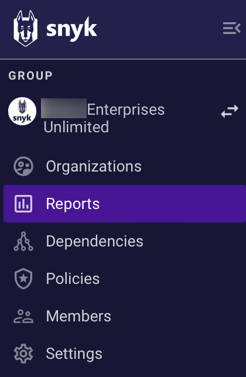
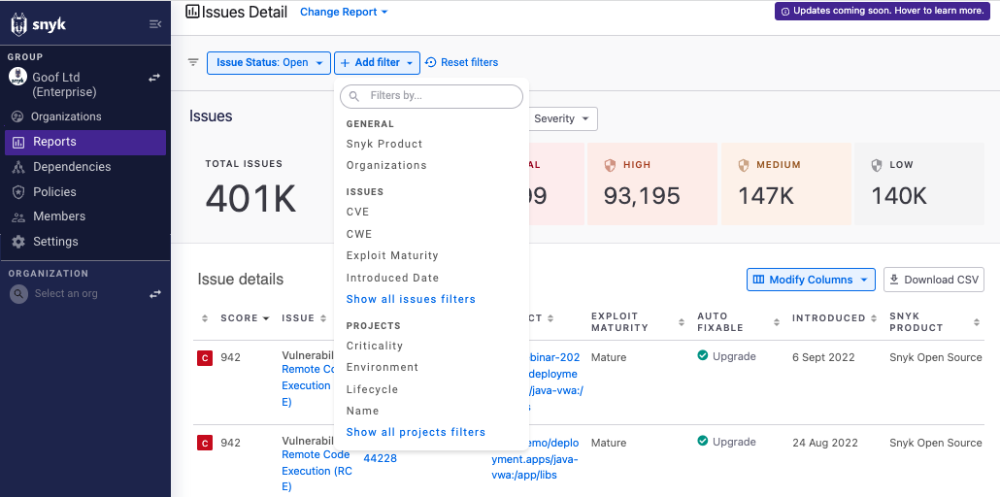
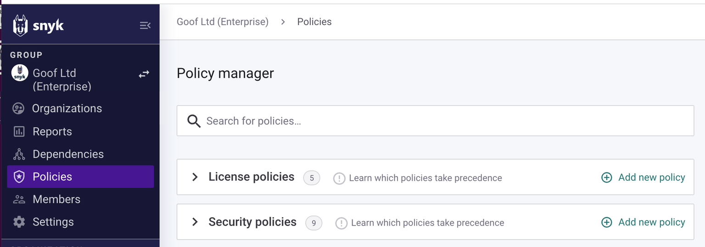
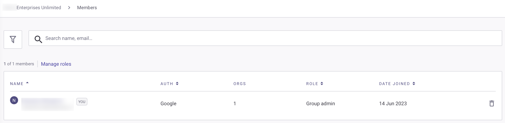
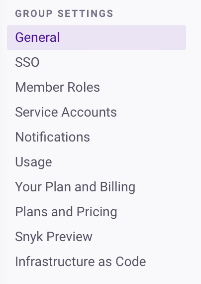

# 그룹


**기능 가용성**\
이 기능은 엔터프라이즈 플랜에서만 사용할 수 있습니다. 자세한 정보는 [플랜 및 가격](https://snyk.io/plans/)을 참조하십시오.


Snyk Groups를 사용하면 팀에서 작업하기가 더 쉬워집니다. 그룹은 많은 조직을 포함할 수 있고, 각 조직은 많은 공동 작업자와 프로젝트를 포함할 수 있습니다.

Snyk의 온보딩 중에 회사를 위한 그룹을 설정해 드릴 것입니다. 그런 다음 현재의 조직을 이 그룹에 추가할 수 있습니다. 회사에 여러 그룹이 필요하다고 생각하는 경우 [Snyk 지원팀](https://snyk.zendesk.com/agent/dashboard)에 요청을 제출하십시오. 다중 그룹에 대한 자세한 내용은 [성능을 높이는 계정 구성](../../structure-your-account-for-high-application-performance.md)을 참조하십시오.

## 그룹 수준 옵션

그룹 수준 옵션을 사용하여 그룹 내 모든 조직의 [조직](./#group-organizations), [보고서](./#group-reports), [의존성](./#group-dependencies) 및 [정책](./#group-policies)을 보고, [그룹 설정](./#group-settings)을 구성하고, 그룹의 [사용자](./#group-members)를 모두 볼 수 있습니다.

<figure><figcaption>
엔터프라이즈 플랜 사용자를 위한 그룹 수준 옵션
</figcaption></figure>

### 그룹 조직

**조직**을 선택하여 액세스할 수 있는 모든 조직과 각 조직 내에서 할당된 역할을 볼 수 있습니다:

<figure><figcaption>
사용자가 액세스 권한을 가진 모든 조직의 목록
</figcaption></figure>

그룹이 사용자가 조직에 가입할 수 있도록 설정된 경우, 해당 그룹에있는 모든 조직 목록과 현재 멤버가 아닌 조직 가입 옵션도 표시됩니다.


사용자 역할 및 관련된 액세스 권한에 대한 자세한 내용은 [사용자 역할](../../user-roles/)을 참조하십시오.


### 그룹 보고서

**보고서**를 선택하여 그룹 내 조직의 취약성 상태를 한 곳에서 보고서로 볼 수 있습니다:

<figure><figcaption>
오픈 이슈를 보여주기 위해 필터링된 그룹 보고서
</figcaption></figure>


자세한 내용은 [보고](../../../manage-issues/reporting/)를 참조하십시오.


### 그룹 자산 대시보드

**자산 대시보드**를 선택하여 애플리케이션 및 보안 제어의 개요를 볼 수 있습니다.&#x20;


**자산 대시보드**는 Snyk AppRisk 플랜에서만 사용할 수 있습니다.


### 그룹 인벤토리

**인벤토리**를 선택하여 자산을 보기, 필터링하고 관리할 수 있습니다.&#x20;


**인벤토리**는 Snyk AppRisk 플랜에서만 사용할 수 있습니다.


### 그룹 이슈

**이슈**를 선택하여 응용 프로그램에 대한 위험이라는 기반으로 컨테이너, 코드 및 오픈 소스 이슈를 더 잘 식별하고 우선순위를 매길 수 있습니다. **이슈**는 Snyk에 의해 식별된 모든 이슈를 중앙화된 관점에서 제공하며 추가 자산 콘텍스트를 제공합니다.


**이슈**는 Snyk AppRisk 플랜에서만 사용할 수 있습니다.


### 그룹 의존성

**의존성**을 선택하여 그룹의 종속성 및 라이선스 이슈를 볼 수 있습니다:

<figure><figcaption>
그룹 의존성 보기
</figcaption></figure>


자세한 내용은 [의존성 및 라이선스](../../../manage-risk/reporting/dependencies-and-licenses/)를 참조하십시오.


### 그룹 정책

**정책**을 선택하여 그룹의 라이선스 및 보안 정책을 볼 수 있습니다:

<figure><figcaption>
그룹 정책 보기
</figcaption></figure>


자세한 내용은 [정책](../../../manage-risk/policies/)을 참조하십시오.


### 그룹 통합

**통합**을 선택하여 사용 가능한 Snyk AppRisk 통합을 보고 구성할 수 있습니다.


**통합**은 Snyk AppRisk 플랜에서만 사용할 수 있습니다.


### 그룹 멤버

**멤버**를 선택하여 그룹의 사용자를 볼 수 있습니다.

그룹 멤버는 그룹의 모든 조직에 액세스 권한이 있는 사용자입니다. 조직의 사용자는 각 조직의 설정에서 관리됩니다.

<figure><figcaption>
그룹 사용자를 위한 멤버 보기
</figcaption></figure>


자세한 내용은 [그룹에서 사용자 관리](manage-users-in-a-group.md)를 참조하십시오.


### 그룹 설정

**설정**을 선택하여 그룹 설정을 보고 관리할 수 있습니다.

<figure><figcaption>
엔터프라이즈 플랜 사용자를 위한 나열된 그룹 설정
</figcaption></figure>


자세한 내용은 [설정 관리](../group-and-organization-settings.md)를 참조하십시오.
