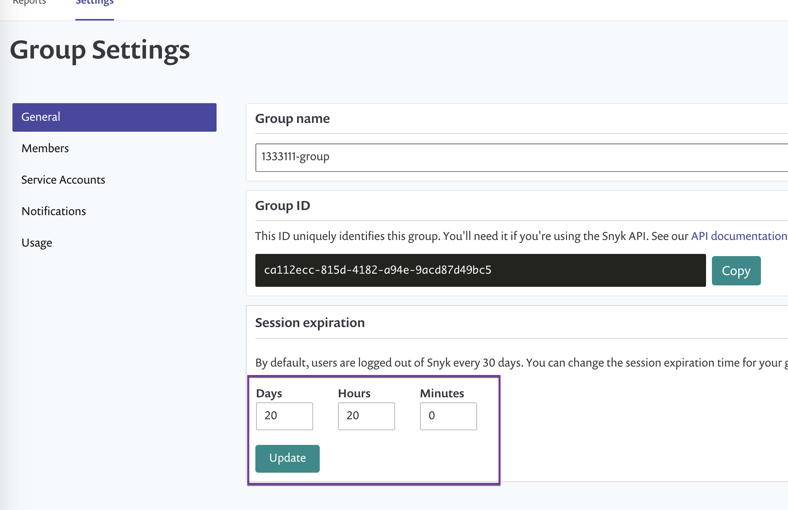

# Snyk 그룹의 세션 길이 구성

기본적으로 비활성상태의 로그인된 사용자는 24시간 후에 자동으로 로그아웃되어 계정이 사용자의 비활동으로 인해 무심코 노출되는 것을 방지합니다.

그룹 관리자는 기본 세션 길이를 5분부터 30일까지의 어떤 값으로도 변경할 수 있습니다.


여러 그룹에 속한 사용자는 이러한 그룹 중 어느 것에 대해 구성된 가장 짧은 시간 이후에 자동으로 로그아웃됩니다.


## **세션 길이를 구성하는 데 필요한 사전 요구 사항**

그룹의 관리자여야 합니다.

그룹을 지원하는 Snyk 요금제의 고객이어야 합니다. 자세한 정보는 [요금제 및 가격](https://snyk.io/plans/)을 참조하십시오.

## **세션 길이를 구성하는 단계**

1. Snyk 계정에 로그인하고 세션 길이를 구성하려는 그룹으로 이동합니다.
2. **설정**으로 이동하여 그룹 설정을 업데이트합니다.
3. **세션 만료** 영역에서 세션 길이에 대한 값을 입력하세요.

<figure><figcaption>
그룹 설정의 세션 만료 영역
</figcaption></figure>

세션 길이 만료가 구성되면 60초 후 또는 사용자가 로그인하는 경우 중 먼저 발생한 시점부터 세션 길이 추적이 시작됩니다.


자세한 정보는 [그룹 일반 설정](group-general-settings.md) 문서에서 그룹 설정에 대한 내용을 참조하세요.
