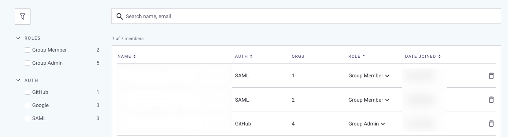

# 그룹에서 사용자 관리


**기능 가용성**

그룹은 Enterprise 요금제에서만 사용 가능합니다. 자세한 정보는 [요금제 및 가격](https://snyk.io/plans/)을 참조하십시오.


사용자 관리를 원하는 **그룹** 및 **멤버** 메뉴 옵션을 선택하여 그룹 멤버를 관리할 수 있습니다:

<figure><figcaption>
그룹 멤버 페이지
</figcaption></figure>

그룹 관리자로서 다음을 수행할 수 있습니다:

- [그룹 및 조직 멤버 보기](manage-users-in-a-group.md#view-group-and-organization-members)
- [개별 멤버 보기](manage-users-in-a-group.md#view-individual-members)
- [그룹 멤버를 그룹 관리자로 승격](manage-users-in-a-group.md#promote-a-group-member-to-a-group-admin)
- [그룹 멤버 삭제](manage-users-in-a-group.md#delete-group-members)
- [보기 필터링 및 정렬](manage-users-in-a-group.md#filter-and-sort-views-of-group-members)


외부 사용자를 직접 그룹에 추가할 수 없습니다. 먼저 조직에 추가하고 그다음 그룹에 추가해야 합니다. 자세한 내용은 [조직에서 사용자 관리](../organizations/manage-users-in-organizations.md)를 참조하십시오.


## 그룹 및 조직 멤버 보기

그룹 멤버 페이지에서 귀하의 그룹과 연관된 모든 멤버, 역할 및 인증 유형, 멤버인 조직 수 및 가입일을 볼 수 있습니다.

그룹 레벨에서는 **그룹 멤버** 및 **그룹 관리자** 두 가지 표준 역할이 있습니다.


그룹 관리자는 모든 Snyk 권한을 갖습니다. 자세한 내용은 [미리 정의된 사용자 역할](../../user-roles/pre-defined-roles.md)을 참조하십시오. 그러나 그룹 멤버가 바로 사용자에게 권한을 주지는 않습니다. 권한을 부여하려면 사용자가 조직 멤버로 추가되거나 그룹 관리자로 승격되어야 합니다.


<figure><figcaption>
그룹 멤버 보기
</figcaption></figure>

## 개별 멤버 보기

각 멤버의 행을 클릭하여 해당 멤버의 그룹 멤버 세부 정보를 볼 수 있습니다.

**그룹 멤버**인 경우, 사용자가 멤버인 각 조직에서의 사용자 역할, 추가된 날짜 및 사용자의 인증 방법을 볼 수 있습니다.

그룹 멤버는 각 조직에서 다른 역할을 가질 수 있습니다. 역할로 필터링할 수 있습니다. 사용 가능한 삭제 버튼을 사용하여 사용자를 그룹이나 조직에서 제거할 수도 있습니다.

<figure><figcaption>
그룹 멤버 세부 정보
</figcaption></figure>

그룹 관리자 역할을 가진 사용자는 해당 그룹의 모든 조직에 액세스할 수 있으며, 이러한 조직에서 조직 관리자 역할과 동일한 액세스 권한을 부여받습니다. 특정 조직에서 그룹 관리자의 역할을 변경하거나 하나 이상의 조직에서 그룹 관리자를 삭제할 수는 없지만, **그룹에서 제거** 옵션을 사용하여 그룹 관리자를 그룹에서 제거할 수 있습니다.

## 그룹 멤버를 그룹 관리자로 승격

사용자의 이름 옆의 **역할** 드롭다운을 선택하여 사용자를 그룹 관리자로 승격할 수 있습니다.

<figure><figcaption>
그룹 관리자로 승격
</figcaption></figure>


그룹 관리자로 승격하려는 사용자가 이미 그룹의 일부가 아닌 경우, 먼저 해당 사용자를 적어도 하나의 조직 멤버로 추가해야 합니다; 사용자가 **그룹 멤버** 역할로 그룹 멤버 페이지에 나타납니다. 그런 다음 사용자를 그룹 관리자로 승격할 수 있습니다.


## 그룹 멤버 삭제

그룹에서 멤버를 삭제하려면:

1. 사용자 옆의 휴지통 아이콘을 클릭합니다.
2. 관리 중인 그룹에서 **멤버 삭제**를 클릭합니다.

## 그룹 멤버 보기 필터링 및 정렬

### 필터링 보기

그룹 멤버 페이지에서 필터 아이콘을 클릭하여 필터 사이드바를 확장하여 역할 또는 인증 방법으로 표시되는 멤버를 필터링할 수 있습니다:

<figure><figcaption>
역할 또는 인증 방법으로 필터링
</figcaption></figure>

### 정렬 보기

이름, 인증 방법, 역할 및 가입일 순으로 정렬할 수 있습니다.

열 제목을 클릭하여 사용자 보기를 정렬할 수 있습니다:

<figure><figcaption>
그룹 멤버 열 제목
</figcaption></figure>