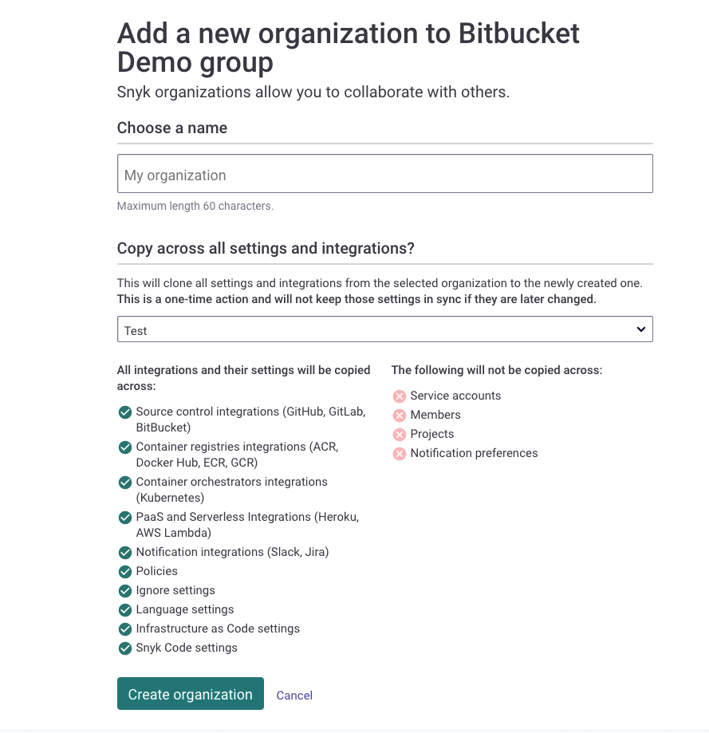

# 조직 생성 및 삭제

조직 수준의 옵션을 사용하여 조직을 [생성](create-and-delete-organizations.md#create-an-organization)하고 [삭제](create-and-delete-organizations.md#delete-an-organization)하며 [선호하는 조직 설정](create-and-delete-organizations.md#set-your-preferred-organization)을 할 수 있습니다.

## 조직 생성

Snyk에서는 무제한으로 조직을 가질 수 있습니다. 당신의 조직은 서로 다른 가격 요금제에 있을 수 있습니다.


조직의 설정과 통합에 만족할 때 추가 조직을 만들 때 해당 설정을 복사하여 사용할 수 있습니다.


다음 단계를 따라 조직을 생성합니다:

1\. Snyk 웹 UI에서 상위 메뉴에서 조직 목록을 열고 **새로운 조직 생성** 옵션을 클릭합니다:

<figure><figcaption>
조직 생성
</figcaption></figure>

2\. **새로운 조직을 생성**하는 페이지에서 새로운 조직의 이름을 입력합니다. 조직을 식별하기 위해 구조화된 명명 규칙을 사용하는 것을 고려해 보세요.


새로운 조직에 대해 고유한 이름을 입력하는 것이 매우 권장됩니다.


3\. 드롭다운 목록에서 모든 설정과 통합을 복사할 조직을 선택합니다.

4\. **조직 생성**을 선택합니다.

<figure><figcaption>
조직 생성
</figcaption></figure>

새로운 조직이 생성되고 조직 목록에 추가됩니다.

기본적으로 각 조직은 Snyk ID와 내부 이름이 고유하며 이는 해당 조직의 **설정** 페이지에서 찾을 수 있습니다.

새로운 조직의 설정과 통합을 검토하고 필요에 맞게 조정한 후 새로운 조직으로 프로젝트를 가져오기 전에 확인하세요.

## 조직 삭제

조직 관리자는 그룹이 없는 경우에 조직을 삭제할 수 있습니다. 조직이 그룹에 속한 경우에는 그룹 관리자만 해당 조직을 삭제할 수 있습니다.

다음 단계를 따라 조직을 삭제합니다:

1\. Snyk 웹 UI에서 상단 메뉴에서 조직 드롭다운 목록을 열고 삭제하려는 조직을 선택합니다.

2\. 선택한 조직이 표시되면 **그룹 메뉴**에서 **Org Settings** 버튼을 클릭합니다.

3\. **설정** 페이지에서 메뉴에서 **General**을 선택합니다.

4\. 페이지를 아래로 스크롤하여 **조직 삭제** 섹션으로 이동하고 **조직 삭제** 버튼을 클릭합니다:

<figure><figcaption>
조직 삭제
</figcaption></figure>

5\. 확인 대화 상자에서 삭제할 조직의 이름을 입력하고 삭제를 확인하기 위해 **OK**를 클릭합니다:

<figure><figcaption>
조직 삭제 확인
</figcaption></figure>

선택한 조직은 Snyk 계정에서 삭제됩니다.
