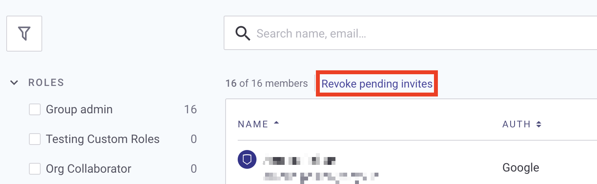
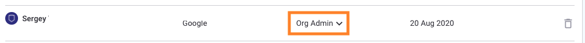

# 조직 내 사용자 관리

**사용자**를 관리하려는 **조직**에서 **멤버(Members)** 메뉴 옵션을 선택합니다.


이러한 작업을 수행할 수 있는 필요한 권한이 있어야 합니다. 자세한 내용은 권한 목록을 보려면 [사전 정의된 사용자 역할](../../user-roles/pre-defined-roles.md)을 참조하세요.


## 사용자 추가

조직에 새 사용자를 추가하려면 **멤버 추가(Add members)**&#xB97C; 클릭하세요:

<figure><figcaption>
조직에 멤버 추가
</figcaption></figure>

**멤버 추가** 화면에서 다음을 수행할 수 있습니다:

* **새 멤버 초대(Invite new members)**&#xB97C; 선택하여 새 사용자에게 이메일 초대장을 보냅니다. 초대할 사용자의 이메일 주소를 쉼표로 구분하여 입력하고 **초대장 보내기**를 클릭합니다.
* **기존 멤버 추가(Add existing members)**&#xB97C; 선택하여 그룹의 기존 멤버를 조직에 추가합니다. 프롬프트가 표시되면 사용자를 선택하고 멤버 초대를 클릭합니다.
* 무료 플랜 사용자용:\
  **링크로 초대(Invite by link)**&#xB97C; 선택하여 링크를 보냅니다; **링크 복사(Copy link)**&#xB97C; 클릭하여 링크를 직접 보냅니다.
* **새 멤버의 역할 지정(New members join as)** 드롭다운을 사용하여 사용자가 가입할 때의 기본 역할을 정의합니다. 예: **조직 관리자(Org admin)** 등. 자세한 내용은 [권한 관리](../../user-roles/pre-defined-roles.md)를 참조하세요.

사용자 추가의 시연을 보려면 이 비디오를 확인하십시오:


조직에 멤버 초대하기


## 보류 중인 초대 취소

다음 단계에 따라 보류 중인 초대를 취소하세요:

1.  **멤버(Members)** 페이지에서 적어도 하나의 보류 중인 초대가 있을 때 나타나는 **보류 중인 초대 취소 링크(Revoke pending invites)**&#xB97C; 클릭합니다.\

    <figure><figcaption>
보류 중인 초대 취소
</figcaption></figure>
2. 나타나는 **당신의 조직 이름의 보류 중인 초대(Pending invites in \_your organization's name)** 모달에서 사용자의 이름 옆의 휴지통 아이콘을 클릭하여 초대를 취소합니다.

## 멤버 역할 변경

사용자의 역할을 변경하려면 멤버의 **Role** 항목을 클릭하고 드롭다운을 사용하여 새 역할을 선택합니다:

<figure><figcaption>
새 역할 선택
</figcaption></figure>


사용자 정의 역할을 만드는 엔터프라이즈 플랜 고객들에게, Snyk은 다른 사용자에게 더 많은 권한이 있는 역할을 할당하는 것을 방지합니다. 역할을 업데이트하거나 새 사용자를 초대하거나 더 많은 권한이 있는 역할을 가진 기존 사용자를 추가하려고 하면 **더 높은 권한의 역할을 할당할 수 없습니다**(Cannot assign higher privilege role) 오류가 표시됩니다.


<figure><figcaption>
<strong>더 높은 권한의 역할을 할당할 수 없습니다 오류 메시지</strong>
</figcaption></figure>

## 조직 멤버 삭제

조직에서 멤버를 삭제하려면 다음 단계를 따르세요:

1. 사용자 이름 옆의 휴지통 아이콘을 클릭합니다.
2. 프롬프트가 표시되면 **당신의 조직 이름**에서 **멤버 삭제**를 클릭합니다.

## 조직 멤버 필터링 및 정렬 보기

### 필터링 보기

필터 사이드바를 확장하고 역할이나 인증 방법에 따라 표시되는 멤버를 필터링할 수 있습니다:

<figure><figcaption>
역할 또는 인증 방법별 멤버 필터링
</figcaption></figure>

### 정렬 보기

열 제목을 클릭하여 사용자 보기를 정렬할 수 있습니다:

<figure><figcaption>
사용자 보기 정렬
</figcaption></figure>

이름, 인증 방법, 역할 및 가입 날짜로 정렬할 수 있습니다.
