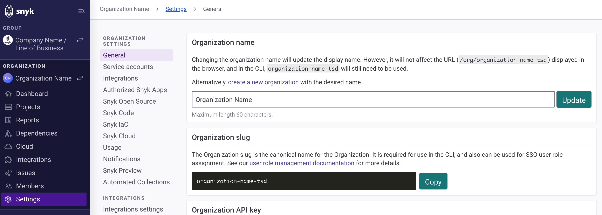

# 조직 일반 설정

조직의 설정을 보고 수정하려면 조직 내에 있고 **설정** 및 **일반**으로 이동하십시오:

<figure><figcaption>
조직 일반 설정
</figcaption></figure>

조직 일반 설정에서 다음을 확인하고 수정할 수 있습니다:

* **조직 이름**: 이 조직에 대한 표시 이름을 설정합니다. 예를 들어 기본 초기 조직 표시 이름을 변경하여 해당 조직과 관련된 작업을 더 잘 반영할 수 있습니다. 조직 표시 이름을 변경해도 브라우저 막대에 표시되는 URL이나 CLI에서 사용되는 내부 이름은 변경되지 않습니다. 전체 이름을 변경하려면 원하는 이름으로 [새로운 조직을 생성](https://app.snyk.io/create-organisation)하십시오.
* **조직 API 키**: 조직 API 키를 확인하거나 복사합니다. [서비스 계정](../../../enterprise-setup/service-accounts/)은 표준 사용자 자격 증명을 대체하는 API 키(토큰)가 필요합니다. **서비스 계정 관리** 버튼을 클릭하여 서비스 계정에 대한 세부 정보를 설정할 수 있습니다.
* **조직 ID**: 조직 ID를 확인하거나 복사합니다. 이는 각 조직이 생성될 때 자동으로 생성되는 조직의 내부 ID입니다. 이 ID는 이 조직을 고유하게 식별하며 [Snyk API](../../../snyk-api/)를 사용할 때 필요합니다. 이러한 조직 식별 세부 정보는 Snyk이 각 조직에 대해 자동으로 생성합니다.
* **무시**: 조직 전체에 대한 무시 설정을 정의합니다. 다음 옵션 중에서 선택할 수 있습니다:
  * Snyk 앱 또는 API를 통해 이슈를 무시하거나 이슈의 무시 설정을 편집할 수 있습니다.
    * _관리자 사용자만_
    * 모든 환경에서 _모든 사용자_
  * **CLI 또는 `.snyk` 파일을 통해 문제를 무시할 수 있는 능력**
    * _Snyk 앱 및 API만_
    * _Snyk 앱, API, CLI 및 리포지토리의 .snyk 파일_
  * **각 무시에 대한 이유 제공 필요**
    * _필요함 (Snyk 앱에서만 적용되며 CLI나 API에는 적용되지 않음)_
    * _필요하지 않음_
    * 자세한 내용은 [무시 설정 구성](../../../manage-risk/prioritize-issues-for-fixing/ignore-issues/#configure-ignore-settings)을 참조하십시오.
* **액세스 요청**: Snyk 조직에 액세스 권한이 없는 사용자가 액세스를 요청할 수 있도록 설정합니다. 외부 사용자를 포함합니다. 자세한 내용은 조직의 액세스 요청 문서인 [액세스 요청 설정 활성화](requests-for-access-to-an-organization.md#enable-the-request-access-setting)을 참조하십시오.
* **조직 탈퇴**: 이 조직을 떠납니다. 해당 조직의 프로젝트 및 알림에 대한 액세스 권한을 상실합니다.
* **조직 삭제**: Snyk에서 이 조직을 완전히 제거하여 해당 프로젝트 및 이력 데이터를 모두 삭제합니다. 자세한 내용은 조직 관리 문서인 [조직 삭제](create-and-delete-organizations.md#delete-an-organization)를 참조하십시오.

조직 설정에 대한 자세한 내용은 [조직 관리](create-and-delete-organizations.md)를 참조하십시오.
