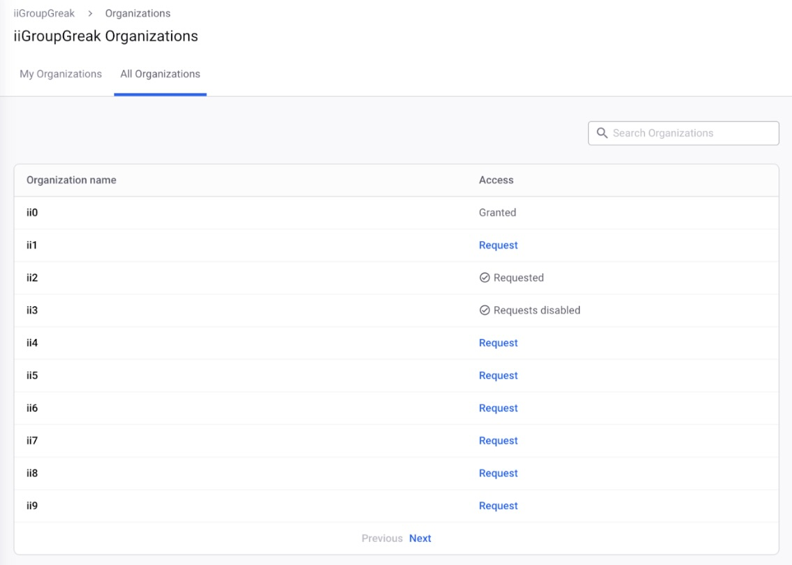

# 조직에 대한 액세스 요청

Snyk 조직의 회원이 아닌 사용자는 액세스를 요청할 수 있습니다.

**액세스 요청**이 조직에 대해 활성화되어 있는 경우, 사용자가 액세스를 요청하면 조직의 모든 관리자들이 이메일로 알림을 받고 해당 사용자에게 이메일을 통해 초대장을 보낼 수 있습니다.

요청자가 초대를 수락하면, 요청자는 조직에 액세스할 수 있게 됩니다.

## 조직에 액세스 요청하는 방법

특정 그룹 내의 조직에 가입하고 싶은 사용자는 그룹 메뉴에서 **Organizations** 옵션과 **All Organizations** 탭을 선택할 수 있습니다. 표시된 목록에서 조직 이름을 찾은 후 **Request**를 클릭하고 액세스를 요청하는 프롬프트에 응답합니다. 이렇게 하면 조직 관리자들 또는 조직 레벨의 **사용자 초대** 권한을 가진 사용자들에게 요청이 통보됩니다.

<figure><figcaption>
그룹 내의 모든 조직을 표시하는 All Organizations 페이지
</figcaption></figure>

사용자가 이 액세스를 요청하는 데에 다른 일반적인 경로는 다음과 같습니다:

* 다른 사람이 공유한 링크를 사용
* Snyk이 오픈한 풀 리퀘스트를 위해 Snyk으로 넘어가기
* 저장소의 어떤 풀 리퀘스트에서 Snyk의 상태 체크를 통해 이동하기

**액세스 요청**이 조직에 대해 활성화되어 있고 비회원이 프로젝트나 상태 체크 결과에 대한 유효한 URL에 도달하면, 해당 사용자는 48시간 동안 조직 당 한 번씩 액세스를 요청할 수 있습니다.


조직에 액세스를 요청해야 하는 경우, 보통 사용하는 인증 방법과는 다른 방법으로 로그인한 것일 수 있습니다. 더 자세한 정보는 [지원 문서](https://support.snyk.io/s/article/Unable-to-display-this-organization-The-organization-does-not-exist-or-you-do-not-have-permission-to-access-it)를 참조하여 오류가 발생한 이유와 해결 방법에 대해 알아보세요.



프로젝트 또는 상태 체크의 유효한 URL만을 통해 액세스를 요청할 수 있습니다. 다른 URL을 사용하면 오류 메시지가 표시됩니다. 이를 통해 사용자가 URL을 추측하여 액세스를 요청하거나 Snyk이 회사에서 사용 중임을 확인하는 것을 방지합니다.


## 요청 액세스 설정 활성화

조직에서 **Settings** > **General** 옵션으로 이동한 다음 **Requesting Access** 섹션으로 이동합니다. 액세스 요청을 허용하려면 **Enabled**를 선택하고, 액세스 요청을 중지하려면 **Disabled**를 선택합니다.

<figure><figcaption>
액세스 요청 설정
</figcaption></figure>
