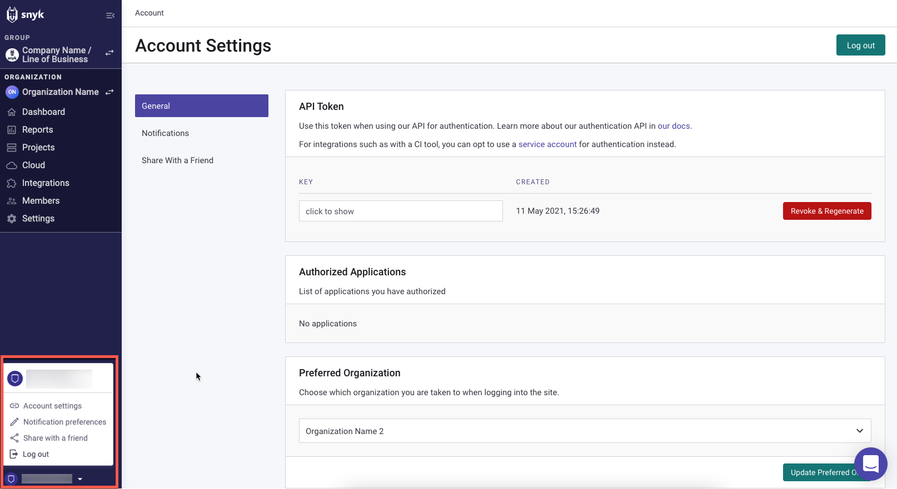

# 선호하는 조직 설정

## 선호하는 조직 설정

여러 조직을 보유하고 있다면, Snyk 계정에서 **선호하는 조직(Preferred Organization)** 중 하나가 기본값으로 설정됩니다. 선호하는 조직은 다음과 같이 결정됩니다:

- Snyk 웹 UI에서: Snyk 계정에 로그인할 때 기본으로 표시되는 조직입니다.
- Snyk CLI에서: CLI를 통해 검사할 때 기본적으로 사용되는 테스트 카운트에 대한 조직입니다.\
  **참고**: CLI에서 테스트 카운트에 사용되는 조직을 변경하려면 `--org=<ORG_ID>` 옵션을 사용하세요. 자세한 내용은 테스트 명령어에 대한 CLI 도움말을 참조하세요: [Snyk test](../../../snyk-cli/commands/test.md), [Snyk Code test](../../../snyk-cli/commands/code-test.md), [Snyk Container test](../../../snyk-cli/commands/container-test.md), 또는 [Snyk IaC test](../../../snyk-cli/commands/iac-test.md).

다음 단계에 따라 선호하는 조직을 변경할 수 있습니다:

1. Snyk 웹 UI에서, 화면 왼쪽 하단의 계정 아이콘을 클릭한 다음 **계정 설정(Account settings)** 옵션을 선택합니다:

<figure><figcaption>
계정 설정
</figcaption></figure>

2. **계정 설정** 페이지에서 **선호하는 조직(Preferred Organization)** 섹션에서, 조직 드롭다운 목록을 열어 액세스할 수 있는 조직 목록을 표시하고 선호하는 조직으로 설정할 조직을 선택합니다:

<figure><figcaption>
선호하는 조직 변경
</figcaption></figure>

3. **선호하는 조직 업데이트** 버튼을 클릭하여 새로운 설정을 저장합니다.

선택한 **선호하는 조직**은 Snyk 계정에 로그인할 때 표시되며 CLI를 사용하여 검사할 때 기본적으로 사용됩니다.