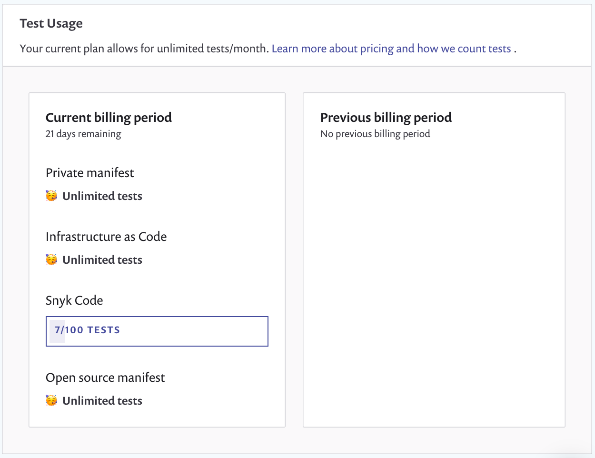
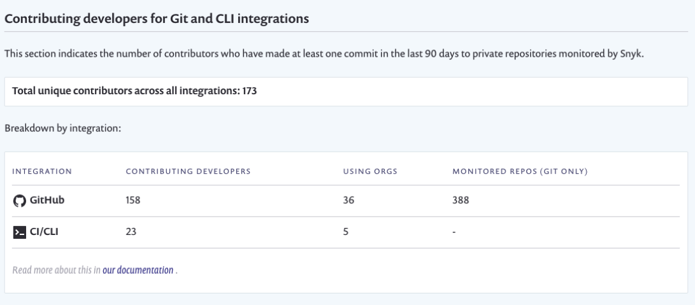

# 사용 설정

그룹 또는 조직에서 **설정** > **사용량**을 선택하여 그룹 또는 조직에 대한 Snyk 사용 세부 정보를 볼 수 있습니다.

* [테스트 사용](usage-settings.md#test-usage): 사용된 테스트 수
* [기여하는 개발자](usage-settings.md#contributing-developers): 프로젝트에 기여한 개발자 수


테스트 빈도 설정에 대한 자세한 내용은 프로젝트 목록 페이지의 [프로젝트 작업](../snyk-projects/#project-actions-on-the-project-listing-page)에서 대량 작업도 설명되어 있습니다.


## 테스트 사용

**테스트 사용** 섹션에는 현재 청구 기간 동안 사용 중인 테스트 수가 표시됩니다:

<figure><figcaption>
테스트 사용 데이터
</figcaption></figure>


테스트 제한은 Snyk 제품 및 요금제에 따라 다릅니다.

무료 요금제의 경우, 제한은 다음과 같습니다: 오픈 소스, 400개의 테스트; 코드, 100개의 테스트; IaC, 300개의 테스트; 컨테이너, 100개의 테스트.

자세한 내용은 [요금제 및 가격 페이지](https://snyk.io/plans/)를 참조하십시오.



테스트로 인정되는 사항에 대한 자세한 내용은 Snyk가 테스트를 계산하는 방법에 대한 [무엇이 테스트로 간주되는가?](../../working-with-snyk/what-counts-as-a-test.md)를 참조하십시오.


## 기여하는 개발자


Snyk의 개발자 수는 GitHub, GitHub Enterprise 및 GitLab 통합 및 Snyk CLI에 대해 적용됩니다.


Snyk은 기여하는 개발자를 다음과 같이 정의합니다: Snyk에서 모니터링하는 비공개 저장소에 최근 90일 이내에 커밋한 개발자.

**Git 및 CLI 통합에 대한 기여하는 개발자** 섹션은 기여하는 개발자 수를 조직 수준과 그룹 수준에서 보여줍니다.

이 수치는 통합된 사설 저장소의 기본 브랜치에 기여하는 개발자 수를 나타냅니다.

Snyk은 퍼블릭(오픈 소스) 저장소에 대한 기여를 세지 않습니다. 이는 가격 모델이 사설 저장소에 대한 기여 개발자 수에 기반하고 있기 때문입니다.

기여하는 개발자 수 카운트의 예는 다음과 같습니다:

<figure><figcaption>
기여하는 개발자 카운트
</figcaption></figure>

* **모든 통합별 고유 기여자 총합:** Snyk 계정에서 모든 통합에 걸쳐 고유한 기여자 수입니다. 기여하는 개발자는 한 번만 세어지며, 여러 통합이나 여러 저장소에 기여했더라도 한 번만 세어집니다.
* **통합별 분해**: 해당 통합에 대한 기여자, 조직 및 저장소 수.

각 기여자는 개발자의 로컬 Git 구성 내에서 설정된 **저자** 이메일 필드로 **카운트**됩니다.
