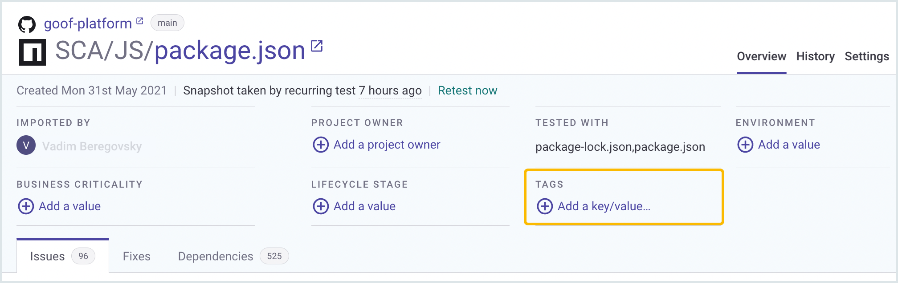
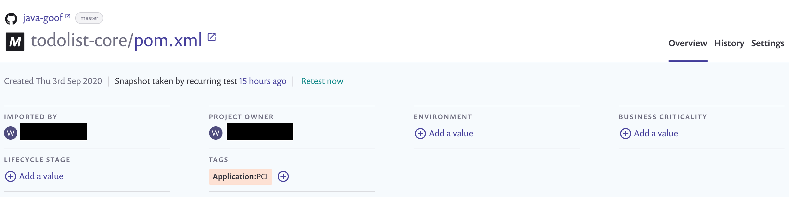
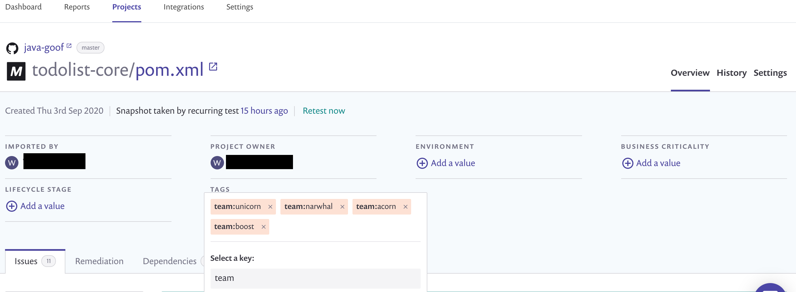
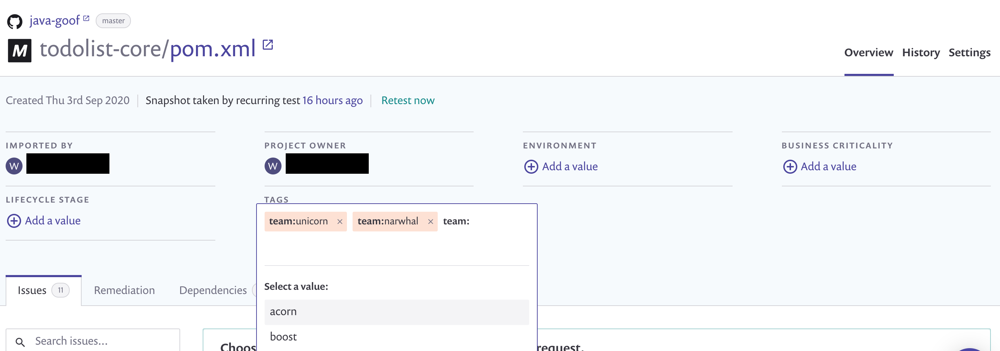

# 프로젝트 태그


**기능 가용성**\
프로젝트 태그는 엔터프라이즈 플랜에서만 제공됩니다. 자세한 정보는 [요금제 및 가격](https://snyk.io/plans/)을 참조하세요.


## 프로젝트 태그 사용 및 조건

### 웹 UI, API 및 CLI에서 태그 사용


그룹 및 조직 관리자는 이 페이지에서 설명한 작업을 수행할 수 있습니다. 협력자는 그룹에 속한 조직의 구성원인 경우 해당 작업을 수행할 수 있습니다.


프로젝트 태그 기능을 사용하면 Snyk 프로젝트에 사용자 지정 메타데이터를 추가할 수 있습니다. 태그를 생성하고 삭제하며, 프로젝트에 태그를 적용하고 삭제하며, 태그를 사용하여 프로젝트를 필터링할 수 있습니다.

이러한 작업을 Snyk 웹 UI에서 수행할 수 있습니다. 이 페이지에 표시된대로 수행할 수 있습니다.

또한 API 엔드포인트 [프로젝트에 태그 추가](../../snyk-api/reference/projects-v1.md#org-orgid-project-projectid-tags), [프로젝트에서 태그 제거](../../snyk-api/reference/projects-v1.md#org-orgid-project-projectid-tags-remove), 및 [그룹 내 모든 태그 나열](../../snyk-api/reference/groups-v1.md#group-groupid-tags)를 사용하여 이러한 작업을 수행할 수 있습니다.

프로젝트에 적용된 태그에 대한 값 설정 및 프로젝트 태그를 지우려면 Snyk CLI 옵션 `--project-tags`를 사용하십시오. 이 옵션을 지원하는 명령어에 대한 요약을 보려면 [CLI 명령어 및 옵션 요약](../../snyk-cli/cli-commands-and-options-summary.md)을 참조하십시오.


프로젝트 태그가 더 이상 프로젝트에 할당되지 않으면 해당 태그는 더 이상 존재하지 않습니다.&#x20;


### 태그 조건

다음 조건이 프로젝트 태그에 적용됩니다:

- 키는 30자로 제한됩니다.
- 값은 256자로 제한됩니다.
- 키는 알파벳 및 다음 문자 **`-`**, **`_`** 만 허용됩니다.
- 값은 이러한 문자와 함께 **`/`**, **`:`**, **`?`**, **`#`**, **`@`**, **`&`**, **`+`**, **`=`**, **`%`**, **`~`**까지 허용됩니다.
- 키와 값 조합 재사용은 개수에 추가되지 않습니다.

## **태그 생성 방법**

Snyk 프로젝트에 새 태그를 만들려면 다음 단계를 따르세요:

1. 프로젝트 세부 정보 페이지에서 **TAGS** 아래 **Add a key/value...**를 클릭합니다.

    ***

    <figure><figcaption>
프로젝트 태그 만들기 옵션 선택
</figcaption></figure>
2. 새 키를 추가하고 **Enter**를 클릭합니다.
3. 새 값을 추가하고 **Enter**를 클릭합니다.

새 태그가 만들어졌습니다. 새 태그가 만들어지면 해당 태그는 자동으로 만들어진 프로젝트에 적용됩니다. 또한 해당 태그는 그룹의 다른 프로젝트에도 사용할 수 있습니다.

<figure><figcaption>
태그가 적용된 프로젝트 세부 정보 페이지
</figcaption></figure>

하나의 프로젝트 태그 키에 여러 프로젝트 태그 값이 적용될 수 있습니다.

<figure><figcaption>
동일한 키에 다중 프로젝트 태그 값 적용
</figcaption></figure>

태그를 작성한 후에는 해당 태그를 다른 프로젝트에 적용할 수 있습니다.

## 태그 삭제 방법

그룹에서 프로젝트 태그를 삭제하려면 API 엔드포인트 [그룹에서 태그 삭제](../../snyk-api/reference/groups-v1.md#group-groupid-tags)를 사용하십시오.

이 엔드포인트에는 본문에 `"force": false` 또는 `"force": true`를 지정할 수 있는 옵션이 있습니다. `"force": true`를 지정하면 태그가 적용된 모든 프로젝트에서 태그가 제거되고 그 후 삭제됩니다. `"force": false`를 지정하고 태그가 여전히 프로젝트에 적용된 경우 오류 403인 “태그에 엔터티가 있음”이 발생합니다. 그렇지 않으면 태그 삭제가 성공해야 합니다.&#x20;


태그는 하나 이상의 프로젝트에 생성되고 적용되었을 때만 존재합니다. 모든 프로젝트에서 태그가 제거되면 해당 태그는 더 이상 존재하지 않습니다.


## **태그 적용 및 제거 방법**

그룹에서 태그가 있는 경우 해당 태그를 Snyk 프로젝트에 적용할 수 있습니다.

1. 프로젝트 세부 정보 페이지에서 **TAGS** 아래의 **+** 아이콘을 클릭합니다.
2. 최근에 사용된 키 목록에서 키를 선택하거나 적용하려는 태그의 키를 입력합니다.
3. 최근에 사용된 값 목록에서 값을 선택하거나 적용하려는 키 값의 값을 입력합니다.
4. 값을 선택한 후에 해당 태그가 프로젝트에 적용됩니다.
5. 프로젝트에서 태그를 제거하려면 태그 옆의 **x**를 클릭합니다.\
   태그를 제거하고 다른 프로젝트에 할당되지 않은 경우 해당 태그가 더 이상 존재하지 않습니다.

<figure><figcaption>
태그를 위한 키 값 선택
</figcaption></figure>

## 태그로 프로젝트 목록 필터링하는 방법

프로젝트 목록 페이지에 **그룹 없이 나열** (그룹 없음)이 적용된 경우 메뉴에서 옵션을 사용하여 태그로 목록을 필터링할 수 있습니다.

태그로 필터링하는 자동 완성 필터가 있습니다. 이는 일부 결과로 제한되어 있습니다. 태그가 표시되지 않으면 태그가 결과 상단에 올라오도록 태그의 문자수를 입력하십시오.

<figure><figcaption>
태그로 필터링 옵션
</figcaption></figure>