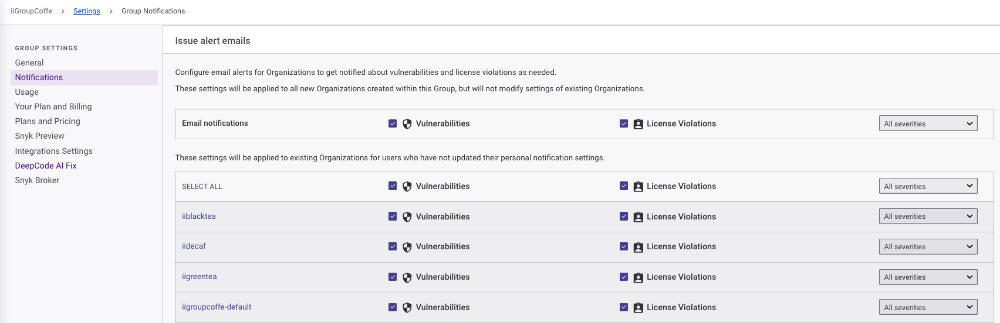
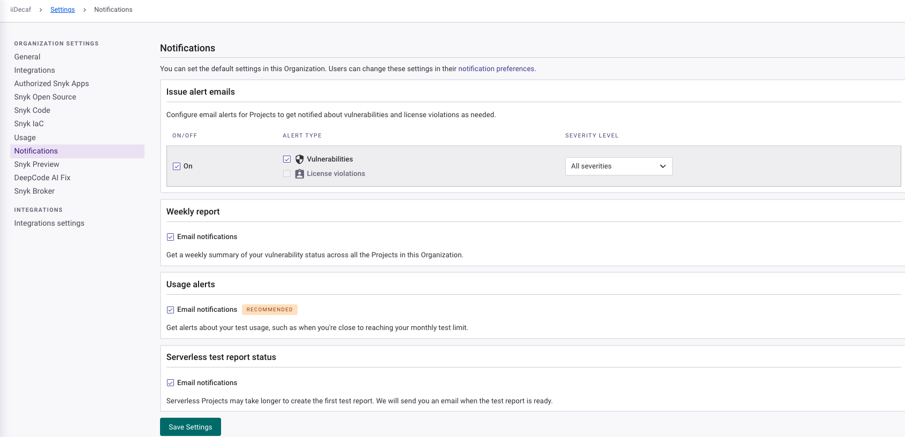
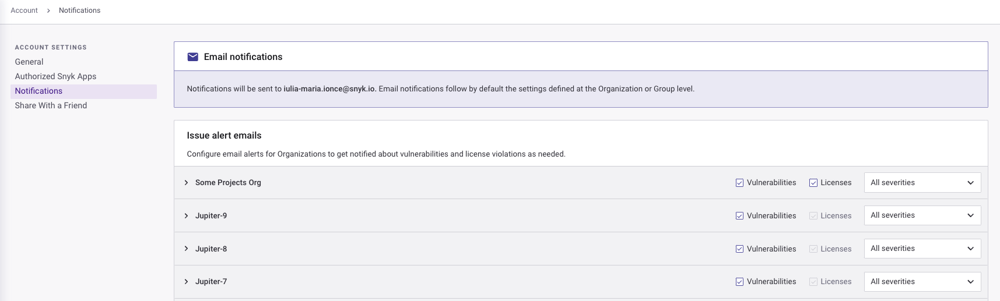

# 알림 관리

Snyk은 모니터링 중인 프로젝트에서 새로운 문제가 발견될 때 자동으로 알림을 보내어 해당 프로젝트에서 새로운 위험이 발생할 수 있음을 알려줍니다.

## 알림이 전송되는 방법

Snyk은 다음과 같은 방법으로 알림을 전송할 수 있습니다:

* 이메일로, 계정 설정에서 [이메일 알림을 구성한 경우](https://app.snyk.io/account/notifications).
* Slack으로, [Slack 통합](../integrate-with-snyk/jira-and-slack-integrations/slack-integration.md)을 설치한 경우.

Snyk은 또한 주간 업데이트를 통해 귀하의 조직 전체에 걸친 보안 상태를 요약해서 제공합니다.

Snyk은 다음을 위해 알림을 제공합니다:

* 취약점
* 라이선스 문제
* 주간 요약 보고서
* 사용량 경고
* 보고서 상태


프로젝트를 비활성화로 설정하더라도 Snyk이 알림을 보내는 것을 중지시키지 않습니다. 해당 프로젝트에 대한 알림을 별도로 비활성화해야 합니다.



**FedRAMP 환경 알림**\
[이슈 경고 이메일](manage-notifications.md#group-defaults-for-issue-alert-emails)과 [주간 보고서 이메일](manage-notifications.md#group-defaults-for-weekly-report-emails)은 FedRAMP 환경에서 비활성화됩니다. 해당 알림 설정은 페이지에서 숨겨질 수 있습니다.


## 알림 관리 방법

Snyk은 개별 알림을 관리할 수 있는 제어 기능을 제공합니다. 관리자는 [그룹](manage-notifications.md#define-group-notification-defaults) 또는 [조직](manage-notifications.md#define-organization-notification-defaults)에서 다른 사람을 위한 알림 기본 설정을 관리할 수 있습니다.


주간 알림 이메일은 조직 사용자에게만 전송되므로 그룹 관리자는 이메일을 수신해야 하는 조직에 대해 조직 구성원으로서 추가해야 합니다.


또한 특정 Slack 채널로 조직의 알림을 전송할 수도 있습니다. 자세한 내용은 [Slack 통합](../integrate-with-snyk/jira-and-slack-integrations/slack-integration.md)을 참조하세요.

### 그룹 알림 기본 설정 정의

그룹 수준에서 알림 설정을 정의하여 Snyk이 새로운 알림을 발견할 때 어떻게 이슈 경고 이메일, 주간 보고서 이메일, 사용량 경고 이메일 및 보고서 상태 이메일을 전송하는지 템플릿을 정의할 수 있습니다. 그룹 수준에서 새로운 개별 조직에 대한 기본 설정에도 액세스할 수 있습니다.


그룹 기본 설정을 변경하더라도 기존 조직 또는 프로젝트의 설정은 변경되지 않습니다. 개별 사용자는 기본 알림 설정을 재정의할 수 있습니다.


그룹 수준 알림 설정으로 이동하려면:

1. 변경하려는 그룹의 그룹 개요로 이동합니다.
2. **설정**을 선택합니다.
3. **알림**을 선택합니다.

<figure><figcaption>
그룹 수준의 알림 설정
</figcaption></figure>

#### 이슈 경고 이메일을 위한 그룹 기본 설정

이슈 경고 이메일은 Snyk이 새로운 취약점, 라이센스 문제 또는 문제 해결을 발견한 날에 보내는 알림입니다.

이슈 경고 이메일의 기본 설정을 변경하려면:

1. 새로운 조직의 사용자들이 새로 발견된 문제나 문제 해결을 위해 기본적으로 새로운 조직의 모든 프로젝트에게 경고 이메일을 받아야 하는 경우 **취약점** 상자를 확인합니다.
2. 새로운 조직의 사용자들이 새로운 조직의 모든 프로젝트에 대해 새 라이선스 문제나 문제 해결에 대한 경고 이메일을 받아야 하는 경우 **라이센스 위반** 상자를 확인합니다.
3. **취약점** 또는 **라이센스 위반** 상자 중 하나가 확인된 경우, Snyk가 경고 이메일을 보낼 문제의 심각도를 드롭다운 목록에서 **모든 심각성** 또는 **중대한 심각성**을 선택하여 지정합니다.
4. 개별 조직에서 기본값을 변경하려면 조직 이름 옆의 **취약점**, **라이센스 위반**, **심각성** 설정을 변경합니다. 이러한 설정은 이 그룹에서 새로운 조직을 만들 때 개인 사용자가 개인 알림을 업데이트하지 않은 경우 해당 개인 사용자에게 적용됩니다.

#### 주간 보고 이메일을 위한 그룹 기본 설정

주간 보고 이메일은 Snyk이 소속된 모든 프로젝트 및 조직의 취약성 상태를 요약해주는 알림입니다. 조직의 모든 프로젝트가 취약점이 없는 경우, 알림에는 활성 프로젝트 수, 알려진 취약점 수 및 총 종속성 수가 나열됩니다.

주간 보고 이메일의 기본 설정을 변경하려면:

* 이 그룹에 새 조직의 사용자가 주간 요약 이메일을 기본적으로 받아야 하는 경우 **이메일 알림** 상자를 확인합니다.
* 개별 조직에 대한 기본값을 변경하려면 조직 이름 옆의 상자를 선택합니다. 기본값은 이 그룹에서 새로운 조직을 만들 때 적용됩니다.


개별 프로젝트는 주간 보고서에서 제외될 수 없습니다. 새 취약점이나 문제 해결에서만 제외될 수 있습니다.


#### 사용량 경고를 위한 그룹 기본 설정

사용량 경고 이메일은 사용량 한도에 접근할 때 Snyk가 경고하는 알림입니다.

사용량 경고의 기본 설정을 변경하려면:

* 이 그룹에 새 조직의 사용자가 기본적으로 사용량 경고 이메일을 받아야 하는 경우 **이메일 알림** 상자를 확인합니다.
* 개별 조직에 대한 기본값을 변경하려면 조직 이름 옆의 상자를 선택합니다. 기본값은 이 그룹에서 새로운 조직을 만들 때 적용됩니다.

### 조직 알림 기본 설정 정의

조직의 알림 설정을 정의하여 Snyk가 해당 개인 알림 설정을 변경하지 않은 조직 내 모든 개인에게 이메일을 어떻게 전송할지 결정할 수 있습니다.


조직의 기본 설정을 변경하더라도 기존 프로젝트나 개별 사용자의 설정은 변경되지 않습니다. 개별 사용자는 기본 알림 설정을 재정의할 수 있습니다.


조직 수준의 알림 설정으로 이동하려면:

1. 변경하려는 조직으로 이동합니다.
2. **설정**을 선택합니다.
3. **알림**을 선택합니다.

<figure><figcaption>
조직 수준의 알림 설정
</figcaption></figure>

#### 이슈 경고 이메일을 위한 조직 기본 설정

이슈 경고 이메일은 Snyk가 새로운 취약점, 라이센스 문제 또는 문제 해결을 발견한 날에 보내는 알림입니다.

이슈 경고 이메일의 기본 설정을 변경하려면:

* 새로 가져온 프로젝트에 대한 이슈 경고 이메일을 끄려면 **On** 상자를 선택 취소합니다. 이 조직에 새 프로젝트가 특정 경고를 받아야 하는 경우 상자를 확인합니다.
* 모든 프로젝트에 대해 새 문제나 문제 해결에 대한 경고 이메일을 생성하려면 **취약점** 상자를 확인합니다.
* 모든 프로젝트에 대해 새 라이센스 문제나 문제 해결에 대한 경고 이메일을 생성하려면 **라이센스 위반** 상자를 확인합니다.
* **취약점** 또는 **라이센스 위반** 상자 중 하나가 확인된 경우, Snyk가 경고 이메일을 보낼 문제의 심각도를 드롭다운 목록에서 **모든 심각성** 또는 **중대한 심각성**을 선택하여 지정합니다.

#### 주간 보고 이메일을 위한 조직 기본 설정

주간 보고 이메일은 Snyk가 소속된 모든 프로젝트 및 조직의 취약성 상태를 요약해주는 알림입니다.

주간 보고 이메일의 기본 설정을 변경하려면, **주간 보고서** 아래의 **이메일 알림** 상자를 선택하여 이 조직의 구성원이 기본적으로 주간 요약 이메일을 받아야 하는 경우 확인합니다.

#### 사용량 경고를 위한 조직 기본 설정

사용량 경고 이메일은 사용량 한도에 접근할 때 Snyk가 경고하는 알림입니다.

사용량 경고의 기본 설정을 변경하려면, **Approaching test limit** 상자를 선택하여 이 조직의 구성원이 기본적으로 사용량 경고 이메일을 받아야 하는 경우 확인합니다.

## 개인 알림 설정 변경

Snyk가 이메일을 보내는 방법에 대한 기본 설정을 가지고 있는 조직이 있습니다.

이 설정을 재정의하려면 다음과 같이 알림 환경 환경을 변경하십시오:

1. 이름 옆의 드롭다운을 선택합니다.
2. **알림 환경**을 선택합니다.

<figure><figcaption>
계정 수준의 알림 설정
</figcaption></figure>

계정 설정 페이지에서 소속된 조직 각각에 대해 알림 유형을 변경할 수 있습니다. 또한 개별 프로젝트에 대한 알림을 사용자 정의할 수도 있습니다.

### 이슈 경고 이메일에 대한 환경 설정

이슈 경고 이메일은 Snyk가 새로운 취약성, 라이선스 문제 또는 해결 조치를 발견한 날에 보내는 알림입니다.

개별 조직에 대한 이슈 경고 이메일 설정을 사용자가 변경하려면 멤버인 각 조직에 대해 다음 작업을 수행하십시오:

* 조직의 모든 프로젝트에서 새로운 문제나 해결 조치에 대한 경고 이메일을 받으려면 **취약성** 상자를 확인합니다.
* 개인 프로젝트에 대한 설정을 변경하려면:

1. 조직을 확장하여 조직 내 프로젝트 목록을 확인합니다.
2. 각 프로젝트 이름 옆에 있는 **취약점** 또는 **라이선스** 상자를 선택하여 프로젝트에 대한 심각성을 확인하거나 취소합니다.

### 주간 보고 이메일에 대한 환경 설정

주간 보고 이메일은 소속된 모든 프로젝트 및 조직의 취약성 상태를 요약해주는 알림입니다.

주간 보고서 이메일를 받기 위해 조직을 포함하려면 알림을 받기 원하는 각 조직 옆에 상자를 확인합니다.

### 사용량 경고에 대한 환경 설정

사용량 경고 이메일은 사용량 한도에 접근할 때 Snyk가 경고하는 알림입니다.

해당 조직의 사용량 경고를 받으려면 조직 옆의 상자를 확인합니다.
