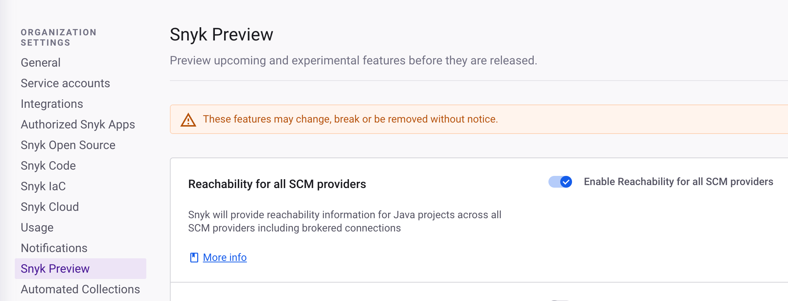

# Snyk 미리보기


[Snyk IDE 플러그인](../scm-ide-and-ci-cd-integrations/snyk-ide-plugins-and-extensions/)에도 미리보기 기능이 있습니다. 이러한 미리보기 기능은 Snyk 미리보기와 별도이며 IDE별 플러그인의 문서에서 찾을 수 있습니다.


Snyk 미리보기를 사용하면 기본적으로 모든 고객에게 제공되지 않을 수 있는 새로운 기능을 활성화할 수 있습니다.

관리자 권한이 있는 사용자는 조직 및 그룹 수준에서 Snyk 미리보기를 사용할 수 있습니다.

Snyk 미리보기를 사용하여 기능을 활성화하는 방법:

1. 그룹 또는 조직 수준에서 **설정** > **Snyk 미리보기**를 선택합니다.
2. 기능 미리보기를 활성화 또는 비활성화하려면 **기능 미리보기 활성화**를 선택합니다.
3. **변경 사항 저장**을 클릭합니다.

<figure><figcaption>
Snyk 미리보기
</figcaption></figure>


그룹 수준에서 기능이 활성화된 후 해당 그룹의 모든 조직이 이 기능을 사용할 수 있으며 이러한 조직에 대해 개별적으로 비활성화할 수 없습니다.

또한, 일부 기능은 그룹 수준에서만 사용할 수 있습니다. 이는 적절하게 표시됩니다.
