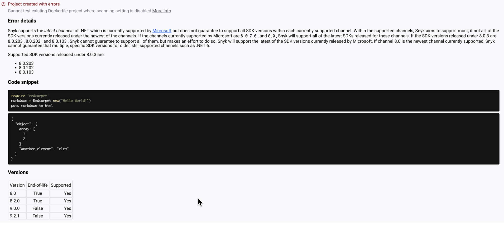

# Log 가져오기

Log 가져오기 기능은 Integration을 통해 조직에 가져온 모든 Git 저장소 및 컨테이너 레지스트리 이미지의 기록을 제공하여 수동 및 자동 변경사항을 검토하고 모든 오류를 해결할 수 있게 합니다. 이 로그를 통해 발생한 오류를 확인하고 해결하는 데 도움이 됩니다.

## Import Log 보기

Import Log는 Snyk 웹 UI의 조직 **Projects** 페이지에 위치합니다.\
**프로젝트 추가** 옆의 **View import log** 버튼을 선택합니다.


조직 내에서 수행된 가져오기에 대한 Import Log 메시지를 보려면 View Organization 및 View Project [권한](../user-roles/pre-defined-roles.md)이 필요합니다.


## Import Log 타임라인

Import Log 타임라인은 다음과 같은 **가장 최근**의 적용 가능한 조건까지 되돌아갑니다:

* 2023년 1월 25일
* 조직이 생성된 날짜

예를 들어, 조직이 2023년 1월 25일 이전에 생성된 경우, Snyk는 해당 날짜 이전의 로그를 검색할 수 없습니다.

<figure><figcaption>
Import Log 타임라인
</figcaption></figure>

Import Log는 모든 가져온 대상을 시간 역순으로 나열하며, 가장 최근 가져오기가 페이지 상단에 표시됩니다. 각 가져오기는 드롭다운을 사용하여 확장할 수 있으며, 가져오기 당시 Snyk에서 생성된 모든 가져온 프로젝트가 나열됩니다.

가져오기 중인 대상은 **대상 가져오는 중**이라는 로딩 아이콘이 표시됩니다.

**프로젝트 보기**를 선택하면 해당 특정 프로젝트의 이슈 탭으로 이동합니다.

## Import Log 오류 메시지

가져오기 중에 오류가 발생하면 경고 아이콘이 해당 저장소 이름에 표시됩니다. 이를 확장하면 오류가 관련된 프로젝트와 오류 세부 정보가 **상태** 열 아래에 표시됩니다.

표시될 수 있는 오류 메시지는 다음과 같습니다:

* 오류가 있는 상태로 프로젝트가 생성됨.
* 프로젝트를 만들 수 없음.
* 가져오기에 실패한 프로젝트.

<figure><figcaption>
오류가 있는 상태로 만들어진 프로젝트에 대한 자세한 오류 메시지
</figcaption></figure>


Snyk은 `golang-deps`, `npm-deps`, `dotnet-deps`, `maven-deps` 및 `pip-deps` 생태계에 대해 자세한 오류 메시지를 표시합니다.

